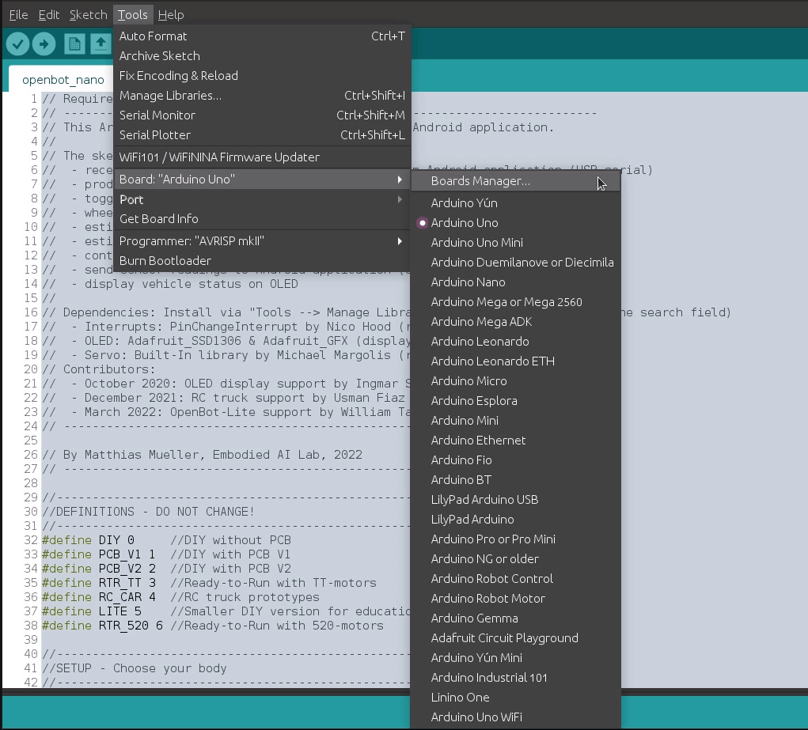

# Firmware

  <a href="README.md">English</a> |
  <a href="README.zh-CN.md">简体中文</a> |
  <a href="README.de-DE.md">Deutsch</a> |
  Français |
  <a href="README.es-ES.md">Español</a>

Nous utilisons une unité de microcontrôleur (MCU) pour agir comme un pont entre le corps du robot et le smartphone. Nous fournissons notre [firmware](openbot_nano/openbot_nano.ino) pour l'Arduino Nano avec un microcontrôleur ATmega328P ainsi que pour le kit de développement ESP32.

## Fonctionnalités

La tâche principale du MCU est de gérer le contrôle de bas niveau du véhicule et de fournir des lectures des capteurs montés sur le véhicule. Le MCU reçoit les commandes du véhicule et les signaux d'indicateur via la connexion série. Il convertit les commandes en signaux PWM pour le contrôleur de moteur et bascule les LED selon le signal d'indicateur. Le programme Arduino suit également les rotations des roues en comptant les interruptions des capteurs optiques sur les roues avant gauche et droite. Il calcule la tension de la batterie par une moyenne mobile pondérée des mesures au circuit diviseur de tension. Il peut également mesurer la distance aux obstacles devant la voiture avec un capteur ultrasonique optionnel. Ces mesures sont renvoyées à l'application Android via le lien série.

## Configuration

Tout d'abord, vous devez configurer votre matériel au début du code. Si vous avez construit le modèle DIY (en utilisant le pilote de moteur L298N), définissez `OPENBOT DIY`. Si vous avez utilisé le PCB personnalisé, vérifiez la version et définissez soit `OPENBOT PCB_V1` soit `OPENBOT PCB_V2`. Si vous avez un kit OpenBot, définissez `OPENBOT RTR_TT`. Si vous avez modifié un camion RC, définissez `OPENBOT RC_CAR`. Si vous utilisez la version DIY plus petite pour l'éducation, définissez `OPENBOT LITE`. Si vous utilisez le kit OpenBot prêt à l'emploi avec des moteurs 520, définissez `OPENBOT RTR_520`. Si vous avez construit le véhicule tout-terrain, vous devez définir `OPENBOT MTV`. Pour faire fonctionner le `OpenBot DIY` avec l'ESP32, définissez OpenBot `DIY_ESP32`.

## Bluetooth

Vous pouvez également faire fonctionner l'OpenBot via Bluetooth. Pour cela, vous pouvez activer le Bluetooth en définissant `BLUETOOTH 1` (désactiver : 0). Pour que le Bluetooth fonctionne, vous avez besoin d'OpenBot avec des cartes ESP32 comme `(RTR_520, MTV, DIY_ESP32)`.

## Configuration

Ensuite, vous devez configurer les fonctionnalités que vous souhaitez activer. Les fonctionnalités désactivées ne sont pas compilées pour économiser de la mémoire et rendre le code plus rapide. Si un drapeau n'est pas défini, la fonctionnalité sera désactivée. Chaque modèle a des paramètres par défaut que vous devrez peut-être modifier en fonction de votre configuration.

- Activez le diviseur de tension en définissant `HAS_VOLTAGE_DIVIDER 1` (désactiver : 0). Si vous avez un diviseur de tension, vous devez également spécifier le `VOLTAGE_DIVIDER_FACTOR` qui est calculé comme (R1+R2)/R2, `VOLTAGE_MIN` qui est la tension minimale pour faire fonctionner les moteurs, `VOLTAGE_LOW` qui est la tension minimale de la batterie et `VOLTAGE_MAX` qui est la tension maximale de la batterie.
- Activez les LED d'indicateur en définissant `HAS_INDICATORS 1` (désactiver : 0).
- Activez les capteurs de vitesse avant/arrière en définissant `HAS_SPEED_SENSORS_FRONT 1` / `HAS_SPEED_SENSORS_BACK 1` (désactiver : 0).
- Activez le capteur ultrasonique en définissant `HAS_SONAR 1` (désactiver : 0). Activez le filtre médian pour les mesures sonar en définissant `USE_MEDIAN 1` (désactiver : 0).
- Activez le capteur de pare-chocs utilisé pour détecter les collisions en définissant `HAS_BUMPER 1` (désactiver : 0).
- Activez l'affichage OLED en définissant `HAS_OLED 1` (désactiver : 0).
- Activez les LED avant/arrière/statut en définissant `HAS_LEDS_FRONT 1` / `HAS_LEDS_BACK 1` / `HAS_LEDS_STATUS 1` (désactiver : 0).

### Dépendances

Si vous avez activé les capteurs de vitesse ou le capteur ultrasonique, vous devez installer la bibliothèque [PinChangeInterrupt](https://github.com/NicoHood/PinChangeInterrupt). L'Arduino Nano n'a que deux broches d'interruption externe (D2 et D3) et D3 est également l'une des six broches qui supportent le PWM. Heureusement, il dispose également de trois interruptions de port qui couvrent toutes les broches de l'Arduino. Cette bibliothèque analyse ces interruptions de port permettant à toutes les broches de l'Arduino d'être utilisées comme interruptions.

Si vous avez activé l'OLED, vous devez installer les bibliothèques [Adafruit_SSD1306](https://github.com/adafruit/Adafruit_SSD1306) et [Adafruit_GFX Library](https://github.com/adafruit/Adafruit-GFX-Library).

Vous pouvez installer des bibliothèques en suivant ces étapes :
1. Ouvrez le gestionnaire de bibliothèques : `Outils` :arrow_right: `Gérer les bibliothèques`
2. Entrez le nom de la bibliothèque dans la barre de recherche.
3. Sélectionnez la dernière version et cliquez sur installer. Si vous avez déjà installé la bibliothèque, elle s'affichera et vous pourrez peut-être la mettre à jour.

  
   

### Clone chinois Nano (par exemple, lien US)

Vous devrez peut-être télécharger les pilotes [WCH340](http://www.wch.cn/product/CH340.html) du fabricant de la puce (chinois) :

- [Windows](http://www.wch.cn/downloads/CH341SER_EXE.html)
- [Linux](http://www.wch.cn/download/CH341SER_LINUX_ZIP.html)
- [Mac](http://www.wch.cn/download/CH341SER_MAC_ZIP.html)

### Kit de développement ESP32

Pour installer la carte ESP32 dans votre IDE Arduino, suivez ces instructions :

1. Dans votre IDE Arduino, allez à **Fichier > Préférences** :

  

2. Entrez *https://dl.espressif.com/dl/package_esp32_index.json* dans le champ “*URL de gestionnaire de cartes supplémentaires*” comme indiqué dans la figure ci-dessous. Ensuite, cliquez sur le bouton “OK” :

  

**Remarque :** si vous avez déjà l'URL des cartes ESP8266, vous pouvez séparer les URL par une virgule comme suit :

    https://dl.espressif.com/dl/package_esp32_index.json, 
    http://arduino.esp8266.com/stable/package_esp8266com_index.json

3. Ouvrez le gestionnaire de cartes. Allez à **Outils > Carte > Gestionnaire de cartes** :

  

4. Recherchez ESP32 et appuyez sur le bouton d'installation pour “ESP32 by Espressif Systems” :

  

5. Vous devriez maintenant avoir tout ce qu'il faut pour flasher avec succès la carte ESP32 de votre OpenBot en utilisant l'environnement de développement Arduino.

  

6. Pour flasher l'OpenBot avec votre nouveau code, sélectionnez simplement **ESP32 Dev Module** dans le menu **Outils > Carte > ESP32 Arduino**. Notez que du contenu supplémentaire ainsi que des solutions de dépannage du processus de flashage ESP32 peuvent être trouvés dans le lien suivant [link](https://randomnerdtutorials.com/installing-the-esp32-board-in-arduino-ide-windows-instructions/).

  

## Téléchargement

### Paramètres (configuration Arduino nano)

- `Outils` :arrow_right: `Carte` :arrow_right: `Arduino AVR Boards` :arrow_right: `Arduino Nano`
- `Outils` :arrow_right: `Processeur` :arrow_right: `ATmega328P (Old Bootloader)`
- `Outils` :arrow_right: `Port` :arrow_right: `*Sélectionnez le port USB*`

:memo: REMARQUE : Actuellement, la plupart des cartes Arduino Nano bon marché sont livrées avec l'*ancien bootloader*. Cependant, selon le vendeur, vous pouvez également en obtenir une avec le nouveau bootloader. Donc, si vous ne pouvez pas télécharger le firmware, il est probable que vous deviez changer le processeur en *ATmega328P*.

### Paramètres (configuration ESP32)

- `Outils` :arrow_right: `Carte` :arrow_right: `ESP32 Arduino` :arrow_right: `ESP32 Dev Module`
- `Outils` :arrow_right: `Port` :arrow_right: `*Sélectionnez le port USB*`

### Téléchargement du firmware

Le firmware peut maintenant être téléchargé via `Croquis` :arrow_right: `Téléverser` ou en appuyant sur le bouton de téléchargement (flèche droite).

### Test

Cette section explique comment tester toutes les fonctionnalités de la voiture après que le firmware a été flashé avec succès.

1. Confirmez que :
    1. les roues ne sont pas connectées à la voiture
    2. l'Arduino est connecté à l'ordinateur
    3. le port USB correct est sélectionné
2. Ouvrez le moniteur série : `Outils` :arrow_right: `Moniteur série`

#### Envoi de messages à l'OpenBot

Vous pouvez également envoyer des messages à l'Arduino en tapant une commande dans le champ de saisie en haut, puis en appuyant sur envoyer. Les commandes suivantes sont disponibles (à condition que les fonctionnalités nécessaires soient prises en charge par le robot) :

- `c<gauche>,<droite>` où `<gauche>` et `<droite>` sont tous deux dans la plage [-255,255]. Une valeur de `0` arrêtera les moteurs. Une valeur de `255` applique la tension maximale entraînant les moteurs à pleine vitesse en avant. Des valeurs plus basses entraînent des tensions et des vitesses proportionnellement plus basses. Les valeurs négatives appliquent les tensions correspondantes en polarité inverse entraînant les moteurs en marche arrière.
- `i<gauche>,<droite>` où `<gauche>` et `<droite>` sont tous deux dans la plage [0,1] et correspondent aux LED d'indicateur gauche et droite. Par exemple, `i1,0` allume l'indicateur gauche, `i0,1` l'indicateur droit et `i1,1` les deux indicateurs. Les feux d'indicateur activés clignoteront une fois par seconde. Une valeur de `i0,0` éteint les indicateurs. Un seul état à la fois est possible.
- `l<avant>,<arrière>` où `<avant>` et `<arrière>` sont tous deux dans la plage [0,255] et correspondent à la luminosité des LED avant et arrière.
- `s<temps_ms>` où `<temps_ms>` correspond au temps en ms entre les mesures sonar déclenchées (par défaut = 1000). Après l'acquisition de la lecture sonar, le message est envoyé au robot. Si le délai d'attente est dépassé, la `MAX_SONAR_DISTANCE` spécifiée est envoyée.
- `w<temps_ms>` où `<temps_ms>` correspond au temps en ms entre les mesures d'odométrie des roues envoyées au robot (par défaut = 1000). La vitesse des roues est surveillée en continu et le rpm est calculé comme moyenne sur l'intervalle de temps spécifié.
- `v<temps_ms>` où `<temps_ms>` correspond au temps en ms entre les mesures de tension envoyées au robot (par défaut = 1000). La tension est surveillée en continu et filtrée via un filtre de moyenne mobile de taille 10. En plus de définir l'intervalle de temps pour les lectures de tension, l'envoi de cette commande déclenchera également des messages qui rapportent la tension minimale pour faire fonctionner les moteurs (`vmin:<valeur>`), la tension minimale de la batterie (`vlow:<valeur>`) et la tension maximale de la batterie (`vmax:<valeur>`).
- `h<temps_ms>` où `<temps_ms>` correspond au temps en ms après lequel le robot s'arrêtera si aucun nouveau message de battement de cœur n'a été reçu (par défaut = -1).
- `b<temps_ms>` où `<temps_ms>` correspond au temps en ms après lequel le déclencheur de pare-chocs sera réinitialisé (par défaut = 750).
- `n<couleur>,<état>` où `<couleur>` correspond à une LED de statut (`b` = bleu, `g` = vert, `y` = jaune) et `état` à sa valeur (`0` = éteint, `1` = allumé).
- `f` enverra une demande à l'OpenBot pour retourner un message avec le type de robot et ses fonctionnalités, par exemple mesure de tension (`v`), indicateurs (`i`), sonar (`s`), capteurs de collision (`b`), odométrie des roues (`wf`, `wb`), LED (`lf`, `lb`, `ls`), etc. Par exemple, pour la version `RTR_V1` d'OpenBot, le message ressemblerait à ceci : `fRTR_V1:v:i:s:b:wf:wb:lf:lb:ls:`.

#### Réception de messages de l'OpenBot

En fonction de votre configuration, vous pouvez voir différents messages.

- Les messages commençant par `v` rapportent la tension de la batterie. Si vous connectez la batterie à la voiture (c'est-à-dire allumez l'interrupteur), elle devrait afficher la tension de la batterie. Si vous déconnectez la batterie (c'est-à-dire éteignez l'interrupteur), elle devrait afficher une petite valeur.
- Les messages commençant par `w` rapportent les lectures des capteurs de vitesse mesurées en révolutions par seconde (rpm). Chaque trou dans le disque encodeur incrémentera un compteur de plus/moins un en fonction de la direction. Vous pouvez définir le nombre de trous avec le paramètre `DISK_HOLES`. Si vous utilisez le disque standard avec 20 trous, il y aura 20 comptes pour chaque révolution de la roue.
- Les messages commençant par `s` rapportent l'espace libre estimé devant le capteur ultrasonique en cm.
- Les messages commençant par `b` rapportent les collisions. Les codes `lf` (avant gauche), `rf` (avant droit), `cf` (avant centre), `lb` (arrière gauche), `rb` (arrière droit) indiquent quel capteur a déclenché la collision.

#### Procédure de test

Avant de continuer, assurez-vous que les pneus sont retirés. Vous aurez besoin du moniteur série ouvert pour envoyer des commandes et vous verrez les messages reçus de votre OpenBot. Si vous avez installé l'affichage OLED, vous verrez également l'état du véhicule affiché là-bas de manière plus lisible. La procédure de test suivante peut être utilisée pour tester toutes les fonctionnalités de la voiture:

1. Allumez la voiture et observez la tension de la batterie (le nombre après le `v`). Vous pouvez vérifier la lecture avec un multimètre et ajuster le `VOLTAGE_DIVIDER_FACTOR` si nécessaire.
2. Si vous avez un capteur ultrasonique installé :
    1. Tenez votre main devant le capteur et déplacez-la d'avant en arrière. Vous devriez voir les lectures (le nombre après le `s`) changer en conséquence.
    2. Nous avons observé que le capteur ultrasonique est très sensible aux vibrations ! Il est donc conseillé de s'assurer que vous obtiendrez des lectures fiables pendant le fonctionnement en effectuant le test suivant :
        1. Placez l'OpenBot avec le capteur ultrasonique installé de manière à ce qu'il y ait au moins 200 cm d'espace libre devant lui. Vous devriez voir une lecture de `200` ou plus.
        2. Observez les lectures sur le moniteur série pendant un certain temps, puis entrez la commande `c128,128`.
        3. Si les lectures du capteur changent de manière significative, vous devrez atténuer les vibrations transmises au capteur ultrasonique depuis le châssis (par exemple, ajouter du silicone, ajuster la position de montage).
3. Si vous avez les capteurs de vitesse installés :
    1. Assurez-vous d'avoir beaucoup d'espace libre devant le capteur ultrasonique. La lecture (le nombre après le `s`) doit être au moins supérieure à la `STOP_DISTANCE` qui est de `10` par défaut.
    2. Envoyez la commande `c128,128`. Les moteurs commenceront à tourner à *vitesse lente* (50% PWM). Les lectures des capteurs de vitesse (valeurs après le `w`) sont rapportées en tr/min et devraient être entre 250 et 300 pour la version RTR_TT en fonction de l'état de charge de la batterie. Si vous utilisez la version DIY ou une batterie plus faible, les valeurs peuvent être inférieures. Vérifiez que tous les moteurs tournent vers l'avant et que les lectures des capteurs de vitesse sont positives.
    3. Essayez d'envoyer différentes commandes et observez les lectures des capteurs de vitesse. Par exemple, la commande `c-128,-128` fera tourner tous les moteurs en arrière à *vitesse lente* (50% PWM). La commande `c255,-255` fera tourner les moteurs gauches vers l'avant et les moteurs droits vers l'arrière à *vitesse rapide* (100% PWM). La commande `c-192,192` fera tourner les moteurs gauches en arrière et les moteurs droits vers l'avant à *vitesse normale* (75% PWM).
4. Arrêtez les moteurs en envoyant la commande `c0,0` ou en tenant votre main devant le capteur ultrasonique.
5. Si vous avez les voyants LED installés, envoyez la commande `i1,0` et observez le voyant gauche clignoter. Ensuite, envoyez la commande `i0,1` et observez le voyant droit clignoter. Enfin, éteignez les voyants en envoyant la commande `i0,0`.

### Mode Sans Téléphone

Avant de tester la voiture avec un smartphone ayant l'application OpenBot installée, vous pouvez également tester la voiture sans téléphone. Il suffit de régler l'option `NO_PHONE_MODE` à `1`. La voiture roulera maintenant à *vitesse normale* (75% PWM) et ralentira lorsqu'elle détectera des obstacles avec le capteur ultrasonique. Une fois qu'elle s'approche du `TURN_THRESHOLD` (par défaut : 50 cm), elle commencera à tourner dans une direction aléatoire et allumera la LED de ce côté. Si l'espace libre estimé devant la voiture tombe en dessous du `TURN_THRESHOLD`, elle reculera lentement et les deux LED s'allumeront. Notez que la voiture et l'Arduino doivent être alimentés. L'Arduino peut être alimenté en connectant la broche 5V à la sortie 5V du pilote de moteur L298N, ou en connectant le câble USB à une source d'alimentation (par exemple, un téléphone).

Avant de faire rouler la voiture, nous recommandons de retirer les pneus, de connecter l'Arduino à un ordinateur et d'observer le moniteur série comme dans la section [Testing](#testing). La sortie sur le moniteur série est un peu plus facile à analyser (comme l'OLED) et montre la tension de la batterie, le tr/min pour les moteurs gauche et droit et l'espace libre estimé devant la voiture. Vous pouvez déplacer un grand objet d'avant en arrière devant le capteur ultrasonique et observer la vitesse des moteurs changer.

:warning: AVERTISSEMENT : Si vous n'avez pas de capteur ultrasonique installé ou s'il est désactivé, la voiture roulera simplement vers l'avant à *vitesse normale* (75% PWM) et finira par entrer en collision. Même avec le capteur installé, la voiture peut parfois entrer en collision en raison de lectures bruyantes.

## Utilisation d'autres MCU (exigences)

Vous pouvez utiliser tout autre MCU avec les fonctionnalités suivantes :

- 1x USB-to-TTL Serial (communication avec le smartphone)
- 4x sortie PWM (contrôle des moteurs)
- 1x broche analogique pour la surveillance de la batterie
- 2x broche numérique pour les capteurs de vitesse
- 1x broche numérique pour le capteur ultrasonique (optionnel)
- 2x broche numérique pour les voyants LED (optionnel)

## Suivant

Compilez et exécutez l'[application Android](../android/README.md)
