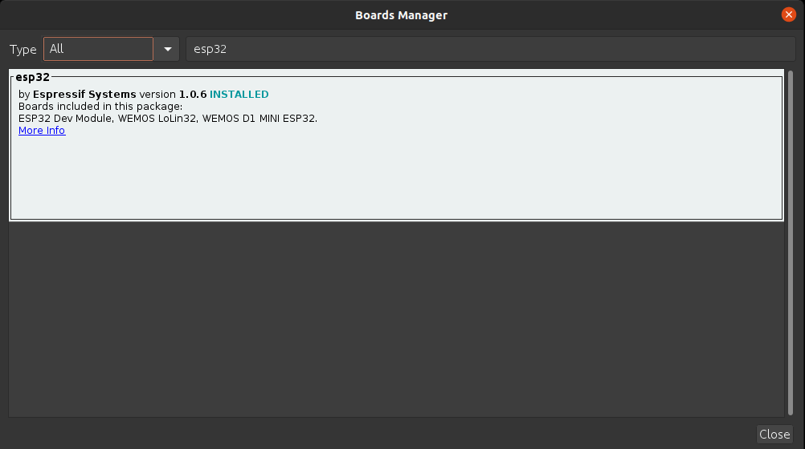
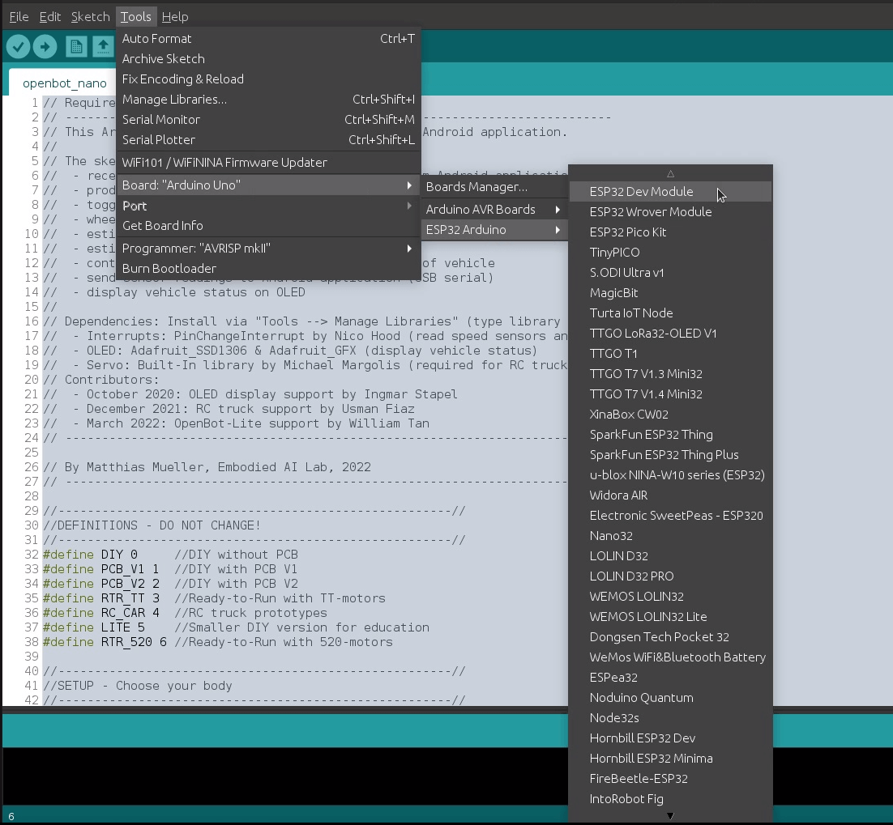

# 펌웨어

  <a href="README.md">English</a> |
  <a href="README.zh-CN.md">简体中文</a> |
  <a href="README.de-DE.md">Deutsch</a> |
  <a href="README.fr-FR.md">Français</a> |
  <a href="README.es-ES.md">Español</a> |
  한국어

우리는 로봇 본체와 스마트폰 간의 다리 역할을 하는 마이크로컨트롤러(MCU)를 사용합니다. 우리는 ATmega328P 마이크로컨트롤러를 탑재한 Arduino Nano용 펌웨어와 ESP32 개발 키트를 위한 [펌웨어](openbot/openbot.ino)를 제공합니다.

## 기능

MCU의 주요 작업은 차량의 저수준 제어를 처리하고 차량에 장착된 센서에서 측정값을 제공합니다. MCU는 차량 제어 및 지시 신호를 직렬 연결을 통해 받습니다. 이를 PWM 신호로 변환하여 모터 제어기에 전달하고, 지시 신호에 따라 LED를 전환합니다. 또한, Arduino 프로그램은 왼쪽과 오른쪽 앞바퀴의 광학 센서에서 발생하는 인터럽트를 계산하여 바퀴 회전을 추적합니다. 배터리 전압은 전압 분배 회로에서 측정된 값으로부터 이동 평균을 사용하여 계산됩니다. 선택적으로 초음파 센서를 사용하여 차량 앞의 장애물까지의 거리를 측정할 수도 있습니다. 이러한 측정값은 직렬 연결을 통해 Android 애플리케이션으로 다시 전송됩니다.

## 초기 설정

먼저 코드 시작 부분에서 하드웨어 구성을 설정해야 합니다. DIY 빌드를 했다면(L298N 모터 드라이버 사용), `OPENBOT DIY`를 설정하세요. 맞춤형 PCB를 사용했다면 버전을 확인하고 `OPENBOT PCB_V1` 또는 `OPENBOT PCB_V2`를 설정하세요. OpenBot 키트를 사용하고 있다면 `OPENBOT RTR_TT`를 설정하세요. RC 트럭을 개조했다면 `OPENBOT RC_CAR`를 설정하세요. 교육용 작은 DIY 버전을 사용하고 있다면 `OPENBOT LITE`를 설정하세요. 520모터를 탑재한 OpenBot Ready-to-Run 키트를 사용하고 있다면 `OPENBOT RTR_520`을 설정하세요. Multi Terrain Vehicle을 만들었다면 `OPENBOT MTV`를 설정해야 합니다. ESP32를 사용하는 `OpenBot DIY`를 실행하려면 `DIY_ESP32`를 설정하세요.

## 블루투스

OpenBot을 블루투스를 통해 실행할 수도 있습니다. 이를 위해 `BLUETOOTH 1`을 설정하여 블루투스를 활성화(비활성화: 0)할 수 있습니다. 블루투스를 사용하려면 ESP32 보드가 장착된 OpenBot이 필요합니다. 예: `(RTR_520, MTV, DIY_ESP32)`.

## 설정

다음으로, 활성화할 기능을 구성해야 합니다. 비활성화된 기능은 메모리를 절약하고 코드를 더 빠르게 만들기 위해 컴파일되지 않습니다. 플래그가 정의되지 않으면 기능이 비활성화됩니다. 각 모델에는 기본 설정이 있으며, 구성에 따라 변경할 필요가 있을 수 있습니다.

- 전압 분배기를 활성화하려면 `HAS_VOLTAGE_DIVIDER 1`을 설정하세요(비활성화: 0). 전압 분배기가 있는 경우 `VOLTAGE_DIVIDER_FACTOR`를 계산하여 설정해야 합니다. 이는 (R1+R2)/R2로 계산됩니다. 또한 `VOLTAGE_MIN`은 모터를 구동할 수 있는 최소 전압, `VOLTAGE_LOW`는 최소 배터리 전압, `VOLTAGE_MAX`는 최대 배터리 전압입니다.
- 지시 LED를 활성화하려면 `HAS_INDICATORS 1`을 설정하세요(비활성화: 0).
- 앞/뒤 속도 센서를 활성화하려면 `HAS_SPEED_SENSORS_FRONT 1` / `HAS_SPEED_SENSORS_BACK 1`을 설정하세요(비활성화: 0).
- 초음파 센서를 활성화하려면 `HAS_SONAR 1`을 설정하세요(비활성화: 0). 초음파 측정값에 대한 중앙값 필터를 활성화하려면 `USE_MEDIAN 1`을 설정하세요(비활성화: 0).
- 충돌을 감지하는 범퍼 센서를 활성화하려면 `HAS_BUMPER 1`을 설정하세요(비활성화: 0).
- OLED 디스플레이를 활성화하려면 `HAS_OLED 1`을 설정하세요(비활성화: 0).
- 앞/뒤/상태 LED를 활성화하려면 `HAS_LEDS_FRONT 1` / `HAS_LEDS_BACK 1` / `HAS_LEDS_STATUS 1`을 설정하세요(비활성화: 0).

### 의존성

속도 센서나 초음파 센서를 활성화한 경우, [PinChangeInterrupt](https://github.com/NicoHood/PinChangeInterrupt) 라이브러리를 설치해야 합니다. Arduino Nano는 두 개의 외부 인터럽트 핀(D2와 D3)만 있으며, D3은 PWM을 지원하는 여섯 개의 핀 중 하나입니다. 다행히도, Arduino에는 모든 핀을 인터럽트로 사용할 수 있도록 포트 인터럽트가 세 개 더 제공됩니다. 이 라이브러리는 이러한 포트 인터럽트를 처리하여 Arduino의 모든 핀을 인터럽트로 사용할 수 있게 해줍니다.

OLED를 활성화한 경우, [Adafruit_SSD1306](https://github.com/adafruit/Adafruit_SSD1306)와 [Adafruit_GFX Library](https://github.com/adafruit/Adafruit-GFX-Library) 라이브러리를 설치해야 합니다.

라이브러리를 설치하는 방법은 다음과 같습니다:

1. 라이브러리 관리자 열기: `도구` :arrow_right: `라이브러리 관리`
2. 검색창에 라이브러리 이름 입력
3. 최신 버전을 선택하고 설치 클릭. 이미 라이브러리를 설치했다면 해당 라이브러리가 표시되며 업데이트할 수 있습니다.

  
   

### 중국산 클론 Nano (예: US 링크)

칩 제조사에서 [WCH340](http://www.wch.cn/product/CH340.html) 드라이버를 다운로드해야 할 수 있습니다 (중국어):

- [Windows](http://www.wch.cn/downloads/CH341SER_EXE.html)
- [Linux](http://www.wch.cn/download/CH341SER_LINUX_ZIP.html)
- [Mac](http://www.wch.cn/download/CH341SER_MAC_ZIP.html)

### ESP32 개발 키트

Arduino IDE에 ESP32 보드를 설치하려면 다음 지침을 따르세요:

1. Arduino IDE에서 **파일 > 환경설정**을 엽니다:

  

2. 아래 그림과 같이 “_추가적인 보드 매니저 URLs_” 필드에 *https://dl.espressif.com/dl/package_esp32_index.json* 를 입력한 후, “OK” 버튼을 클릭합니다:

  

**참고:** 이미 ESP8266 보드 URL이 있는 경우, 다음과 같이 쉼표로 URL을 구분하여 입력할 수 있습니다:

    https://dl.espressif.com/dl/package_esp32_index.json,
    http://arduino.esp8266.com/stable/package_esp8266com_index.json

3. 보드 매니저를 엽니다. **도구 > 보드 > 보드 매니저**로 이동합니다:

  

4. 도구에서 업로드 속도를 115200으로 설정합니다 (ESP32-D0WD-V3 (v3.0 버전)과 같은 최신 ESP-32 칩의 경우):

  

5. ESP32를 검색하고 “ESP32 by Espressif Systems”를 설치합니다:

  

6. 이제 OpenBot의 ESP32 보드를 Arduino 개발 환경을 사용하여 성공적으로 플래시할 준비가 되었습니다:

  

7. 새 코드로 OpenBot을 플래시하려면, **도구 > 보드 > ESP32 Arduino**에서 **ESP32 Dev Module**을 선택하세요. ESP32 플래싱 과정에 대한 추가 내용 및 문제 해결은 [이 링크](https://randomnerdtutorials.com/installing-the-esp32-board-in-arduino-ide-windows-instructions/)에서 확인할 수 있습니다:

  

## 업로드

### 설정 (Arduino Nano 설정)

- `도구` :arrow_right: `보드` :arrow_right: `Arduino AVR 보드` :arrow_right: `Arduino Nano`
- `도구` :arrow_right: `프로세서` :arrow_right: `ATmega328P (구 부트로더)`
- `도구` :arrow_right: `포트` :arrow_right: `*USB 포트를 선택하세요*`

:memo: 참고: 현재 대부분의 저렴한 Arduino Nano 보드는 _구 부트로더_가 탑재되어 있습니다. 그러나 판매자에 따라 새 부트로더가 탑재된 보드를 받을 수도 있습니다. 만약 펌웨어를 업로드할 수 없다면, 프로세서를 _ATmega328P_로 변경해야 할 가능성이 큽니다.

### 설정 (ESP32 설정)

- `도구` :arrow_right: `보드` :arrow_right: `ESP32 Arduino` :arrow_right: `ESP32 Dev 모듈`
- `도구` :arrow_right: `포트` :arrow_right: `*USB 포트를 선택하세요*`

### 펌웨어 업로드

이제 `스케치` :arrow_right: `업로드`를 클릭하거나 업로드 버튼(오른쪽 화살표)을 눌러 펌웨어를 업로드할 수 있습니다.

### 테스트

이 섹션에서는 펌웨어가 성공적으로 플래시된 후, 차량의 모든 기능을 테스트하는 방법을 설명합니다.

1. 다음 사항을 확인합니다:
   1. 바퀴가 차량에 연결되지 않았는지
   2. Arduino가 컴퓨터에 연결되어 있는지
   3. 올바른 USB 포트가 선택되었는지
2. 시리얼 모니터를 엽니다: `도구` :arrow_right: `시리얼 모니터`

#### OpenBot에 메시지 보내기

Arduino에 메시지를 보내려면 상단의 입력 필드에 명령어를 입력한 후 보내기 버튼을 눌러주세요. 다음은 사용 가능한 명령어입니다 (필요한 기능이 로봇에 지원되는 경우):

- `c<left>,<right>` 여기서 `<left>`와 `<right>`는 모두 [-255, 255] 범위에 있습니다. `0`은 모터를 정지시킵니다. `255`는 최대 전압으로 모터를 최대 속도로 전진시킵니다. 값이 낮아질수록 전압과 속도가 비례하여 낮아집니다. 음수 값은 해당 전압을 역극성으로 적용하여 모터를 후진시킵니다.
- `i<left>,<right>` 여기서 `<left>`와 `<right>`는 각각 [0,1] 범위에 있으며 왼쪽과 오른쪽 인디케이터 LED에 해당합니다. 예를 들어, `i1,0`은 왼쪽 인디케이터를 켜고, `i0,1`은 오른쪽 인디케이터를 켭니다. `i1,1`은 두 인디케이터를 모두 켭니다. 활성화된 인디케이터는 1초에 한 번씩 깜빡입니다. `i0,0`은 인디케이터를 끕니다. 한 번에 하나의 상태만 가능합니다.
- `l<front>,<back>` 여기서 `<front>`와 `<back>`는 각각 [0, 255] 범위에 있으며, 앞과 뒤 LED의 밝기를 나타냅니다.
- `s<time_ms>` 여기서 `<time_ms>`는 초음파 센서 측정 간의 시간(기본값 = 1000)을 나타냅니다. 초음파 측정이 완료되면 메시지가 로봇으로 전송됩니다. 만약 타임아웃되면, 지정된 `MAX_SONAR_DISTANCE` 값이 전송됩니다.
- `w<time_ms>` 여기서 `<time_ms>`는 휠 오도메트리 측정 간의 시간(기본값 = 1000)을 나타냅니다. 휠 속도는 지속적으로 모니터링되며, rpm은 지정된 시간 간격 동안 평균값으로 계산됩니다.
- `v<time_ms>` 여기서 `<time_ms>`는 전압 측정 간의 시간(기본값 = 1000)을 나타냅니다. 전압은 지속적으로 모니터링되며 10개의 크기 필터를 사용해 평균이 적용됩니다. 이 명령을 보내면 모터를 구동하기 위한 최소 전압(`vmin:<value>`), 최소 배터리 전압(`vlow:<value>`), 최대 배터리 전압(`vmax:<value>`)을 보고하는 메시지가 트리거됩니다.
- `h<time_ms>` 여기서 `<time_ms>`는 로봇이 새로운 하트비트 메시지를 받지 않으면 정지할 시간(기본값 = -1)을 나타냅니다.
- `b<time_ms>` 여기서 `<time_ms>`는 범퍼 트리거가 리셋되는 시간(기본값 = 750)을 나타냅니다.
- `n<color>,<state>` 여기서 `<color>`는 상태 LED(`b` = 파랑, `g` = 초록, `y` = 노랑)에 해당하고, `state`는 LED의 상태(`0` = 끄기, `1` = 켜기)를 나타냅니다.
- `f`는 OpenBot에게 로봇 유형과 기능을 포함한 메시지를 반환하도록 요청합니다. 예를 들어, 전압 측정(`v`), 인디케이터(`i`), 초음파(`s`), 범퍼 센서(`b`), 휠 오도메트리(`wf`, `wb`), LED(`lf`, `lb`, `ls`) 등이 있습니다. 예를 들어, `RTR_V1` 버전의 OpenBot에 대한 메시지는 다음과 같습니다: `fRTR_V1:v:i:s:b:wf:wb:lf:lb:ls:`.

#### OpenBot에서 메시지 받기

구성에 따라 다양한 메시지를 받을 수 있습니다.

- `v`로 시작하는 메시지는 배터리 전압을 보고합니다. 배터리가 차량에 연결되어 있으면 (즉, 스위치를 켜면) 배터리 전압이 표시되어야 합니다. 배터리를 분리하면 (즉, 스위치를 끄면) 작은 값이 표시됩니다.
- `w`로 시작하는 메시지는 초당 회전수(rpm)로 측정된 속도 센서의 읽기값을 보고합니다. 엔코더 디스크의 각 구멍은 방향에 따라 카운터를 +1 또는 -1씩 증가시킵니다. 구멍의 수는 `DISK_HOLES` 파라미터로 설정할 수 있습니다. 표준 디스크를 사용하는 경우, 휠 한 바퀴에 대해 20회의 카운트가 발생합니다.
- `s`로 시작하는 메시지는 초음파 센서 앞의 예상 자유 공간(센티미터)을 보고합니다.
- `b`로 시작하는 메시지는 충돌을 보고합니다. `lf`(왼쪽 앞), `rf`(오른쪽 앞), `cf`(중앙 앞), `lb`(왼쪽 뒤), `rb`(오른쪽 뒤)는 어떤 센서가 충돌을 감지했는지를 나타냅니다.

#### 테스트 절차

타이어를 제거한 후 진행하세요. 시리얼 모니터를 열고 명령어를 보내며, OpenBot에서 받은 메시지를 확인할 수 있습니다. OLED 디스플레이가 설치되어 있다면, 차량 상태가 더 인간 친화적인 형식으로 표시됩니다. 아래는 차량의 모든 기능을 테스트할 수 있는 절차입니다:

1. **배터리 전압 확인**:
  - 차량을 켜고, `v` 다음에 나오는 숫자를 확인하여 배터리 전압을 확인합니다. 멀티미터로 읽은 값과 비교하고, 필요하다면 `VOLTAGE_DIVIDER_FACTOR`를 조정합니다.

2. **초음파 센서 테스트** (설치된 경우):
  1. 손을 초음파 센서 앞에 두고 앞뒤로 움직여 보세요. `s` 뒤의 숫자가 변경되는 것을 볼 수 있어야 합니다.
  2. 초음파 센서는 진동에 매우 민감하므로, 아래와 같은 테스트로 센서가 안정적으로 작동하는지 확인하세요:
    1. 초음파 센서가 설치된 OpenBot을 최소 200cm 이상의 자유 공간 앞에 두세요. 이때 `200` 이상의 값이 나와야 합니다.
    2. 시리얼 모니터에서 읽은 값을 관찰한 후, `c128,128` 명령어를 입력합니다.
    3. 센서 읽기 값이 크게 변하면, 섀시에서 초음파 센서로 전달되는 진동을 완화해야 할 수 있습니다 (예: 실리콘 추가, 장착 위치 조정).

3. **속도 센서 테스트** (설치된 경우):
  1. 초음파 센서 앞에 충분한 자유 공간이 있는지 확인합니다. `s` 뒤의 값이 기본 `STOP_DISTANCE`인 `10` 이상이어야 합니다.
  2. `c128,128` 명령어를 보내면, 모터가 _느린 속도_ (50% PWM)로 회전하기 시작합니다. 속도 센서의 읽은 값은 `w` 뒤에 나오는 rpm 값으로 나타나며, RTR_TT 버전의 경우 배터리 SOC에 따라 약 250에서 300 사이여야 합니다. DIY 버전이나 배터리가 약한 경우 값이 낮을 수 있습니다. 모든 모터가 전진하고 있으며 속도 센서의 읽은 값이 양수인지 확인합니다.
  3. 다양한 명령을 보내고 속도 센서의 읽은 값을 관찰하세요. 예를 들어, `c-128,-128` 명령어는 모든 모터를 _느린 속도_ (50% PWM)로 후진시킵니다. `c255,-255`는 왼쪽 모터를 전진시키고 오른쪽 모터는 후진시키며, `c-192,192`는 왼쪽 모터를 후진시키고 오른쪽 모터는 전진시킵니다.
  4. `c0,0` 명령어를 보내거나 초음파 센서 앞에 손을 대어 모터를 멈출 수 있습니다.

4. **인디케이터 LED 테스트** (설치된 경우):
  - `i1,0` 명령어를 보내 왼쪽 인디케이터가 깜빡이는지 확인하세요.
  - `i0,1` 명령어를 보내 오른쪽 인디케이터가 깜빡이는지 확인하세요.
  - 마지막으로, `i0,0` 명령어로 인디케이터를 끕니다.

이 절차를 통해 OpenBot의 주요 기능들이 정상적으로 작동하는지 확인할 수 있습니다.

### 전화기 없음 모드

OpenBot 애플리케이션이 설치된 스마트폰으로 차량을 테스트하기 전에, 전화기를 사용하지 않고 차량을 먼저 테스트할 수 있습니다. 간단히 `NO_PHONE_MODE` 옵션을 `1`로 설정하면 됩니다. 이제 차량은 _normal_speed_ (75% PWM)로 주행하며, 초음파 센서가 장애물을 감지하면 속도를 줄입니다. 차량이 `TURN_THRESHOLD` (기본값: 50cm)에 가까워지면 무작위 방향으로 회전하기 시작하고, 그 방향의 LED가 켜집니다. 차량 앞의 추정된 자유 공간이 `TURN_THRESHOLD` 이하로 떨어지면 천천히 후진하고 양쪽 LED가 켜집니다. 차량과 Arduino는 모두 전원이 공급되어야 합니다. Arduino는 5V 핀을 L298N 모터 드라이버의 5V 출력에 연결하거나, USB 케이블을 전원 소스(예: 전화기)에 연결하여 전원을 공급할 수 있습니다.

차량을 실행하기 전에 타이어를 제거하고, Arduino를 컴퓨터에 연결한 후 [테스트](#테스트) 섹션처럼 시리얼 모니터를 관찰하는 것을 권장합니다. 시리얼 모니터의 출력은 해석하기가 좀 더 쉽고 (OLED와 동일), 배터리 전압, 왼쪽과 오른쪽 모터의 rpm, 차량 앞의 추정된 자유 공간을 표시합니다. 초음파 센서 앞에서 큰 물체를 앞뒤로 움직이며 모터의 속도가 변하는 것을 관찰할 수 있습니다.

:warning: 경고: 초음파 센서가 설치되지 않았거나 비활성화된 경우, 차량은 그냥 _normal_speed_ (75% PWM)로 전진하다가 결국 충돌합니다. 센서가 설치되어 있더라도, 센서의 잡음 때문에 차량이 가끔 충돌할 수 있습니다.

## 다른 MCU 사용하기 (요구 사항)

다음 기능을 갖춘 다른 MCU를 사용할 수 있습니다:

- 1x USB-to-TTL 직렬 (스마트폰과의 통신)
- 4x PWM 출력 (모터 제어)
- 1x 아날로그 핀 (배터리 모니터링)
- 2x 디지털 핀 (속도 센서)
- 1x 디지털 핀 (초음파 센서, 선택 사항)
- 2x 디지털 핀 (지시등 LED, 선택 사항)

## 다음

[Android 앱](../android/README.ko-KR.md)을 컴파일하고 실행합니다.
