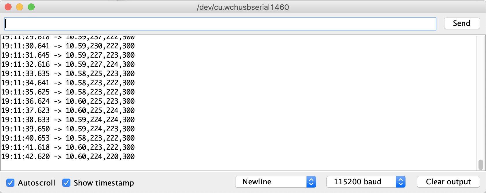

# 固件

<p align="center">
  <a href="README.md">English</a> |
  <span>简体中文</span>
</p>

我们使用单片机（MCU）充当机器人主体和智能手机之间的桥梁。 我们提供带有ATmega328P微控制器的Arduino Nano的 [固件](openbot_v1_nano/openbot_v1_nano.ino) 用于Arduino Nano与ATmega328P单片机。

## 特性

MCU的主要任务是处理车辆的底层控制，并提供来自底层车载传感器的读数。 MCU通过串行连接接收车辆控制和指示信号。 它将控制转换为电机控制器的PWM信号，并根据指示器信号切换LED。 Arduino程序还通过计算左右前轮上光学传感器的中断来跟踪轮盘旋转。 它通过分压器电路上测量值的缩放移动平均值来计算电池电压。 它还可以通过选配的超声波传感器测量到汽车前方障碍物的距离。 这些测量值通过串口发送回Android应用程序。

## 设置

你只需要在一开始设置好你的硬件配置，以便于代码的编写。如果你做了DIY构建（使用L298N电机驱动），设置`OPENBOT DIY`。
如果你使用了定制的PCB，检查版本并设置`OPENBOT PCB_V1`或`OPENBOT PCB_V2`。

## 依赖

如果要使用超声波传感器，需要安装[NewPing](https://playground.arduino.cc/Code/NewPing)库。

```markdown
Tools
└─── Manage Libraries
```

如果要启用超声波传感器，需要设置`HAS_SONAR 1`。

### 中文克隆Nano（例如美国链接）

您可能需要从芯片制造商（中文）下载[WCH340](http://www.wch.cn/product/CH340.html)驱动程序：

- [Windows](http://www.wch.cn/downloads/CH341SER_EXE.html)
- [Linux](http://www.wch.cn/download/CH341SER_LINUX_ZIP.html)
- [Mac](http://www.wch.cn/download/CH341SER_MAC_ZIP.html)

## 上传

### 设置

- `Tools -> Board -> Arduino AVR Boards -> Arduino Nano`
- `Tools -> Processor -> ATmega328P (Old Bootloader)`
- `Tools -> Port ->  选择USB 端口 `

现在可以通过 `Sketch -> Upload `或按上传按钮（右箭头）上传固件。


注意：目前，大多数廉价的Arduino Nano板都带有*Old bootloader*。但是，根据卖家的不同，你也可能会得到一个新的bootloader。所以，如果你无法上传固件，有可能需要将处理器换成*ATmega328P*。

### 测试

本节介绍了固件刷新成功后，如何测试小车的各项功能。

1. 确认
    - 车轮没有连接到汽车上
    - Arduino连接到电脑上
    - 选择正确的USB端口
2. 打开串行监视器：`工具->串行监视器`。

现在您应该看到四个逗号分隔的值，每秒更新一次。



- 第一个值是蓄电池电压。如果您将蓄电池连接到汽车上（即打开开关），它应该显示蓄电池电压。如果您断开蓄电池（即关闭开关），它应该显示一个小值。
- 第二个和第三个值是速度传感器的原始读数。编码器盘上的每个孔都会产生两个计数。您可以通过参数`DISK_HOLES`设置孔的数量。如果您使用的是20个孔的标准盘，那么轮子每转一圈就会有40个计数。因此，如果你把显示的数字除以40，你将得到每秒的转数。
- 第四个值是超声波传感器前的估计可用空间，以cm为单位，默认值为`MAX_DISTANCE`，最大值为`300`。如果禁用超声波传感器，将显示`65535`。

您也可以通过在顶部的输入栏中输入命令，然后按发送键向Arudino发送信息。以下是可用的命令。

- `c<left>,<right>`其中`<left>`和`<right>`都在[-255,255]范围内。`0`值将停止电机。`255`的值是驱动电机全速前进的最大电压。较低的值会导致相应的电压和速度降低。负值应用相应的极性电压，驱动电机反向运行。
- `i<cmd>`其中`<cmd>`的范围是[-1,1]。`-1`值打开左指示灯LED，`1`值打开右指示灯LED。值为`0`则关闭指示灯LED。每次只能有一个状态。

以下测试程序可用于测试该车的所有功能。

1. 打开汽车，观察蓄电池电压。您可以用万用表验证读数，必要时调整`VOLTAGE_DIVIDER_FACTOR`。
2. 如果你安装了超声波传感器。
    a. 将手放在传感器前，前后移动。你应该看到读数有相应的变化。
    b. 确保超声波传感器前面没有任何东西，然后再进行下一步。你应该看到读数为`300`。如果您没有足够的空间，请确保读数至少高于 `STOP_THRESHOLD`，默认为 `64`。
3. 发送命令`c128,128`。电机将以*低速*（50%PWM）开始旋转。速度传感器的读数应该与上图中的数值相似。如果你使用的是DIY版本或电池较弱，数值可能会低一些。检查所有电机是否都在向前旋转。
4. 尝试发送不同的控制，观察速度传感器的读数。例如，命令`c-128,-128`将使所有电机以*低速*（50%PWM）向后旋转。命令`c255,-255`将以*快的速度*(100%PWM)使左电机向前旋转，右电机向后旋转。指令 `c-192,192 `将以*正常速度*(75%PWM)使左电机向后旋转，右电机向前旋转。
5. 将手放在超声波传感器前或发送命令`c0,0`使电机停止。
6. 发送指令`i-1`，观察左侧指示灯闪烁。发送命令`i1`，观察右侧指示灯闪烁。最后，发送命令`i0`，关闭指示灯。

### 无手机模式

在用安装了OpenBot应用的智能手机测试汽车之前，你也可以先测试没有手机的汽车。只需将选项`NO_PHONE_MODE`设置为`1`。汽车现在将以*正常速度*（75%PWM）行驶，当它用超声波传感器检测到障碍物时，会减速。如果它进入`STOP_THRESHOLD`（默认值：64cm）内，它将向右转。注意，汽车和Arduino都需要供电。Arduino可以通过将5V引脚连接到L298N电机驱动器的5V输出端，或者将USB线连接到电源上进行供电。

在让车跑之前，建议先把轮胎拆下来，把Arduino连接到电脑上，像[测试](#测试)一节那样观察串口显示器。输出的数据比较容易理解，可以显示出电池电压、左右电机的转速和车前估计的自由空间。你可以在超声波传感器前来回移动一个大物体，观察电机的速度变化。

警告：如果你没有安装超声波传感器或超声波传感器被禁用，汽车只会以*正常_速度*（75%PWM）向前行驶，会发生碰撞。即使安装了传感器，由于读数有噪音，汽车也会偶尔发生碰撞。

## 使用其他的单片机的需求

您可以使用具有以下功能的任何其他MCU：

- 1个USB到TTL串行（与智能手机通信）
- 4个PWM输出（控制电机）
- 1个模拟ff引脚用于电池监控
- 2个用于速度传感器的数字引脚
- 1个用于超声波传感器的数字引脚（可选）
- 2个用于LED指示灯的数字引脚（可选）

## 下一步

编译并运行[Android App](../android/README_CN.md)

