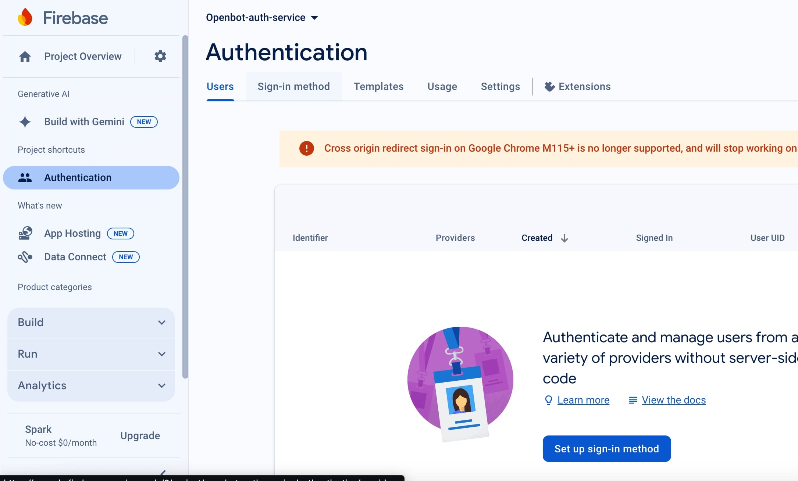
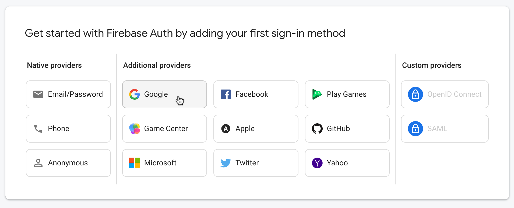

## Google Firebase

<p align="center">
  <a href="README.md">English</a> |
  <a href="README.zh-CN.md">简体中文</a> |
  <a href="README.de-DE.md">Deutsch</a> |
  <a href="README.fr-FR.md">Français</a> |
  <a href="README.es-ES.md">Español</a> |
  <span>한국어</span>
</p>

구글 파이어베이스는 모바일과 웹 애플리케이션 개발을 위한 플랫폼으로, 개발자들이 빠르고 효율적으로 고품질 앱을 만들 수 있도록 도와주는 다양한 서비스와 도구를 제공해요. 실시간 데이터베이스, 사용자 인증, 호스팅, 클라우드 저장소 등 여러 기능들이 하나의 플랫폼에 통합되어 있어요. 파이어베이스는 개발자들이 백엔드 인프라를 쉽게 관리할 수 있도록 돕고, 그들이 멋진 사용자 경험을 만드는 데 집중할 수 있게 해줘요!

- ### Firebase Google 로그인 인증

  Firebase Google 로그인 인증은 사용자가 Google 자격 증명을 사용하여 모바일 또는 웹 앱에 로그인할 수 있게 해주는 Firebase 플랫폼의 기능이에요. 이 서비스는 사용자가 별도의 로그인 자격 증명을 기억하고 관리할 필요 없이 앱에 안전하고 편리하게 접근할 수 있도록 도와줘요. Firebase는 사용자의 신원을 Google로 확인하고, 앱 내에서 사용자의 경험을 개인화할 수 있는 고유한 사용자 ID를 제공하는 등 전체 인증 프로세스를 관리해줘요. 또한 이 기능은 사용자의 계정을 무단 접근으로부터 보호하기 위해 2단계 인증 같은 추가적인 보안 조치도 포함하고 있어요.

- ### 사용법
  이 애플리케이션에서는 Firebase를 사용하여 Google 로그인 인증을 통해 [OpenBot Playground](../../../../open-code/README.md) 프로젝트에 접근해요. 이 프로젝트들은 Google Drive에 업로드되어 있어요.

- ### 참고사항
  이 IOS 애플리케이션을 클론하여 내 장치에서 빌드하려면, [Firebase 설정](../../../../open-code/README.md)을 해줘야 해요. [OpenBot Playground](https://www.playground.openbot.org/) 웹 애플리케이션에 대해서도 설정이 필요해요. 왜냐하면 IOS 앱은 사용자의 Google Drive에서 파일을 가져오는데, 이는 Firebase Google Drive 서비스로 만들어졌기 때문이에요. Google Drive 서비스가 제대로 작동하려면 IOS와 웹 애플리케이션 모두 같은 Firebase 프로젝트를 사용해야 해요.

- ### 필수 조건
  Google 로그인 기능을 위한 Firebase 통합을 IOS OpenBot 애플리케이션에 추가하려면 몇 가지 필수 조건이 필요해요.
- **Google 계정:** Firebase와 Google 로그인을 사용하려면 Google 계정이 필요해요. 만약 계정이 없다면, 여기에서 [Google 계정을 만들 수 있어요](https://accounts.google.com/signup).
- **Cocoapods:** Swift와 Objective-C 프로젝트의 의존성 관리 도구예요. Firebase SDK를 설치하려면 Cocoapods가 시스템에 설치되어 있어야 해요.

### Firebase 프로젝트 설정하기

- [Firebase 콘솔](https://console.firebase.google.com/)에 접속하여 `새 프로젝트`를 만들려면 아래의 단계를 따라주세요.
  1. "프로젝트 만들기" 버튼을 클릭하세요.
  2. Firebase 프로젝트 이름을 입력하세요.
  3. "다음"을 클릭하고, 구글 애널리틱스를 사용하고 싶지 않다면 서비스를 비활성화하세요.
  4. "프로젝트 만들기" 버튼을 클릭하세요.

    <p>
    
    
    
    </p>

- Firebase 프로젝트에 새로운 IOS 앱을 추가하려면 아래의 단계를 따라주세요:
  1. Firebase 프로젝트에서 IOS 아이콘을 클릭하세요.
  2. 앱의 번들 ID를 입력하세요. Xcode 프로젝트에서 사용한 번들 ID와 동일해야 해요.
  3. 앱의 별명을 입력하세요.
  4. "앱 등록" 버튼을 클릭하여 절차를 완료하세요.
  5. GoogleService-Info.plist 파일을 다운로드하여 Xcode 프로젝트에 추가하세요. 이 파일은 앱에서 Firebase를 사용할 때 필요한 설정 정보를 담고 있어요.

     <p>
     
     
     </p>

  6. `다음` 버튼을 클릭하고, 세 번째( Firebase SDK 추가)와 네 번째(초기화 코드 추가) 단계를 건너뛰세요. 이 과정은 이미 완료된 상태랍니다.
  7. Firebase Console로 계속 이동하여 IOS 앱에서 사용할 Firebase 서비스를 설정하세요.

   <p>
     
     
   </p>

- Firebase 프로젝트에서 `Google 로그인 인증`을 활성화하려면, 아래 단계를 따라주세요:
  1. Firebase 콘솔에 가서 프로젝트를 선택하세요.
  2. 왼쪽 `사이드바 메뉴`에서 `모든 제품`을 클릭하세요.
  3. `인증`을 클릭하세요.
  4. `시작하기` 버튼을 클릭하세요.
  5. `Google 아이콘`을 클릭하세요.
  6. `토글 버튼`을 클릭하여 Google 로그인 인증을 `활성화`하세요.

    <p>
    
    
    </p>
    <p>
    
    
    </p>

### iOS 프로젝트 설정

CocoaPods를 사용하여 Firebase SDK를 설치해요. 맥에서 터미널 앱을 열고 Xcode 프로젝트의 루트 디렉토리로 이동해요. 다음 명령어를 실행해서 Xcode 프로젝트의 루트 디렉토리에 Podfile을 생성해 보세요:

```
pod init
```

Podfile을 좋아하는 텍스트 편집기로 열고 파일 끝에 아래의 줄들을 추가해 주세요:

```
  pod 'Firebase/Core'
  pod 'Firebase/Storage'
  pod 'Firebase/Auth'
  pod 'GoogleSignIn'
  pod 'GoogleSignInSwiftSupport'
  pod 'GoogleAPIClientForREST/Drive' 
  ```

Podfile을 저장하고 닫은 다음, Firebase SDK를 설치하려면 아래 명령어를 실행하세요:

  ```
  pod install
```

### 문제 해결

Firebase 설정 과정 중 발생할 수 있는 일반적인 문제들과 그 해결 방법입니다:

```shell
1. CocoaPods 설치 오류: CocoaPods 설치 중에 문제가 발생하거나, pod install이 제대로 실행되지 않거나 Firebase SDK 버전이 올바르게 설치되지 않는 경우, 아래의 해결 방법을 시도해 보세요:
```

- `sudo gem install cocoapods` 명령어를 사용해 CocoaPods 버전을 업데이트하세요.
- Podfile.lock 파일을 삭제하고 pod install을 다시 실행하세요.
- Firebase Console에 지정된 정확한 버전을 사용하여 Podfile에 Firebase SDK pod를 올바르게 추가했는지 확인하세요.

```shell
2. Firebase 설정 오류: Firebase를 제대로 설정할 수 없거나 앱에서 Firebase를 초기화할 수 없는 경우, 아래의 해결 방법을 시도해 보세요:
```

- 이 문서의 "iOS 프로젝트 설정" 섹션에서 모든 단계를 정확히 따라했는지 다시 한 번 확인하세요.
- Firebase 설정 파일(GoogleService-Info.plist)을 Xcode 프로젝트에 제대로 추가했는지 확인하세요.
- Firebase SDK가 Xcode 프로젝트에 제대로 추가되었고 코드에서 임포트가 제대로 되었는지 확인하세요.
- Firebase Console에서 Firebase 프로젝트가 올바르게 설정되었는지, 특히 번들 ID와 기타 프로젝트 설정을 확인하세요.
- 다른 라이브러리와의 충돌: 프로젝트 내에서 다른 라이브러리와 충돌이 발생하는 경우, 예를 들어 종속성이 충돌하거나 SDK 버전이 호환되지 않는 경우, 아래의 해결 방법을 시도해 보세요:
- Podfile에 올바른 Firebase SDK 버전이 지정되었는지 확인하세요.
- 다른 라이브러리들을 최신 버전으로 업데이트하여 문제가 해결되는지 확인하세요.
- 충돌하는 종속성이나 라이브러리 버전이 있는지 확인하고, 충돌하는 라이브러리를 제거하거나 업데이트하여 해결하세요.