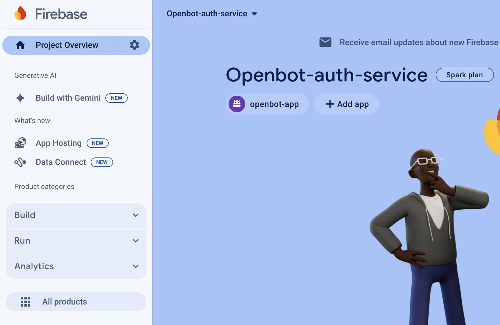

## Google Firebase

Google Firebase is a mobile and web application development platform that offers a variety of services and tools to help
developers build high-quality apps quickly and efficiently. It includes features such as real-time database, user
authentication, hosting, cloud storage and many more, all these are integrated into a single platform. Firebase provides
a convenient and scalable solution for developers to manage their backend infrastructure, allowing them to focus on
building great user experiences.

- ### Firebase Google Sign-In Authentication

  Firebase Google Sign-In Authentication is a feature of the Firebase platform that allows users to sign in to mobile or
  web apps using their Google credentials. This service provides a secure and convenient way for users to access apps
  without having to remember and manage separate login credentials. Firebase manages the entire authentication process,
  from verifying the user's identity with Google to providing a unique user ID that can be used to personalize the user'
  s experience within the app. This feature also includes additional security measures, such as two-factor
  authentication, to help protect user's account from unauthorized access.

- ### Usage
  In this application, we use Firebase for Google Sign-In authentication to
  access [OpenBot Playground](https://github.com/3dwesupport/OpenBot/tree/react-blockly/open-code#readme) projects
  uploaded on Google Drive.

- ### Note
  If you plan to clone this IOS application and build it on your device, it's important to note that you will need
  to [set up Firebase](https://github.com/3dwesupport/OpenBot/tree/react-blockly/open-code#readme) for
  the [OpenBot Playground](https://www.openbot.itinker.io/) web application as well. This is because the IOS app
  retrieves files from the user's Google Drive, which is created by Firebase Google Drive services. It's important to
  use the same Firebase project for both the IOS and web applications for Google Drive services to work properly.

- ### Prerequisites
  To integrate Firebase into an IOS OpenBot application for Google Sign-In, we will need a few prerequisites.
- **Google Account:** To use Google Sign-In with Firebase, you must have a Google account. If you don't have one, click
  here to [create](https://accounts.google.com/signup) free Google account.
- **Cocoapods:** It is a dependency manager for Swift and Objective-C projects. To install the Firebase SDK, you need to
  have Cocoapods installed on your system.

### Set up your Firebase project

- Go to the [Firebase Console](https://console.firebase.google.com/) and create a `new project` following these steps.
    1. Click on the "Create Project" button.
    2. Enter a name for your Firebase project.
    3. Click "Next" and disable Google Analytics services if you don't want to use them.
    4. Click on the "Create Project" button.

    <p>
    
    
    
    </p>

- To add a new IOS app to your Firebase project, do the following:
    1. Click on the IOS icon in the Firebase project.
    2. Enter your app's bundle ID. This should be the same bundle ID as the one used in your Xcode project.
    3. Enter your app's nickname.
    4. Click on the "Register app" button to complete the process.
    5. Download the GoogleService-Info.plist file and add it to your Xcode project. This file contains the configuration
       information needed to use Firebase in your app.

       <p>
       
       
       </p>

    6. Click on the `Next` button and skip the third (Add Firebase SDK) and fourth (Add initialization code) steps as
       it's already done for this project.
    7. Continue to the Firebase Console to configure the Firebase services you want to use in your IOS app.

   <p>
     
     
   </p>

- To `enable Google Sign-In authentication` for your Firebase project, follow these steps:
    1. Go to the Firebase Console and select your project.
    2. Click on the `All products` option in the left `sidebar menu`.
    3. Click on `Authentication`.
    4. Click on the `Get Started` button.
    5. Click on the `Google icon`.
    6. Click on the `toggle button` to `enable` Google Sign-In authentication.

    <p>
    
    
    </p>
    <p>
    
    
    </p>

### Set up the iOS Project

Install the Firebase SDK using CocoaPods. Open the Terminal app on your Mac and navigate to your Xcode project's root
directory. Run the following command to create a Podfile in your Xcode project's root directory:

```
pod init
```

Open the Podfile using your preferred text editor and add the following lines at the end of the file:

```
  pod 'Firebase/Core'
  pod 'Firebase/Storage'
  pod 'Firebase/Auth'
  pod 'GoogleSignIn'
  pod 'GoogleSignInSwiftSupport'
  pod 'GoogleAPIClientForREST/Drive' 
  ```

Save and close the Podfile, then Run the following command to install the Firebase SDKs:

  ```
  pod install
```

### Troubleshooting

Some common issues that may occur during the Firebase configuration process and their solutions:

```shell
1. CocoaPods installation errors: If you encounter issues during the CocoaPods installation, such as pod install failing to run or not installing the correct Firebase SDK version, try the following solutions:
```

- Update your CocoaPods version by running sudo gem install cocoapods.
- Delete the Podfile.lock file and run pod install again.
- Make sure you have added the Firebase SDK pod to your Podfile correctly, using the exact version specified in the
  Firebase Console.

```shell
2. Firebase configuration errors: If you are unable to configure Firebase correctly, such as not being able to initialize Firebase in your app, try the following solutions:
```

- Double-check that you have followed all the steps in the "Set up the iOS Project" section of this document correctly.
- Make sure you have added the Firebase configuration file (GoogleService-Info.plist) to your Xcode project correctly.
- Ensure that the Firebase SDK has been added to your Xcode project correctly and is being imported in your code.
- Verify that your Firebase project is set up correctly in the Firebase Console, including the correct bundle ID and
  other project settings.
- Conflicts with other libraries: If you experience conflicts with other libraries in your project, such as having
  conflicting dependencies or incompatible SDK versions, try the following solutions:
- Ensure that you have specified the correct Firebase SDK version in your Podfile.
- Try updating your other libraries to the latest version to see if the issue is resolved.
- Check for any conflicting dependencies or library versions and try to resolve them by removing or updating the
  conflicting libraries.