# Robot iOS App - Beta-Version

  <a href="README.md">English</a> |
  <a href="README.zh-CN.md">简体中文</a> |
  Deutsch |
  <a href="README.fr-FR.md">Français</a> |
  <a href="README.es-ES.md">Español</a>

## HAFTUNGSAUSSCHLÜSSE

1. **Sicherheit:** Stellen Sie immer sicher, dass Sie in einer sicheren Umgebung arbeiten. Denken Sie daran, dass Ihr Telefon bei einer Kollision beschädigt werden könnte! Besondere Vorsicht ist geboten, wenn Sie automatisierte Steuerungen verwenden (z.B. Personenverfolgung oder Fahrmodus). Stellen Sie sicher, dass Sie immer einen Game-Controller angeschlossen haben und mit der Tastenbelegung vertraut sind, damit Sie das Fahrzeug jederzeit stoppen können. Nutzung auf eigene Gefahr!
2. **App in Entwicklung:** Die Anwendung befindet sich in der Entwicklung und kann je nach Telefonmodell und Betriebssystemversion abstürzen oder unerwartetes Verhalten zeigen. Testen Sie alle Funktionen ohne angeschlossene Räder. Nutzung auf eigene Gefahr!

## App-Bildschirme

### Hauptmenü

Die App startet mit einem Menübildschirm, der alle verfügbaren Bildschirme anzeigt. Der Bluetooth-Verbindungsbildschirm kann durch Klicken auf das Bluetooth-Symbol oben rechts geöffnet werden. Der Einstellungsbildschirm kann durch Klicken auf das daneben befindliche Einstellungssymbol geöffnet werden. Durch Klicken auf die anderen Symbole kann der Benutzer auf verschiedene Bildschirme zugreifen, deren Funktionen in den folgenden Abschnitten erklärt werden.

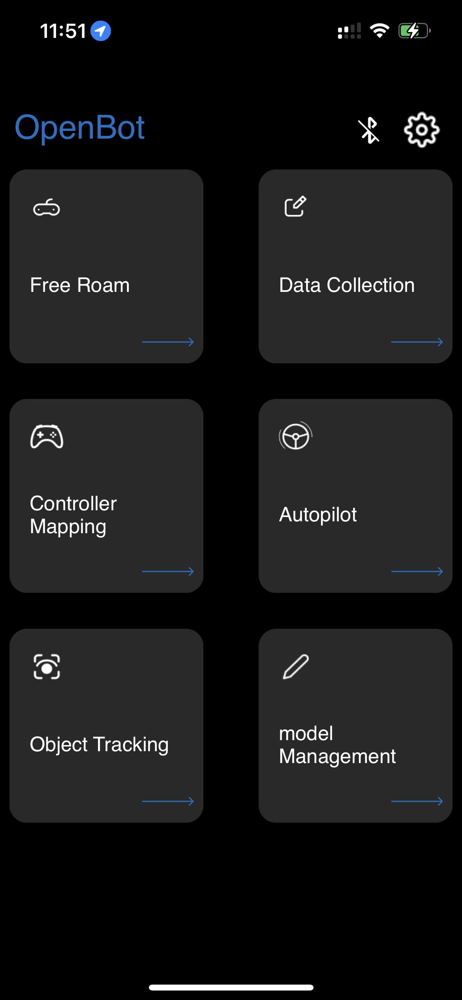
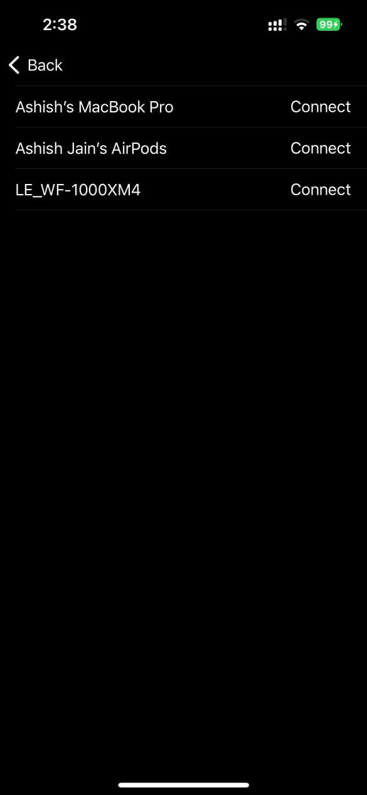
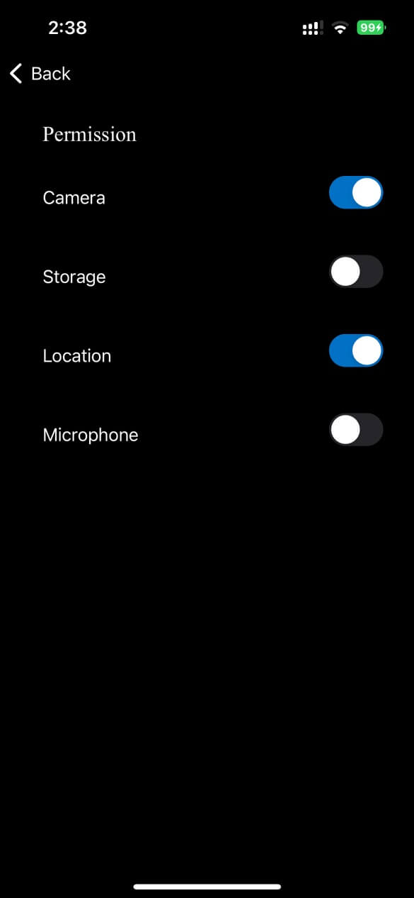

#### Bluetooth-Verbindung

Im Gegensatz zur Android-App, die es ermöglicht, das Smartphone über ein USB-Kabel mit der Low-Level-Steuerplatine eines OpenBot zu verbinden, verlässt sich die iOS-App ausschließlich auf eine Bluetooth Low-Energy (BLE) Drahtlosverbindung. Beim Öffnen des Bluetooth-Verbindungsbildschirms in der iOS-Anwendung (durch Klicken auf das Bluetooth-Logo vom Hauptbildschirm oder von jedem Fragment aus) wird eine Liste aller kompatiblen Geräte angezeigt. Die Kompatibilität wird hier durch die Verwendung einer Reihe spezifischer UUIDs gewährleistet, die einem OpenBot-Fahrzeug sowohl auf der [App](https://github.com/3dwesupport/OpenBot/blob/090dcb28206195a7ee45a13b8ded968a8d365abe/ios/OpenBot/OpenBot/Utils/Constants.swift#L57)- als auch auf der [Firmware](https://github.com/3dwesupport/OpenBot/blob/090dcb28206195a7ee45a13b8ded968a8d365abe/firmware/openbot_nano/openbot_nano.ino#L115)-Ebene zugewiesen sind. Sie müssen sicherstellen, dass diese UUIDs übereinstimmen. Das Koppeln eines iOS-Geräts mit einem OpenBot-Fahrzeug erfordert dann lediglich die Auswahl dieses Fahrzeugs aus der Liste und das Drücken der "Verbinden"-Taste. Die Standard-Baudrate für die Verbindung ist auf 115200 eingestellt und kann auf App- und Firmware-Ebene geändert werden.

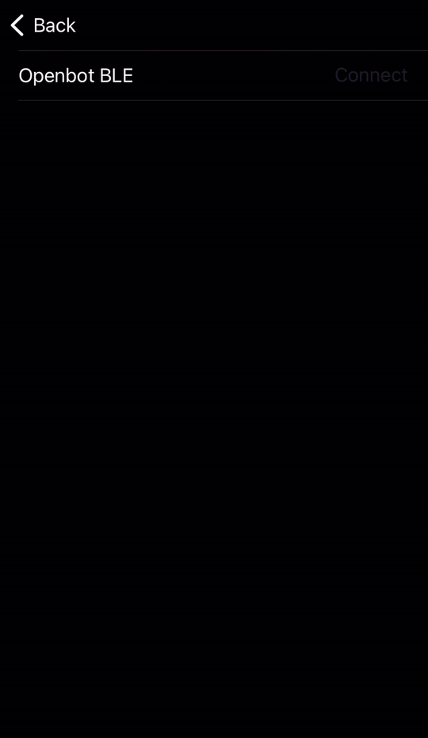

### Freies Fahren

Freies Fahren bietet einfache Robotersteuerung mit Echtzeit-Updates und Informationen über Batterie, Geschwindigkeit und Abstand zu Oberflächen. Es bietet auch Steuerungen im Zusammenhang mit Controller, Fahrmodus und Geschwindigkeit.

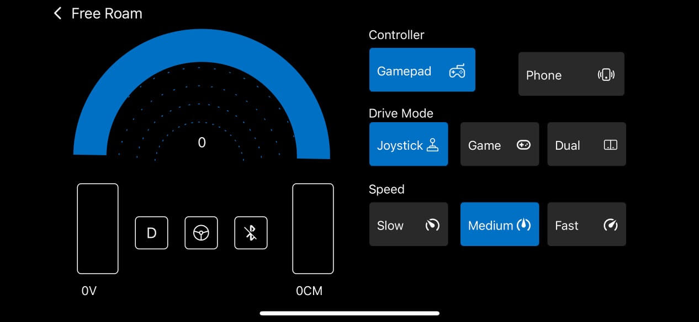

- **Batterie**: Das Batteriesymbol zeigt die Echtzeit-Batteriestände des verbundenen Roboters an.

- **Fahrmodus**: Es gibt 3 Fahrmodi, die auf der Ansicht angezeigt werden:

    - D -> Fahren, wenn der Roboter vorwärts fährt

    - N -> Neutral, wenn der Roboter stillsteht

    - R -> Rückwärts, wenn der Roboter rückwärts fährt

- **Geschwindigkeit**: Der Tachometer zeigt die Echtzeit-Geschwindigkeit des Roboters an.

- **Sonar**: Die Sonaransicht zeigt den Abstand des Roboters zu einem entgegenkommenden Objekt in cm.

- **Bluetooth**: Zeigt den Status der Bluetooth-Verbindung mit dem Mikrocontroller an. Durch Tippen auf das Symbol kann der Benutzer auch zum Bluetooth-Bildschirm weitergeleitet werden, um die Verbindung anzuzeigen/zu ändern.

#### Steuerung

Die erste Taste dient zur Auswahl des **Steuermodus**. Es gibt zwei verschiedene Steuermodi:

- **Gamepad**: Die App empfängt Steuerungen von einem verbundenen BT-Controller.
- **Telefon (Demnächst)**: Der Roboter kann über ein anderes Smartphone mit installierter Controller-App oder über ein Python-Skript gesteuert werden, das auf einem Computer im selben Netzwerk läuft.

Die zweite Taste dient zur Auswahl des **Fahrmodus**. Es gibt drei verschiedene Fahrmodi bei Verwendung eines Game-Controllers (z.B. PS4):

- **Spiel**: Verwenden Sie die rechten und linken Schultertasten (R2, L2) für Vorwärts- und Rückwärtsschub und einen der Joysticks zum Lenken. Dieser Modus imitiert den Steuerungsmodus von Autorennspielen.
- **Joystick**: Verwenden Sie einen der Joysticks, um den Roboter zu steuern.
- **Dual**: Verwenden Sie den linken und rechten Joystick, um die linke und rechte Seite des Autos zu steuern. Dies ist eine rohe Differentiallenkung.

Die dritte Taste dient zur Auswahl des **Geschwindigkeitsmodus**. Es gibt drei verschiedene Geschwindigkeitsmodi:

- **Langsam**: Die Spannung, die an die Motoren angelegt wird, ist auf 50% der Eingangsspannung (~6V) begrenzt.
- **Normal**: Die Spannung, die an die Motoren angelegt wird, ist auf 75% der Eingangsspannung (~9V) begrenzt.
- **Schnell**: Es gibt keine Begrenzung. Die volle Eingangsspannung wird bei Vollgas an die Motoren angelegt (~12V). *Dies ist die Standardeinstellung für den Betrieb der neuronalen Netze.*

Das Fahren mit höheren Geschwindigkeiten verkürzt die Lebensdauer der Motoren, macht aber mehr Spaß. Die Steuerungen, die an den Roboter gesendet werden, werden auf der rechten Seite angezeigt. Bei Verwendung des Game-Controllers kann der Geschwindigkeitsmodus durch Drücken des rechten Joysticks (R3) erhöht und durch Drücken des linken Joysticks (L3) verringert werden.

### Datenerfassung

Einfache Benutzeroberfläche zur Sammlung von Datensätzen.

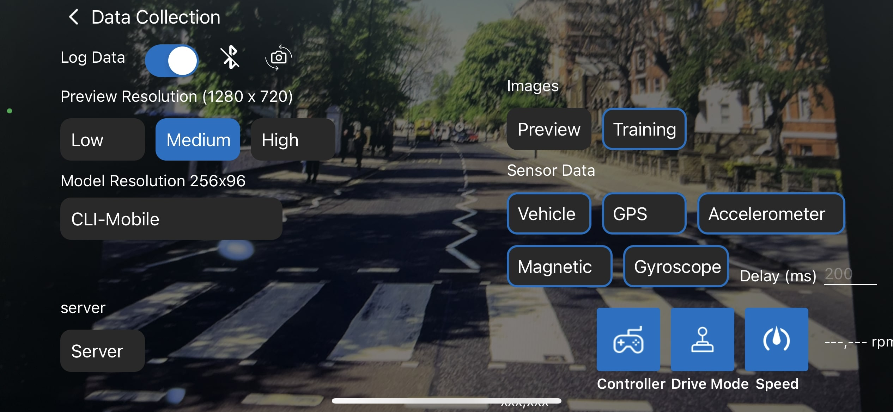

- **Vorschauauflösung**: Wird verwendet, um zwischen den Auflösungen der Kameravorschau zu wechseln. Es gibt 3 Einstellungen:

    - ***HOCH*** (1920x1080p)

    - ***MITTEL*** (1280x720p)

    - ***NIEDRIG*** (640x360)

- **Modellauflösung**: Wird verwendet, um zwischen den Auflösungen der für das Training verschiedener Modelle gespeicherten Bilder zu wechseln.

- **Gesammelte Daten protokollieren**: Der Datenerfassungsprozess kann vom Bildschirm oder aus der Ferne, z.B. von einem Bluetooth-Controller, gesteuert werden. Bei Verwendung eines Bluetooth-Controllers können Sie:

    - die **A-Taste** drücken, um den Datenerfassungsprozess zu **starten**

    - die **A-Taste erneut drücken**, um die Datenerfassung zu **stoppen** und die gesammelten Daten in einer .zip-Datei zu speichern

    - alternativ die **R1-Taste** drücken, um die Datenerfassung **ohne Speichern** der gesammelten Daten zu **stoppen** (z.B. aufgrund einer unerwarteten Kollision mit der Umgebung)

    - denken Sie daran, das Controller-Mapping-Fragment zu verwenden, um sicherzustellen, dass Sie die richtigen Tasten verwenden.

- **Fahrzeugstatus**: Das Feld **Batterie** zeigt die Batteriespannung an, die vom Mikrocontroller über den Spannungsteiler gemessen wird. Das Feld **Geschwindigkeit (l,r)** gibt die linke und rechte Geschwindigkeit der (vorderen) Räder in U/min an. Es wird vom Mikrocontroller über die optischen Raddrehzahlsensoren gemessen. Das Feld **Sonar** zeigt den freien Raum vor dem Auto in Zentimetern an. Es wird vom Mikrocontroller über den Ultraschallsensor gemessen. Beachten Sie, dass Sie Werte erst einige Sekunden nach dem Herstellen der USB-Verbindung erhalten.

- **Sensoren**: Meldet Messungen von Fahrzeugsensoren. Derzeit erfassen wir Messwerte von folgenden Sensoren: Kamera, Gyroskop, Beschleunigungsmesser, Magnetometer, Umgebungslichtsensor und Barometer. Mithilfe der iOS-API können wir die folgenden Sensormesswerte erhalten: RGB-Bilder, Winkelgeschwindigkeit, lineare Beschleunigung, Schwerkraft, Magnetfeldstärke, Lichtintensität, atmosphärischer Druck, Breitengrad, Längengrad, Höhe, Peilung und Geschwindigkeit. Zusätzlich zu den Telefonsensoren erfassen wir Messwerte von Körpersensoren (Raddrehzahl, Hindernisabstand und Batteriespannung), die über die serielle Verbindung übertragen werden. Wir erfassen auch und stempeln Steuersignale, die von einem verbundenen Controller empfangen werden, falls vorhanden. Schließlich integrieren wir mehrere neuronale Netze für die Personenverfolgung und autonome Navigation.

### Controller-Mapping

Einfache Benutzeroberfläche zur Überprüfung der Tasten- und Joystick-Belegung eines verbundenen BT-Controllers.

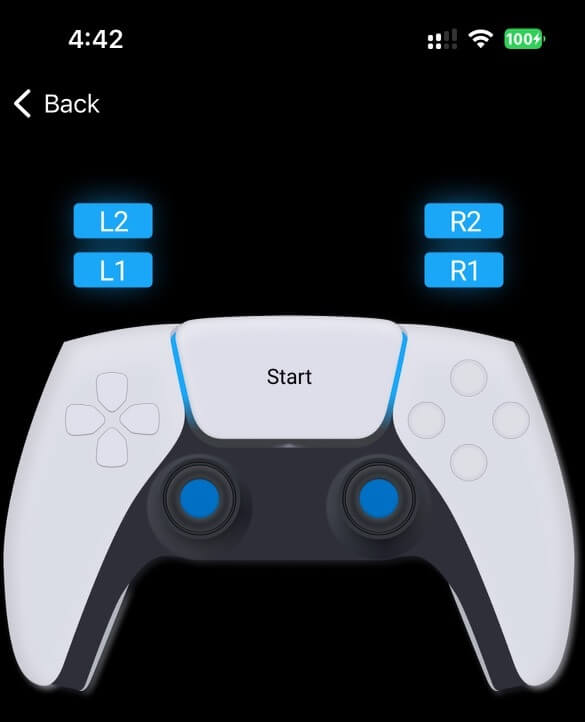

### Roboter-Info

Einfache Benutzeroberfläche, um Roboterinformationen zu erhalten und grundlegende Funktionen zu testen. Der **Robotertyp**, wie in der Firmware konfiguriert, wird als Text und Animation angezeigt. Die Häkchen in den Abschnitten **Sensoren**, **Raddrehzahl** und **LEDs** zeigen, welche Funktionen vom verbundenen Roboter unterstützt werden. Der Abschnitt **Messwerte** liefert die wichtigsten Sensormessungen. Im Abschnitt **Befehle senden** können Benutzer grundlegende Motorbefehle durch Drücken der entsprechenden Tasten senden und die vorderen und hinteren LEDs mit einem Schieberegler steuern.

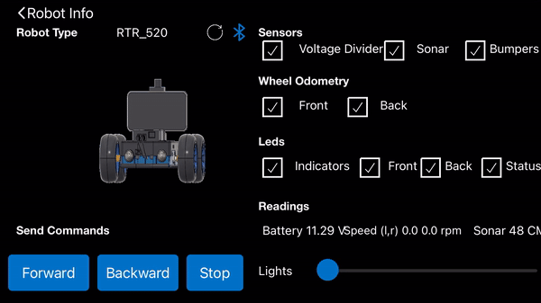

### Autopilot

Einfache Benutzeroberfläche zum Ausführen von Autopilot-Modellen.

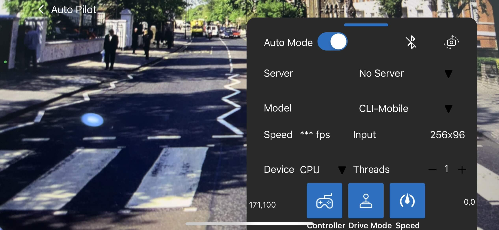

### Objektverfolgung

Einfache Benutzeroberfläche zur Verfolgung von Objekten aus 80 verschiedenen Klassen. Eine kurze Beschreibung der verschiedenen KI-Modelle zur Objektverfolgung und Leistungsbenchmarks finden Sie im Abschnitt [Modellverwaltung](#modellverwaltung).

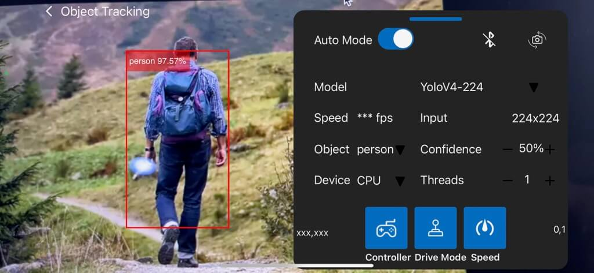

### Modellverwaltung

Alle Modelle sind quantisiert, um eine bessere Leistung auf eingebetteten Geräten zu erzielen. Beachten Sie, dass Modelle mit größerer Eingangsauflösung trotz niedrigerer mAP besser für kleinere Objekte geeignet sein können.

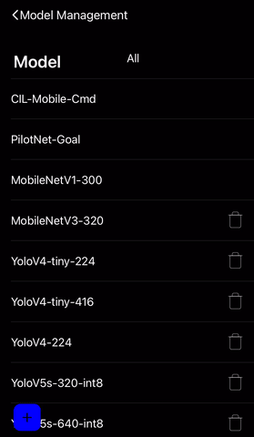

## Code-Struktur

Die [TensorFlow Lite Object Detection iOS Demo](https://github.com/tensorflow/examples/tree/master/lite/examples/object_detection/ios) wurde als Ausgangspunkt verwendet, um TFLite-Modelle zu integrieren und den Kamerafeed zu erhalten. Der [tflite](OpenBot/tflite)-Ordner enthält die Modelldefinitionen für die [Autopilot](OpenBot/tflite/Autopilot.swift)- und [Detektor](OpenBot/tflite/Detector.swift)-Netzwerke.

## Nächstes (optional)

Trainieren Sie Ihre eigene [Fahrstrategie](../../policy/README.md)
