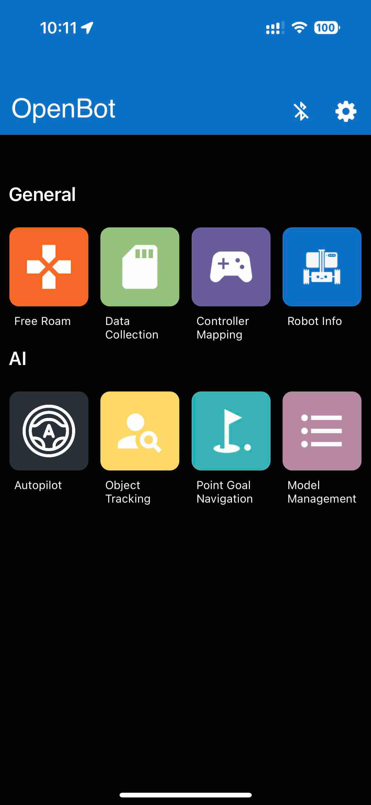

# Application iOS Robot - Version Bêta

  <a href="README.md">English</a> |
  <a href="README.zh-CN.md">简体中文</a> |
  <a href="README.de-DE.md">Deutsch</a> |
  Français |
  <a href="README.es-ES.md">Español</a>

## AVERTISSEMENTS

1. **Sécurité :** Assurez-vous toujours d'opérer dans un environnement sûr. Gardez à l'esprit que votre téléphone pourrait être endommagé en cas de collision ! Une attention particulière est nécessaire lors de l'utilisation du contrôle automatisé (par exemple, suivi de personne ou politique de conduite). Assurez-vous d'avoir toujours une manette de jeu connectée et de bien connaître la configuration des touches afin de pouvoir arrêter le véhicule à tout moment. Utilisez à vos propres risques !
2. **Application en développement :** L'application est en cours de développement et peut planter ou présenter un comportement inattendu selon le modèle de votre téléphone et la version du système d'exploitation. Assurez-vous de tester toutes les fonctionnalités sans roues connectées. Utilisez à vos propres risques !

## Écrans de l'application

### Menu Principal

L'application démarre avec un écran de menu qui affiche tous les écrans disponibles. L'écran de connexion Bluetooth peut être ouvert en cliquant sur l'icône Bluetooth en haut à droite. L'écran des paramètres peut être ouvert en cliquant sur l'icône des paramètres juste à côté. En cliquant sur les autres icônes, l'utilisateur peut accéder à divers écrans dont les fonctionnalités sont expliquées dans les sections suivantes.

#### Connexion Bluetooth

Contrairement à l'application Android, qui permet de connecter le smartphone à la carte de contrôle bas niveau d'un OpenBot via un câble USB, l'application iOS repose uniquement sur une connexion sans fil Bluetooth Low-Energy (BLE). En ouvrant l'écran de connexion Bluetooth dans l'application iOS (en cliquant sur le logo Bluetooth depuis l'écran principal ou depuis n'importe quel fragment), une liste de tous les appareils compatibles est affichée. La compatibilité est ici assurée en utilisant une gamme de UUID spécifiques attribués à un véhicule OpenBot au niveau de l'[application](https://github.com/3dwesupport/OpenBot/blob/090dcb28206195a7ee45a13b8ded968a8d365abe/ios/OpenBot/OpenBot/Utils/Constants.swift#L57) et du [firmware](https://github.com/3dwesupport/OpenBot/blob/090dcb28206195a7ee45a13b8ded968a8d365abe/firmware/openbot_nano/openbot_nano.ino#L115). Vous devez vous assurer que ces UUID correspondent. Appairer un appareil iOS à un véhicule OpenBot nécessite simplement de sélectionner ce véhicule dans la liste et d'appuyer sur le bouton "Connecter". Le débit par défaut de la connexion est fixé à 115200 et peut être modifié au niveau de l'application et du firmware.

### Libre Circulation

Libre Circulation offre un contrôle simple du robot avec des mises à jour en temps réel et des informations sur la batterie, la vitesse et la distance par rapport aux surfaces. Il offre également des contrôles liés au contrôleur, au mode de conduite et à la vitesse.

- **Batterie** : L'icône de la batterie montre les niveaux de batterie en temps réel du robot connecté.

- **Mode de Conduite** : Il y a 3 modes de conduite affichés sur la vue :

    - D -> Conduite, lorsque le robot avance

    - N -> Neutre, lorsque le robot est à l'arrêt

    - R -> Marche arrière, lorsque le robot recule

- **Vitesse** : Le compteur de vitesse montre la vitesse en temps réel du robot.

- **Sonar** : La vue sonar montre la distance du robot par rapport à un objet en approche en cm.

- **Bluetooth** : Montre l'état de la connexion Bluetooth avec le microcontrôleur. En appuyant sur l'icône, l'utilisateur peut également être redirigé vers l'écran Bluetooth pour voir/modifier la connexion.

#### Contrôle

Le premier bouton sert à sélectionner le **mode de contrôle**. Il existe deux modes de contrôle différents :

- **Manette de jeu** : L'application reçoit les commandes d'un contrôleur BT connecté.
- **Téléphone (Bientôt disponible)** : Le robot peut être contrôlé via un autre smartphone avec l'application de contrôle installée ou via un script Python exécuté sur un ordinateur connecté au même réseau.

Le deuxième bouton sert à sélectionner le **mode de conduite**. Il existe trois modes de conduite différents lors de l'utilisation d'une manette de jeu (par exemple, PS4) :

- **Jeu** : Utilisez les gâchettes d'épaule droite et gauche (R2, L2) pour l'accélération avant et arrière et l'un des joysticks pour la direction. Ce mode imite le mode de contrôle des jeux vidéo de course automobile.
- **Joystick** : Utilisez l'un des joysticks pour contrôler le robot.
- **Double** : Utilisez le joystick gauche et le joystick droit pour contrôler les côtés gauche et droit de la voiture. C'est une direction différentielle brute.

Le troisième bouton sert à sélectionner le **mode de vitesse**. Il existe trois modes de vitesse différents :

- **Lent** : La tension appliquée aux moteurs est limitée à 50 % de la tension d'entrée (~6V).
- **Normal** : La tension appliquée aux moteurs est limitée à 75 % de la tension d'entrée (~9V).
- **Rapide** : Il n'y a pas de limite. La tension d'entrée complète sera appliquée aux moteurs à pleine accélération (~12V). *C'est le réglage par défaut pour exécuter les réseaux neuronaux.*

Rouler à des vitesses plus élevées réduira la durée de vie des moteurs mais est plus amusant. Les commandes envoyées au robot sont affichées sur le côté droit. Lors de l'utilisation de la manette de jeu, le mode de vitesse peut être augmenté en appuyant sur le joystick droit (R3) et diminué en appuyant sur le joystick gauche (L3).

### Collecte de Données

Interface utilisateur simple pour la collecte de jeux de données.

- **Résolution de Prévisualisation** : Utilisée pour basculer entre les résolutions de prévisualisation de la caméra. Il y a 3 réglages :

    - ***HAUTE*** (1920x1080p)

    - ***MOYENNE*** (1280x720p)

    - ***BASSE*** (640x360)

- **Résolution du Modèle** : Utilisée pour basculer entre les résolutions des images enregistrées pour l'entraînement de différents modèles.

- **Journaliser les Données Collectées** : le processus de collecte de données peut être contrôlé depuis l'écran ou à distance, par exemple depuis un contrôleur Bluetooth. Lors de l'utilisation d'un contrôleur Bluetooth, vous pouvez :

    - appuyer sur le **bouton A** pour **démarrer** le processus de collecte de données

    - appuyer à nouveau sur le **bouton A** pour **arrêter** la collecte de données et enregistrer les données collectées dans un fichier .zip

    - appuyer alternativement sur le **bouton R1** pour **arrêter** la collecte de données **sans enregistrer** les données collectées (par exemple en raison d'une collision inattendue avec l'environnement)

    - n'oubliez pas d'utiliser le fragment de mappage du contrôleur pour vous assurer que vous utilisez les bons boutons.

- **État du Véhicule** : Le champ **Batterie** affiche la tension de la batterie mesurée par le microcontrôleur via le diviseur de tension. Le champ **Vitesse (g,d)** rapporte la vitesse gauche et droite des roues (avant) en tr/min. Elle est mesurée par le microcontrôleur via les capteurs de vitesse des roues optiques. Le champ **Sonar** montre l'espace libre devant la voiture en centimètres. Il est mesuré par le microcontrôleur via le capteur ultrasonique. Notez que vous ne recevrez des valeurs que quelques secondes après l'établissement de la connexion USB.

- **Capteurs** : Rapporte les mesures des capteurs du véhicule. Actuellement, nous enregistrons les lectures des capteurs suivants : caméra, gyroscope, accéléromètre, magnétomètre, capteur de lumière ambiante et baromètre. En utilisant l'API iOS, nous sommes en mesure d'obtenir les lectures de capteurs suivantes : images RGB, vitesse angulaire, accélération linéaire, gravité, intensité du champ magnétique, intensité lumineuse, pression atmosphérique, latitude, longitude, altitude, cap et vitesse. En plus des capteurs du téléphone, nous enregistrons les lectures des capteurs du corps (odométrie des roues, distance des obstacles et tension de la batterie), qui sont transmises via le lien série. Nous enregistrons également et horodatons les signaux de contrôle reçus d'un contrôleur connecté, le cas échéant. Enfin, nous intégrons plusieurs réseaux neuronaux pour le suivi de personne et la navigation autonome.

### Mappage du Contrôleur

Interface utilisateur simple pour vérifier le mappage des boutons et des joysticks d'un contrôleur BT connecté.

### Infos sur le Robot

Interface utilisateur simple pour obtenir des informations sur le robot et tester les fonctionnalités de base. Le **Type de Robot** tel que configuré dans le firmware est affiché sous forme de texte et d'animation. Les coches dans les sections **Capteurs**, **Odométrie des Roues** et **LEDs** montrent quelles fonctionnalités sont prises en charge par le robot connecté. La section **Lectures** fournit les mesures de capteurs les plus importantes. Dans la section **Envoyer des Commandes**, les utilisateurs peuvent envoyer des commandes de moteur de base en appuyant sur les boutons correspondants et contrôler les LEDs avant et arrière avec un curseur.

### Pilote Automatique

Interface utilisateur simple pour exécuter des modèles de pilote automatique.

### Suivi d'Objets

Interface utilisateur simple pour suivre des objets de 80 classes différentes. Une brève description des différents modèles d'IA pour le suivi d'objets et des benchmarks de performance peut être trouvée dans [Gestion des Modèles](#gestion-des-modèles).

### Gestion des Modèles

Tous les modèles sont quantifiés pour de meilleures performances sur les appareils embarqués. Notez que les modèles avec une résolution d'entrée plus grande peuvent être meilleurs pour les petits objets malgré un mAP inférieur.

## Structure du Code

Le [TensorFlow Lite Object Detection iOS Demo](https://github.com/tensorflow/examples/tree/master/lite/examples/object_detection/ios) a été utilisé comme point de départ pour intégrer les modèles TFLite et obtenir le flux de la caméra. Le dossier [tflite](OpenBot/tflite) contient les définitions de modèles pour les réseaux [Pilote Automatique](OpenBot/tflite/Autopilot.swift) et [Détecteur](OpenBot/tflite/Detector.swift).

## Prochaines Étapes (optionnel)

Entraînez votre propre [Politique de Conduite](../../policy/README.md)