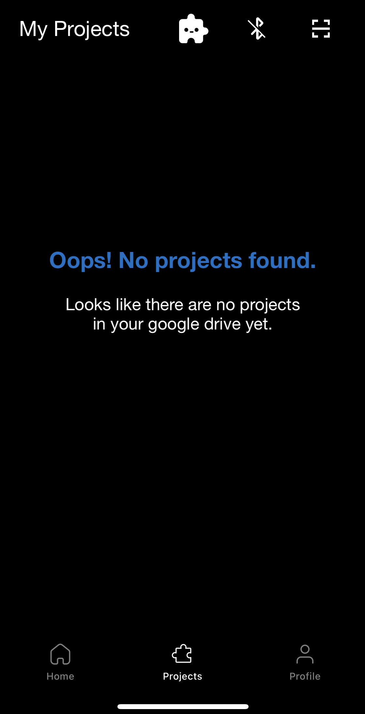
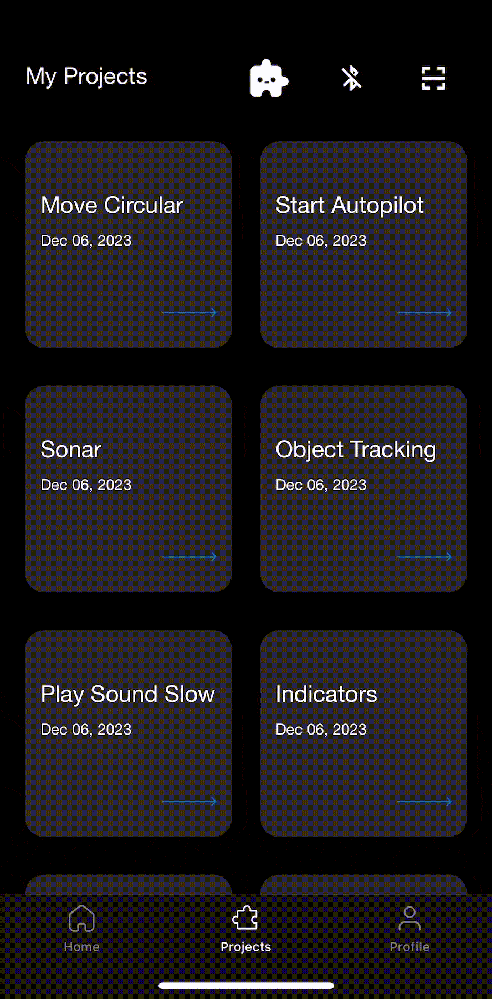
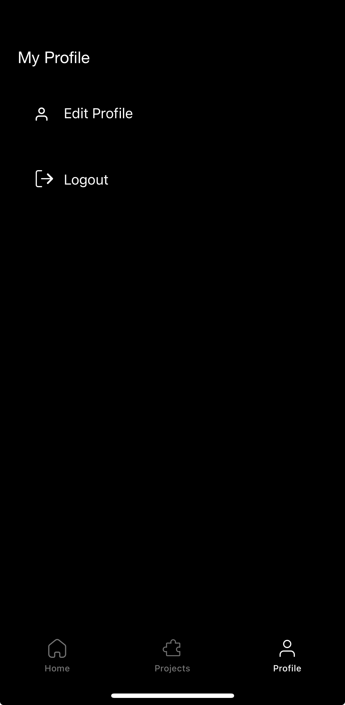

# Robot iOS App - Beta Release

  <a href="README.md">English</a> |
  <a href="README.zh-CN.md">简体中文</a> |
  <a href="README.de-DE.md">Deutsch</a> |
  <a href="README.fr-FR.md">Français</a> |
  <a href="README.es-ES.md">Español</a> |
  한국어 

## 디스클레이머

1. **안전:** 항상 안전한 환경에서 사용하세요! 충돌 시 휴대폰이 손상될 수 있다는 점을 기억하세요. 자동 제어 기능(예: 사람 따라가기 또는 주행 정책)을 사용할 때는 특히 주의가 필요합니다. 언제든 차량을 멈출 수 있도록 게임 컨트롤러를 항상 연결하고 키 매핑에 익숙해져 있어야 합니다. 모든 사용은 사용자 책임입니다!

2. **앱 개발 중:** 이 앱은 아직 개발 중이며, 휴대폰 모델이나 운영체제 버전에 따라 충돌하거나 예기치 못한 동작을 할 수 있습니다. 바퀴를 연결하지 않은 상태에서 모든 기능을 테스트해 보세요. 모든 사용은 사용자 책임입니다!

3. **앱은 곧 `App Store`에서 `사용 가능`할 예정입니다.**

## 앱 화면

### 메인 메뉴

앱은 모든 사용 가능한 화면을 보여주는 메뉴 화면으로 시작해요. 오른쪽 상단에 있는 Bluetooth 아이콘을 클릭하면 Bluetooth 연결 화면이 열려요. 바로 옆에 있는 설정 아이콘을 클릭하면 설정 화면으로 이동할 수 있어요. 다른 아이콘을 클릭하면 다양한 화면으로 이동할 수 있는데, 이 화면들의 기능은 다음 섹션에서 설명할게요!

앱 하단에는 `홈, 프로젝트, 프로필` 탭이 있는 탭 바가 표시돼요. 기본적으로 홈 탭이 표시돼요. 사용자가 로그인한 상태라면, Google Drive의 "openbot-opencode" 폴더에 저장된 모든 프로젝트가 프로젝트 탭에 나열돼요. 프로필 탭에서는 사용자 프로필 확인과 로그아웃을 할 수 있는 버튼이 있어요.

#### 블루투스 연결

안드로이드 앱은 스마트폰을 OpenBot의 저레벨 컨트롤 보드에 USB 케이블로 연결할 수 있는 반면, iOS 앱은 `오직` 블루투스 저에너지(BLE) 무선 연결만 사용해요. iOS 앱에서 블루투스 연결 화면을 열면(메인 화면이나 다른 화면에서 블루투스 로고를 클릭하면 돼요), 호환 가능한 모든 장치의 목록이 표시돼요. 여기서 호환성은 OpenBot 차량에 특정 UUID 범위를 할당해서 [앱](https://github.com/isl-org/OpenBot/blob/090dcb28206195a7ee45a13b8ded968a8d365abe/ios/OpenBot/OpenBot/Utils/Constants.swift#L57)과 [펌웨어](https://github.com/isl-org/OpenBot/blob/090dcb28206195a7ee45a13b8ded968a8d365abe/firmware/openbot_nano/openbot_nano.ino#L115) 수준에서 확인된답니다. 이 UUID들이 일치하는지 꼭 확인해야 해요!

iOS 기기를 OpenBot 차량과 연결하려면, 목록에서 차량을 선택하고 "Connect" 버튼을 누르기만 하면 돼요. 기본 전송 속도(baud rate)는 115200으로 설정되어 있지만, 앱과 펌웨어에서 변경할 수 있어요.

### 자유 주행

자유 주행 모드는 간단한 로봇 제어와 함께 배터리 상태, 속도, 표면과의 거리 등에 대한 실시간 업데이트와 정보를 제공합니다. 또한 컨트롤러, 주행 모드, 속도와 관련된 다양한 제어 기능도 제공합니다.

- **배터리**: 배터리 아이콘은 연결된 로봇의 실시간 배터리 상태를 보여줍니다.

- **주행 모드**: 화면에는 3가지 주행 모드가 표시됩니다:

  - D -> **Drive**: 로봇이 앞으로 움직일 때
  - N -> **Neutral**: 로봇이 정지 상태일 때
  - R -> **Reverse**: 로봇이 뒤로 움직일 때

- **속도**: 속도계는 로봇의 실시간 속도를 보여줍니다.

- **소나**: 로봇이 물체와 떨어진 거리를 센티미터(cm) 단위로 보여줍니다.

- **블루투스**: 마이크로컨트롤러와의 블루투스 연결 상태를 표시합니다. 아이콘을 누르면 블루투스 화면으로 이동해 연결 상태를 확인하거나 수정할 수 있습니다.

#### 제어

첫 번째 버튼은 **제어 모드**를 선택하는 버튼이에요. 두 가지 다른 제어 모드가 있어요:

- **게임패드**: 연결된 BT 컨트롤러에서 제어 신호를 받는 모드예요.
- **폰**: 다른 스마트폰에서 컨트롤러 앱을 통해 로봇을 제어하거나, 같은 네트워크에 연결된 컴퓨터에서 파이썬 스크립트를 통해 제어할 수 있어요.

두 번째 버튼은 **주행 모드**를 선택하는 버튼이에요. 게임 컨트롤러(예: PS4)를 사용할 때는 세 가지 주행 모드가 있어요:

- **게임**: 오른쪽과 왼쪽 어깨 트리거(R2, L2)를 이용해 전진과 후진 스로틀을 조정하고, 조이스틱을 이용해 방향을 조정해요. 이 모드는 자동차 경주 게임의 제어 방식을 흉내 내요.
- **조이스틱**: 조이스틱 중 하나를 이용해 로봇을 제어해요.
- **듀얼**: 왼쪽과 오른쪽 조이스틱을 이용해 자동차의 왼쪽과 오른쪽을 각각 제어해요. 이건 원시적인 차동 조향 방식이에요.

세 번째 버튼은 **속도 모드**를 선택하는 버튼이에요. 속도 모드는 세 가지로 나뉘어요:

- **느림**: 모터에 공급되는 전압이 입력 전압의 50%로 제한돼요 (~6V).
- **보통**: 모터에 공급되는 전압이 입력 전압의 75%로 제한돼요 (~9V).
- **빠름**: 제한이 없어요. 입력 전압이 전체 스로틀에 맞춰 모터에 전량이 공급돼요 (~12V). *이건 신경망을 실행할 때 기본 설정이에요.*

더 높은 속도로 달리면 모터의 수명이 짧아질 수 있지만, 훨씬 더 재미있어요! 로봇으로 보내지는 제어 신호는 오른쪽에 표시돼요. 게임 컨트롤러를 사용할 때는, 오른쪽 조이스틱(R3)을 눌러 속도 모드를 높일 수 있고, 왼쪽 조이스틱(L3)을 눌러 속도 모드를 낮출 수 있어요.

[//]: # (#### Data Log)

[//]: # ()
[//]: # (There are four different logging modes:)

[//]: # ()
[//]: # (- **only_sensors**: All sensor data but no images are saved.)

[//]: # (- **crop_img**: All sensor data and a cropped images that have the input size of the network are saved. This is the default setting and is what should be used for data collection.)

[//]: # (- **preview_img**: All sensor data and a full-size images are saved. This will require a lot of memory and can be slow. However, it is nice for compiling FPV videos.)

[//]: # (- **all_imgs**: All sensor data and both cropped and full-size images are saved. This will require a lot of memory and can be slow.)

[//]: # ()
[//]: # (The switch on the right is used to toggle logging on and off. On the game controller this switch can be toggled with the X button.)

[//]: # ()
[//]: # (#### Camera)

[//]: # ()
[//]: # (The first item shows the preview resolution. The second item shows the crop resolution. This is the image that is used as input to the neural networks. You will notice that this resolution changes depending on which model you select below. If you train your own autopilot, make sure to select the `AUTOPILOT_F` model. The crop resolution should show `256x96`. The switch on the right is used to toggle between the rear and the front camera.)

[//]: # ()
[//]: # (#### Model)

[//]: # ()
[//]: # (There are two models that come with the app:)

[//]: # ()
[//]: # (- **MobileNetV1-300**: This model is used for person following. It uses a SSD object detector with MobileNet V1 backbone. The model is quantized for better performance on embedded devices. It comes with the app.)

[//]: # (- **CIL-Mobile**: This model is used for autonomous navigation. It will predict controls directly from the camera input. Chances are that it will not work in your environment. You should follow our instructions to train your own [Driving Policy]&#40;../../policy&#41; and replace it.)

[//]: # ()
[//]: # (Additonal models can be downloaded from the Model Management screen.)

[//]: # ()
[//]: # (The switch on the right is used to turn the network on and off. When the network is running, it produces the controls for the robot and the game controller is disabled. However, you may still use the buttons on the game controller, for example to toggle this switch with the R1 trigger button to regain control of the robot.)

[//]: # ()
[//]: # (#### Device)

[//]: # ()
[//]: # (Use the drop-down menu to select the device on which the neural network should be executed. You have the following choices:)

[//]: # ()
[//]: # (- **CPU**: Using the CPU works on most phones and is the default choice. You can adjust the number of threads to optimize performance.)

[//]: # (- **GPU**: Most smartphones have a GPU. Networks with large inputs such as images often run faster on a GPU.)

[//]: # (- **NNAPI**: This will use the [TensorFlow Lite NNAPI delegate]&#40;https://www.tensorflow.org/lite/performance/nnapi&#41;. Modern smartphones often come with dedicated AI accelerators. The [Neural Network API]&#40;https://developer.android.com/ndk/guides/neuralnetworks&#41; &#40;NNAPI&#41; provides acceleration for TensorFlow Lite models on Android devices with Graphics Processing Unit &#40;GPU&#41;, Digital Signal Processor &#40;DSP&#41; and Neural Processing Unit &#40;NPU&#41;. Note that on some older phones this can be very slow!)

[//]: # ()
[//]: # (If a model is active, the inference speed in [ms] will be displayed next to the device which is running the model.)

### 데이터 수집

데이터 세트를 수집하는 간단한 UI.

- **미리보기 해상도**: 카메라 미리보기 해상도를 전환하는 데 사용됩니다. 세 가지 설정이 있습니다:

  - ***HIGH*** (1920x1080p)

  - ***MEDIUM*** (1280x720p)

  - ***LOW*** (640x360)

- **모델 해상도**: 다른 모델 훈련을 위해 저장된 이미지의 해상도를 전환하는 데 사용됩니다.

- **서버**: 서버 기능은 개발 중입니다.

- **수집된 데이터 기록**: 데이터 수집 프로세스는 화면에서 또는 원격으로 제어할 수 있습니다. 예를 들어, 블루투스 컨트롤러를 사용할 때는:

  - **A 버튼**을 눌러 **데이터 수집을 시작**합니다.

  - **A 버튼**을 다시 눌러 **데이터 수집을 중지**하고 수집된 데이터를 .zip 파일로 저장합니다.

  - 또는 **R1 버튼**을 눌러 **데이터 수집을 중지**하고 **수집된 데이터를 저장하지 않습니다** (예: 예기치 않은 충돌이 발생한 경우)

  - 컨트롤러 매핑을 확인하여 올바른 버튼을 사용하고 있는지 확인하세요.

- **차량 상태**: **배터리** 항목은 마이크로컨트롤러를 통해 전압 분배기를 사용해 측정한 배터리 전압을 표시합니다. **속도 (l, r)** 항목은 (앞) 바퀴의 왼쪽과 오른쪽 속도를 rpm으로 표시합니다. 이는 마이크로컨트롤러를 통해 광학 휠 속도 센서를 사용해 측정됩니다. **소나** 항목은 차량 앞의 자유 공간을 센티미터 단위로 표시합니다. 이는 마이크로컨트롤러를 통해 초음파 센서를 사용해 측정됩니다. USB 연결이 설정된 후 몇 초 후에 값을 받을 수 있습니다.

- **센서**: 차량 센서로부터 측정된 값을 보고합니다. 현재, 다음과 같은 센서들로부터 데이터를 기록합니다: 카메라, 자이로스코프, 가속도계, 자기계, 주변광 센서, 기압계. iOS API를 사용하여 다음과 같은 센서 읽기를 얻을 수 있습니다: RGB 이미지, 각속도, 선형 가속도, 중력, 자기장 강도, 광도, 대기압, 위도, 경도, 고도, 방향, 속도. 또한, 전화기의 센서 외에도 바퀴 오도메트리, 장애물 거리, 배터리 전압과 같은 신체 센서 데이터를 기록하며, 이는 직렬 링크를 통해 전송됩니다. 연결된 컨트롤러가 있을 경우, 수신된 제어 신호도 기록하고 타임스탬프를 붙입니다. 마지막으로, 사람 추적과 자율 내비게이션을 위한 여러 신경망을 통합하고 있습니다.

### 컨트롤러 매핑

연결된 BT 컨트롤러의 버튼과 조이스틱 매핑을 확인할 수 있는 간단한 UI에요!

### 로봇 정보

로봇 정보를 얻고 기본 기능을 테스트할 수 있는 간단한 UI입니다. **로봇 유형**은 펌웨어에서 설정된 대로 텍스트와 애니메이션으로 표시됩니다. **센서**, **휠 오도메트리**, **LED** 섹션의 체크마크는 연결된 로봇이 어떤 기능을 지원하는지 보여줍니다. **측정값** 섹션은 가장 중요한 센서 측정값을 제공합니다. **명령 전송** 섹션에서는 사용자가 버튼을 눌러 기본적인 모터 명령을 보낼 수 있고, 슬라이더로 앞뒤 LED를 제어할 수 있습니다.

### 자동 조종 장치

자동 조종 모델을 실행하기 위한 간단한 UI에요!

- **서버**: 정책 훈련을 위한 [웹 앱](../../policy#web-app)이 실행 중이면, 여기에서 선택하여 훈련된 자동 조종 모델을 로봇에 보낼 수 있어요.
- **모델**: 자동 조종 모드를 위한 훈련된 모델을 선택해 주세요.
- **장치**: 추론을 위해 CPU, GPU 또는 NNAPI를 사용할 수 있어요 (자세한 내용은 [여기](#device)를 확인해요).
- **스레드**: 사용할 스레드 수 (CPU가 장치로 선택될 때만 차이가 나요).
- **제어**: 제어기, 주행 모드, 속도는 [제어 섹션](#control)에서 설명한 대로 로봇 설정을 조정하는 데 사용돼요.

### 객체 추적

80개의 다양한 클래스의 객체를 추적할 수 있는 간단한 UI입니다. 객체 추적을 위한 다양한 AI 모델과 성능 벤치마크에 대한 간단한 설명은 [모델 관리](#model-management)에서 확인할 수 있습니다.

- **동적 속도**: 추적 대상 객체에 가까워지면 "자동 모드"에서 로봇 속도가 줄어듭니다. 속도는 바운딩 박스의 면적에 따라 조정됩니다 (가로 모드에서 가장 잘 작동해요).
- **모델**: 전화기 성능에 맞는 객체 탐지기를 선택하세요.
- **객체**: 추적할 객체를 선택하세요. 이 모델은 80개의 COCO [객체 클래스](https://tech.amikelive.com/node-718/what-object-categories-labels-are-in-coco-dataset/)를 감지할 수 있습니다.
- **신뢰도**: 탐지가 수락될지 여부를 결정하는 신뢰도 임계값입니다. 잘못된 탐지가 발생하면 신뢰도를 높이고, 추적 대상이 감지되지 않으면 신뢰도를 낮춰보세요.
- **디바이스**: 추론을 위해 CPU, GPU 또는 NNAPI를 사용합니다 (자세한 내용은 [여기](#device)에서 확인).
- **스레드**: 사용할 스레드 수입니다 (CPU를 디바이스로 선택할 때만 차이가 납니다).
- **제어**: 컨트롤러, 드라이브 모드 및 속도는 [제어 섹션](#control)에서 설명한 대로 로봇 설정을 제어하는 데 사용됩니다.

### 모델 관리

모든 모델은 임베디드 장치에서 더 나은 성능을 위해 양자화되었습니다. 더 큰 입력 해상도를 가진 모델이 더 낮은 mAP에도 불구하고 작은 물체에는 더 좋을 수 있다는 점을 참고하세요.

### 네비게이션

`포인트 목표 네비게이션` 화면에서는 로봇이 3D 공간에서 앞으로와 왼쪽 값을 사용하여 목표 위치로 이동할 수 있도록 설정할 수 있어요. 이 화면에 접근하려면 앱에서 해당 버튼을 터치하면 돼요.

버튼을 터치하면 `앞으로`와 `왼쪽`이라고 적힌 두 개의 입력란이 있는 팝업이 나타나요. 이 입력란에 값을 입력하면 로봇이 이동할 목표 위치를 설정할 수 있어요. 팝업에는 두 개의 버튼도 있어요: `취소`와 `시작`.

- `취소` 버튼: 이 버튼을 누르면 홈 화면으로 돌아가고, 네비게이션 과정이 취소돼요.

- `시작` 버튼: 이 버튼을 누르면 사용자가 입력한 앞으로와 왼쪽 값을 바탕으로 3D 공간에 점을 만들고 네비게이션을 시작해요. 로봇은 목표 위치로 이동하면서 필요한 경우 경로와 속도를 조정해요.

만약 로봇이 성공적으로 목표 위치에 도달하면 목표가 도달됐다는 메시지가 나타나고, 로봇은 멈춰요.

이 기능은 `ARKit`이라는 애플의 증강 현실 프레임워크를 사용해요. 이 기능을 사용하려면 ARKit을 지원하는 장치가 필요해요.

### 프로젝트 화면

프로젝트 화면은 Google 계정으로 로그인하면 OpenBot Playground 프로젝트 목록을 보여줘요. 이 프로젝트들을 실행하여 OpenBot과 연결하거나, 화면 오른쪽 상단에 있는 스캐너 아이콘을 클릭해 QR 코드를 스캔할 수 있어요. 만약 로그인하지 않았다면, 화면에 Google 로그인 버튼이 보이지만, 로그인하지 않고도 프로젝트의 QR 코드는 여전히 스캔할 수 있어요. 로그인 후 화면에 `Oops, no project found`라는 메시지가 뜬다면, Google Drive에 저장된 프로젝트가 있는지 확인해보세요.

최신 프로젝트가 프로젝트 목록에 보이지 않으면, 화면을 아래로 당겨 새로고침할 수 있어요!

- **Google Drive 프로젝트**: Google Drive 프로젝트를 실행하려면, 실행할 프로젝트를 탭하고 프로젝트 파일 내용이 읽힐 때까지 기다려요. 파일이 오류 없이 성공적으로 불러와지면, `Start`와 `Cancel` 버튼이 있는 팝업이 나타나고, 실행하려는 프로젝트의 이름도 표시돼요. 프로젝트를 실행하려면 `Start` 버튼을 클릭하고, 활동을 멈추고 싶으면 `Cancel` 버튼을 클릭해요. `Something went wrong`라는 메시지가 뜬다면, Google Drive 파일에 문제가 있을 수 있어요. 이 문제를 해결하려면, 프로젝트 화면을 새로 고침하고 다시 시도해보세요.

- **QR 코드 스캐너**: Playground 프로젝트의 QR 코드를 스캔하려면 화면 오른쪽 상단에 있는 QR 코드 아이콘을 클릭해요. 앱에 카메라 접근 권한을 주면 QR 코드를 스캔할 수 있어요. 코드가 스캔되면, 파일 내용이 읽힐 때까지 기다려요. 파일이 오류 없이 성공적으로 불러와지면, `Start`와 `Cancel` 버튼이 있는 팝업이 나타나고, 실행하려는 프로젝트의 이름도 표시돼요. 프로젝트를 실행하려면 `Start` 버튼을 클릭하고, 활동을 멈추고 싶으면 `Cancel` 버튼을 클릭해요. `Something went wrong`라는 메시지가 뜬다면, Google Drive 파일에 문제가 있을 수 있어요. 이 경우 Playground에서 새로운 QR 코드를 생성하고 다시 시도해보세요.

- **프로젝트 실행**: OpenBot Playground 프로젝트가 성공적으로 실행되면, 화면에 코드 블록 이름과 함께 playground 블록 명령을 중지할 수 있는 중지 버튼이 표시돼요.

- **프로젝트 삭제**: 프로젝트를 삭제하려면, 삭제하고 싶은 프로젝트를 길게 눌러요. 그러면 삭제를 확인하는 팝업 화면이 나타나요. 'Yes'를 탭하면 프로젝트가 삭제돼요.

### 프로필 화면
앱의 프로필 화면은 사용자가 로그인했는지 여부에 따라 다양한 옵션을 제공합니다.  
사용자가 로그인하지 않았다면, `구글 로그인` 버튼이 표시되어 구글 계정으로 로그인하라는 메시지가 나타납니다. 로그인 후에는 사용자가 자신의 프로필과 다른 기능들을 이용할 수 있습니다.  
사용자가 로그인했다면, `프로필` 탭에 두 개의 버튼이 표시됩니다: `프로필 수정`과 `로그아웃`.

- **프로필 수정**: 이 버튼을 누르면 새로운 화면이 열리고, 사용자는 이름과 프로필 사진 등 프로필 정보를 업데이트할 수 있습니다.

- **로그아웃**: 이 버튼은 사용자가 계정에서 로그아웃할 수 있게 해줍니다. 버튼을 누르면 사용자가 로그아웃되고 로그인 화면으로 돌아갑니다.

### OpenBot 플레이그라운드 화면

OpenBot 플레이그라운드 서비스를 사용하려면, 프로젝트 화면 상단의 툴바 옵션에서 OpenBot 플레이그라운드 아이콘을 클릭하세요. OpenBot 플레이그라운드에 대해 더 알고 싶다면, [여기를 클릭하세요](../../open-code/README.md).

## 코드 구조

[TensorFlow Lite 객체 감지 iOS 데모](https://github.com/tensorflow/examples/tree/master/lite/examples/object_detection/ios)를 시작점으로 사용하여 TFLite 모델을 통합하고 카메라 피드를 얻었습니다. [tflite](OpenBot/tflite) 폴더에는 [Autopilot](OpenBot/tflite/Autopilot.swift)와 [Detector](OpenBot/tflite/Detector.swift) 네트워크의 모델 정의가 포함되어 있습니다.

## 다음 (선택 사항)

자신만의 [운전 정책](../../policy/README.ko-KR.md)을 훈련시키기

Firebase 인증 [Firebase](../OpenBot/OpenBot/Authentication/README.ko-KR.md)
