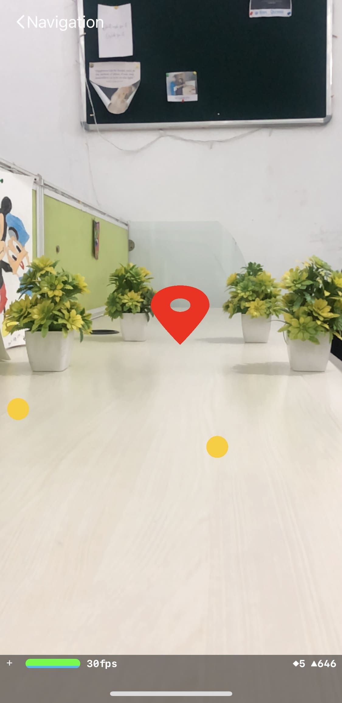

# Robot iOS App - Beta Release

  English |
  <a href="README.zh-CN.md">简体中文</a> |
  <a href="README.de-DE.md">Deutsch</a> |
  <a href="README.fr-FR.md">Français</a> |
  <a href="README.es-ES.md">Español</a>

## DISCLAIMERS

1. **Safety:** Always make sure you operate in a safe environment. Keep in mind, that your phone could be damaged in a collision! Special
   care is necessary when using automated control (e.g. person following or driving policy). Make sure you always have a game controller connected and are familiar with the key mapping so you can stop the vehicle at any time. Use at your own risk!

2. **App under development:** The application is under development and may crash or exhibit unexpected behaviour depending on your phone model and version of the operating system. Make sure to test all functionalities with no wheels connected. Use at your own risk!

3. **The app will be `available` soon on the `App Store`.**

## App Screens

### Main Menu

The app starts with a menu screen that shows all available screens. The Bluetooth connection screen can be opened by clicking on the Bluetooth icon on top right hand side. The settings screen can be opened with a click on the settings icon right next to it. By clicking on the other icons, the user can access various screens whose functionalities are explained in subsequent sections.

The bottom of the app displays a tab bar with tabs for `Home, Projects, and Profile`. By default, the Home tab is displayed. If a user is logged in, all their saved projects in the "openbot-opencode" folder on Google Drive will be listed in Projects tab. The Profile tab includes buttons for accessing the user's profile and signing out.

#### Bluetooth Connection

Unlike the Android app, which allows connecting the smartphone to the low-level control board of an OpenBot via a USB cable, the iOS app relies `solely` on a Bluetooth Low-Energy (BLE) wireless connection. When opening the Bluetooth connection screen in the iOS application (by clicking on the bluetooth logo from the main screen or from any fragment), a list of all compatible devices is displayed. Compatibility is here enforced by using a range of specific UUIDs assigned to an OpenBot vehicle at both the [app](https://github.com/isl-org/OpenBot/blob/090dcb28206195a7ee45a13b8ded968a8d365abe/ios/OpenBot/OpenBot/Utils/Constants.swift#L57) and [firmware](https://github.com/isl-org/OpenBot/blob/090dcb28206195a7ee45a13b8ded968a8d365abe/firmware/openbot_nano/openbot_nano.ino#L115) levels. You must ensure that these UUIDs match. Pairing an iOS device to an OpenBot vehicle then simply requires to select that vehicle from the list and press the "Connect" button. The default baud rate for the connection is set to 115200 and can be changed at the app and firmware level.

### Free Roam

Free Roam offers simple robot control with real time updates and information about battery, speed and distance from surfaces. It also offers controls related to controller, drive mode and speed.

- **Battery**: The battery icon shows realtime battery levels of the connected robot.

- **Drive Mode**: There are 3 drive modes displayed on the view:

  - D -> Drive, when the robot is driving forward

  - N -> Neutral, when the robot is stationary

  - R -> Reverse, when the robot is moving backwards

- **Speed**: The speedometer shows the realtime speed of the robot.

- **Sonar**: The sonar view distance of robot from an oncoming object in cm.

- **Bluetooth**: Shows the status of bluetooth connection with the microcontroller. on tapping the icon, the user can also be redirected to the Bluetooth screen to view/modify the connection.

#### Control

The first button is for selecting the **control mode**. There are two different control modes:

- **Gamepad**: The app receives controls from a connected BT controller.
- **Phone**:  The robot can be controlled via another smartphone with the controller app installed or though a Python script running on a computer connected to the same network.

The second button is for selecting the **drive mode**. There are three different drive modes when using a game controller (e.g. PS4):

- **Game**: Use the right and left shoulder triggers (R2, L2) for forward and reverse throttle and either joystick for steering. This mode imitates the control mode of car racing video games.
- **Joystick**: Use either one of the joysticks to control the robot.
- **Dual**: Use the left and right joystick to control the left and right side of the car. This is raw differential steering.

The third button is for selecting the **speed mode**. There are three different speed modes:

- **Slow**: The voltage applied to the motors is limited to 50% of the input voltage (~6V).
- **Normal**: The voltage applied to the motors is limited to 75% of the input voltage (~9V).
- **Fast**: There is no limit. The full input voltage will be applied to the motors at full throttle (~12V). *This is the default setting for running the neural networks.*

Running at higher speeds will reduce the lifetime of the motors but is more fun. The controls that are sent to the robot are displayed on the right side. When using the game controller, the speed mode can be increased by pressing down the right joystick (R3) and decrased by pressing down the left joystick (L3).

[//]: # (#### Data Log)

[//]: # ()
[//]: # (There are four different logging modes:)

[//]: # ()
[//]: # (- **only_sensors**: All sensor data but no images are saved.)

[//]: # (- **crop_img**: All sensor data and a cropped images that have the input size of the network are saved. This is the default setting and is what should be used for data collection.)

[//]: # (- **preview_img**: All sensor data and a full-size images are saved. This will require a lot of memory and can be slow. However, it is nice for compiling FPV videos.)

[//]: # (- **all_imgs**: All sensor data and both cropped and full-size images are saved. This will require a lot of memory and can be slow.)

[//]: # ()
[//]: # (The switch on the right is used to toggle logging on and off. On the game controller this switch can be toggled with the X button.)

[//]: # ()
[//]: # (#### Camera)

[//]: # ()
[//]: # (The first item shows the preview resolution. The second item shows the crop resolution. This is the image that is used as input to the neural networks. You will notice that this resolution changes depending on which model you select below. If you train your own autopilot, make sure to select the `AUTOPILOT_F` model. The crop resolution should show `256x96`. The switch on the right is used to toggle between the rear and the front camera.)

[//]: # ()
[//]: # (#### Model)

[//]: # ()
[//]: # (There are two models that come with the app:)

[//]: # ()
[//]: # (- **MobileNetV1-300**: This model is used for person following. It uses a SSD object detector with MobileNet V1 backbone. The model is quantized for better performance on embedded devices. It comes with the app.)

[//]: # (- **CIL-Mobile**: This model is used for autonomous navigation. It will predict controls directly from the camera input. Chances are that it will not work in your environment. You should follow our instructions to train your own [Driving Policy]&#40;../../policy&#41; and replace it.)

[//]: # ()
[//]: # (Additonal models can be downloaded from the Model Management screen.)

[//]: # ()
[//]: # (The switch on the right is used to turn the network on and off. When the network is running, it produces the controls for the robot and the game controller is disabled. However, you may still use the buttons on the game controller, for example to toggle this switch with the R1 trigger button to regain control of the robot.)

[//]: # ()
[//]: # (#### Device)

[//]: # ()
[//]: # (Use the drop-down menu to select the device on which the neural network should be executed. You have the following choices:)

[//]: # ()
[//]: # (- **CPU**: Using the CPU works on most phones and is the default choice. You can adjust the number of threads to optimize performance.)

[//]: # (- **GPU**: Most smartphones have a GPU. Networks with large inputs such as images often run faster on a GPU.)

[//]: # (- **NNAPI**: This will use the [TensorFlow Lite NNAPI delegate]&#40;https://www.tensorflow.org/lite/performance/nnapi&#41;. Modern smartphones often come with dedicated AI accelerators. The [Neural Network API]&#40;https://developer.android.com/ndk/guides/neuralnetworks&#41; &#40;NNAPI&#41; provides acceleration for TensorFlow Lite models on Android devices with Graphics Processing Unit &#40;GPU&#41;, Digital Signal Processor &#40;DSP&#41; and Neural Processing Unit &#40;NPU&#41;. Note that on some older phones this can be very slow!)

[//]: # ()
[//]: # (If a model is active, the inference speed in [ms] will be displayed next to the device which is running the model.)

### Data Collection

Simple UI for collection of data sets.

- **Preview Resolution**: Used to switch between resolutions of camera preview. There are 3 settings:

  - ***HIGH*** (1920x1080p)

  - ***MEDIUM*** (1280x720p)

  - ***LOW*** (640x360)

- **Model Resolution**: Used to switch between resolutions of images saved for training different models.

- **Server**: Server functionality is under Development.

- **Log Collected Data**: the data collection process can be controlled from the screen or remotely, for instance from a bluetooth controller. When using a bluetooth controller, you may:

  - press the **A button** to **start** the data collection process

  - press the **A button again** to **stop** data collection and save the collected data in a .zip file

  - alternatively press the **R1 button** to **stop** data collection **without saving** the collected data (for instance because of an unexpected collision with the environment)

  - remember to use the controller mapping fragment to ensure you are using the correct buttons.

- **Vehicle Status**: The field **Battery** displays the battery voltage as measured by the microcontroller via the voltage divider. The field **Speed (l,r)** reports the left and right speed of the (front) wheels in rpm. It is measured by the microcontroller via the optical wheel speed sensors. The field **Sonar** shows the free space in front of the car in centimeters. It is measured by the microcontroller via the ultrasonic sensor. Note, you will only receive values a few seconds after the USB connections has been established.

- **Sensors**: Reports measurements from vehicle sensors. Currently, we record readings from following sensors: camera, gyroscope, accelerometer, magnetometer, ambient light sensor, and barometer. Using the iOS API, we are able to obtain the following sensor readings: RGB images, angular speed, linear acceleration, gravity, magnetic field strength, light intensity, atmospheric pressure, latitude, longitude, altitude, bearing, and speed. In addition to the phone sensors, we record body sensor readings (wheel odometry, obstacle distance and battery voltage), which are transmitted via the serial link. We also record and timestamp control signals received from a connected controller, if present. Lastly, we integrate several neural networks for person following and autonomous navigation.

### Controller Mapping

Simple UI to check the button and joystick mapping of a connected BT controller.

### Robot Info

Simple UI to get robot info and test basic functionality. The **Robot Type** as configured in the firmware is displayed as text and animation. The checkmarks in the sections **Sensors**, **Wheel Odometry** and **LEDs** show which features are supported by the connected robot. The section **Readings** provides the most important sensor measurements. In the section **Send Commands**, users can send basic motor commands by pressing the corresponding buttons and control the front and rear LEDs with a slider.

### Autopilot

Simple UI for running autopilot models.

- **Server**: If you have the [web app](../../policy#web-app) for policy training running, you can select it here and send trained autopilot models to the robot.
- **Model**: Choose a trained model to use for autopilot mode.
- **Device**: Use CPU, GPU or NNAPI for inference (more details [here](#device)).
- **Threads**: Number of threads to use (only makes a difference when CPU is selected as device).
- **Control**: Controller, Drive Mode and Speed are used to control robot settings as described in the [control section](#control).

### Object Tracking

Simple UI for tracking objects of 80 different classes. A short description of the different AI models for object tracking and performance benchmarks can be found in [Model Management](#model-management).

- **Dynamic Speed**: reduces the robot speed in "Auto Mode" if it gets closer to the tracked object.
  The speed is scaled based on the area of the bouding box (works best in landscape orientation).
- **Model**: Choose an object detector based on your phone performance.
- **Object**: Pick the object you want to track. The models can detect the 80 COCO [object classes](https://tech.amikelive.com/node-718/what-object-categories-labels-are-in-coco-dataset/).
- **Confidence**: Confidence threshold to determine if detections are accepted. Increase if you get false detections, decrease if the object of interest it not detected.
- **Device**: Use CPU, GPU or NNAPI for inference (more details [here](#device)).
- **Threads**: Number of threads to use (only makes a difference when CPU is selected as device).
- **Control**: Controller, Drive Mode and Speed are used to control robot settings as described in the [control section](#control).

### Model Management

All models are quantized for better performance on embedded devices. Note that models with larger input resolution might be better for smaller objects despite lower mAP.

### Navigation

The `Point Goal Navigation` screen allows the user to set a goal location for the robot to navigate to using forward and left values in 3D space. To access this screen, simply tap on the corresponding button in the app.

Upon tapping, a popup will appear with two input fields labeled `Forward` and `Left`. The user can enter values into these fields to set the goal location for the robot to navigate to. The popup also contains two buttons: `Cancel` and `Start`.

- `Cancel` button: This button will return the user to the home screen and cancel the navigation process.

- `Start` button: This button will create a point in 3D space using the forward and left values entered by the user and start the navigation process. The robot will begin moving towards the goal location and adjusting its trajectory and speed as needed to reach the destination.

If the robot successfully reaches the goal location, a message will appear indicating that the goal has been reached, and the robot will stop moving.

Note that this feature uses `ARKit`, a framework developed by Apple for augmented reality applications. The user will need to have an ARKit-compatible device to use this feature.

### Projects Screen

The Projects Screen displays a list of your OpenBot Playground projects if you are signed in with your Google account. You can execute these projects to connect with your OpenBot, or scan their QR codes by clicking the scanner icon in the top right corner. If you are not signed in, the screen will display a Google Sign-In button, but you can still scan your project's QR code without signing in. If you get the message `Oops, no project found` on the screen after signing in, make sure that the account has projects stored on Google Drive.

If you don't see your latest projects in the project list, you can reload them by pulling down on the project screen.

- **Google Drive projects**: To run a Google Drive project, tap on the project you want to execute and wait for the contents of the project file to be read. If the file is successfully retrieved without any errors, a pop-up will appear with two buttons: `Start` and `Cancel`. The pop-up will also display the name of the project you are about to run. To execute the project, click on the Start button. If you want to stop the activity, click on the Cancel button. If you receive a pop-up message stating `Something went wrong`, there may be an error with the Google Drive file. To resolve this issue, refresh the project screen by pulling down and then repeating the same process.

- **Qr code scanner**: To scan the QR code of a Playground project, click on the QR code icon located in the top right corner of the screen. Grant camera access to the app so that it can scan the QR code. Once the code is scanned, wait for the contents of the file to be read. If the file is retrieved successfully without any errors, a pop-up will appear with two buttons: `Start` and `Cancel`. The pop-up will also display the name of the project you are about to run. To execute the project, click on the Start button. If you want to stop the activity, click on the Cancel button. If you receive a pop-up message stating `Something went wrong`, there may be an error with the Google Drive file. To resolve this issue, generate a new QR code in Playground and repeat the process.

- **Executing Project**: If your OpenBot Playground project runs successfully, the screen will display the names of code blocks along with a stop button that can be used to stop the execution of playground block commands.

- **Delete Project**: To delete a project, long-press on the project you wish to delete. This will bring up a popup screen asking to confirm the deletion. Tap on 'Yes' to delete the project.

### Profile Screen
The Profile Screen in the app provides different options based on whether the user is signed in or not.
If the user is not signed in, a `Google Sign-in` button will appear, prompting the user to sign in their Google account. Once signed in, the user will be able to access their profile and other features.
If the user is signed in, two buttons will be listed in the  `Profile` tab: `Edit Profile` and `Logout`.

- **Edit Profile**: Tapping on this button will open a new screen where the user can update their profile information, such as their name and profile picture.

- **Logout**: This button allows the user to log out of their account. Tapping on this button will log the user out and return them to the login screen.

### OpenBot PlayGround Screen

To access OpenBot Playground services, click on the OpenBot Playground icon located at the top of the screen in project's screen toolbar options. If you want to learn more about OpenBot Playground, [Click here](../../open-code/README.md).

## Code Structure

The [TensorFlow Lite Object Detection iOS Demo](https://github.com/tensorflow/examples/tree/master/lite/examples/object_detection/ios) was used as starting point to integrate TFLite models and obtain the camera feed. The [tflite](OpenBot/tflite) folder contains the model definitions for the [Autopilot](OpenBot/tflite/Autopilot.swift) and [Detector](OpenBot/tflite/Detector.swift) networks.

## Next (optional)

Train your own [Driving Policy](../../policy/README.md)

Firebase Authentication [Firebase](../OpenBot/OpenBot/Authentication/README.md)
