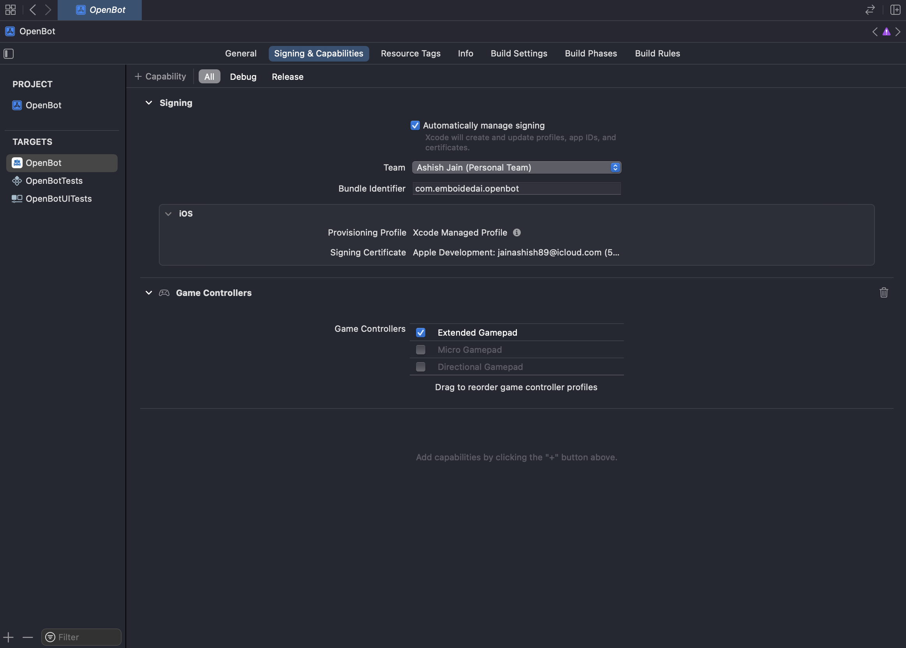
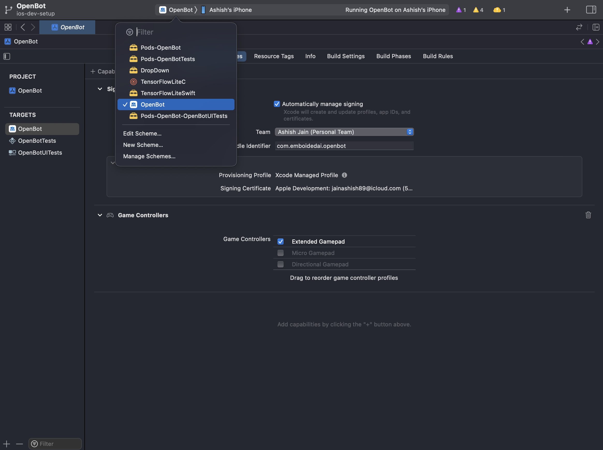
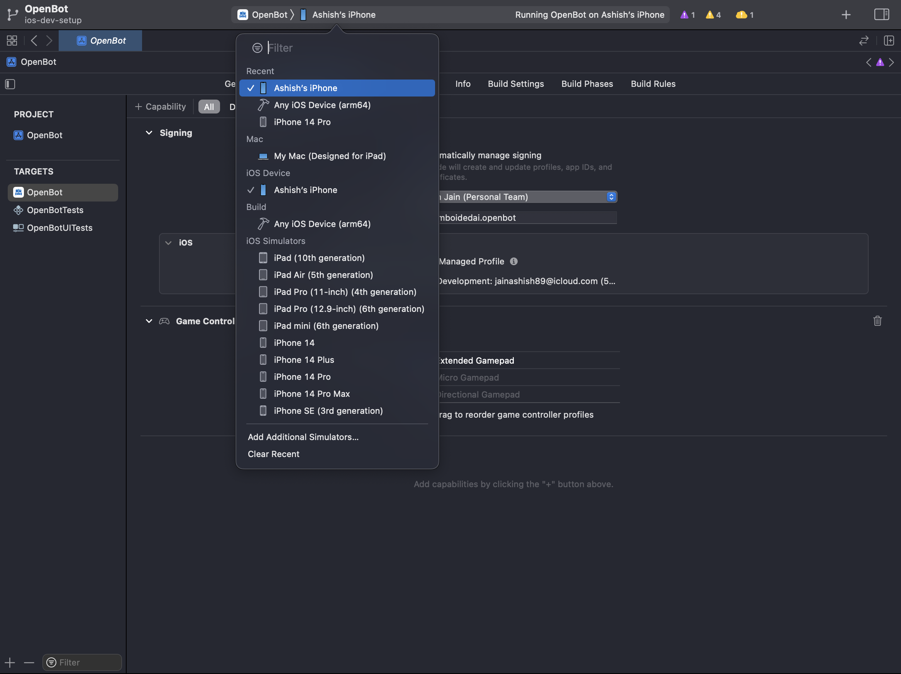

# iOS Apps - Beta Release

  English |
  <a href="README.zh-CN.md">简体中文</a> |
  <a href="README.de-DE.md">Deutsch</a> |
  <a href="README.fr-FR.md">Français</a> |
  <a href="README.es-ES.md">Español</a>

## Features

Click on the links below to read about the features of the apps.

- [Robot App](OpenBot/README.md)
- Controller App (Coming Soon)

## Install the apps
Currently, the only way to run the iOS apps on your phones is via the developer builds, as described in the section below.

## Build the apps

### Prerequisites

- [Xcode iOS 13 or Later](https://developer.apple.com/xcode/) for building and installing the apps.
- [Cocoapods](https://cocoapods.org/) installed on your system.
- Currently, we're using iOS deployment target version 15.5.
- Project is configured as "Automatically manage signing", so you can configure your own independent account for building the app -
  
- To configure your own team, add your iCloud Account via XCode > Settings > Accounts or directly from the Team menu above.
- iOS device with minimum iOS 13 or Later. [List of supported devices](https://support.apple.com/en-in/guide/iphone/iphe3fa5df43/ios).
- [Developer mode](https://developer.apple.com/documentation/xcode/enabling-developer-mode-on-a-device) activated on your iOS device.
- The added iCloud account should be [trusted by your iOS device](https://developer.apple.com/forums/thread/685271).

### Build Process

1. Open XCODE and select *open a project or file*.
2. To install the [OpenBot app](OpenBot/README.md) make sure to select the *OpenBot* configuration.
   
3. Select your device from the list of available devices.
   
4. Run the app on device by clicking on the ▶️ icon on top left of Xcode screen.
