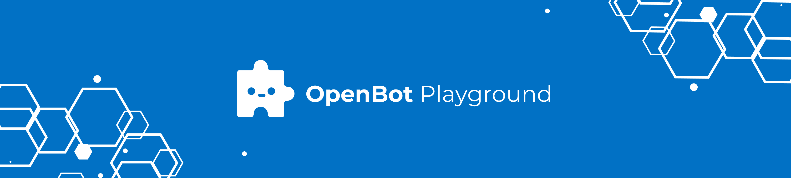

# OpenBot Playground

<p align="center">
  <a href="README.md">English</a> |
  <a href="README.zh-CN.md">简体中文</a> |
  <span>Deutsch</span> |
  <a href="README.fr-FR.md">Français</a> |
  <a href="README.es-ES.md">Español</a>
</p>

OpenBot Playground ist eine Drag-and-Drop-Plattform zur Unterstützung der OpenBot-Anwendung, auf der jeder Anweisungen für den Roboter erstellen kann.

## Erste Schritte

Sie können diese Anwendung direkt über den [Link](https://www.playground.openbot.org/ "Link") ausführen.

Sie können sie auch lokal ausführen, indem Sie eine lokale Kopie des Projekts erstellen. Gehen Sie dazu in den Ordner `openBot/open-code`, [richten Sie das Firebase-Projekt ein](src/services/README.de-DE.md) und führen Sie die Anwendung aus. Nach der [Firebase-Einrichtung](src/services/README.de-DE.md) führen Sie die folgenden Befehle aus:

Wenn Sie npm verwenden

```bash
npm install
```

Im Falle von yarn

```bash
yarn install
```

Anwendung ausführen

```bash
npm start
```

### Anwendungsfunktionen

1. Synchronisieren Sie Ihr Google Drive mit dem OpenBot, und es wird die Daten automatisch darauf speichern.
2. Speichern Sie die Daten im lokalen Speicher.
3. Scannen Sie den Ausgabe-QR-Code direkt aus der OpenBot-Anwendung, um das Programm auszuführen.
4. In den mobilen OpenBot-Apps können Sie nach dem Einloggen die gespeicherten Dateien von Google Drive abrufen und mit nur einem Klick laden.
5. Entwerfen Sie die Anweisungen für OpenBot ohne Code.
6. Vollständig responsives Design, optimiert für das Surfen auf Mobilgeräten und Tablets.

### Projektspeicherung

Dieses Projekt ermöglicht es Benutzern, ihre Daten sowohl lokal als auch auf `Google Drive` zu speichern. Wenn das Projekt erstellt wird, wird es automatisch im `lokalen Speicher` des Geräts des Benutzers gespeichert. Wenn Änderungen am Projekt vorgenommen werden, wird der lokale Speicher in Echtzeit aktualisiert.

Zusätzlich können Benutzer ihr Projekt auf Google Drive hochladen, indem sie auf die [Upload-Schaltfläche](#generate-Code) klicken. Dies ermöglicht es Benutzern, von jedem Gerät mit Internetzugang auf ihr Projekt zuzugreifen, was die Arbeit an dem Projekt von verschiedenen Standorten aus erleichtert.

- #### Lokaler Speicher
  Der lokale Speicher ist eine integrierte Webtechnologie, die es Webanwendungen ermöglicht, Daten lokal im Browser des Benutzers zu speichern. Das bedeutet, dass das Projekt auf dem Gerät des Benutzers gespeichert wird und ohne Internetverbindung zugänglich ist.

  In diesem Projekt wird der lokale Speicher verwendet, um das Projekt zu speichern, wann immer Änderungen daran vorgenommen werden. Das Projekt wird im Cache des Browsers gespeichert, was bedeutet, dass es auch dann bestehen bleibt, wenn der Benutzer den Tab oder den Browser schließt.

- #### Google Drive Speicher
  Google Drive ist ein cloudbasierter Speicherdienst von Google. Er ermöglicht es Benutzern, Dateien online zu speichern und zu teilen sowie von jedem Gerät mit Internetzugang darauf zuzugreifen.

  In diesem Projekt können Benutzer ihr Projekt auf Google Drive hochladen, indem sie auf das Upload-Symbol klicken, wenn sie auf der Website angemeldet sind. Das Projekt wird dann im Google Drive-Konto des Benutzers gespeichert, was bedeutet, dass es von jedem Gerät mit Internetzugang zugänglich ist.

  Um auf ihr Projekt von Google Drive zuzugreifen, können Benutzer sich einfach in ihr Google-Konto einloggen und zu [meine Projekte](#project-section) navigieren, wo alle ihre gespeicherten Projekte angezeigt werden.

## OpenBot Playground Bildschirme

### Startseite

Der `OpenBot Playground` beginnt mit der Startseite, die die folgenden Komponenten enthält:

- [Header](#header): Der Header enthält die folgenden zwei Abschnitte: Thema ändern und Benutzer anmelden.
- [Karussell](#Carousal): Der Inhalt des Karussells erklärt, wie der Playground funktioniert.
- [Projektabschnitt](#project-section): Der Projektabschnitt enthält eine Liste der Projekte und eine Schaltfläche zum Erstellen eines neuen Projekts.

### Playground-Seite

Die `Playground`-Seite ist ein Hauptmerkmal der `OpenBot Playground`-Plattform, die eine Vielzahl von Codierungsblöcken bietet, mit denen Benutzer verschiedene Arten von Funktionen erstellen können, wie z.B. Steuerung, Schleifen, Bewegung, Operatoren, Sensoren und vieles mehr.

- [Header](#header): Der Header enthält den Projektnamen, das Hilfezentrum, AutoSync, das Thema ändern und den Benutzeranmeldeabschnitt.
- [Arbeitsbereich](#workSpace): Bereich, in dem Benutzer die Codierungsblöcke ziehen und ablegen können, um ihren Code zu generieren, der sowohl in JavaScript als auch in Python umgewandelt werden kann.
- [Playground-Bottom-Bar](#Playground-Bottom-Bar): Die untere Leiste enthält Schaltflächen zum Generieren von Code, Hochladen des Projekts in Drive, Vergrößern und Verkleinern von Blöcken, Hinzufügen von Modellen sowie Rückgängig- und Wiederherstellen-Funktionen im Arbeitsbereich.

### Header

Der Header der `Openbot-Playground`-Website hat sein Logo im oberen linken Bereich. Auf der rechten Seite des Headers befinden sich zwei Schaltflächen.

- #### Thema ändern
  Das Thema-Symbol ermöglicht es Ihnen, zwischen dem hellen und dunklen Modus zu wechseln und umgekehrt.

  <p align="left">
  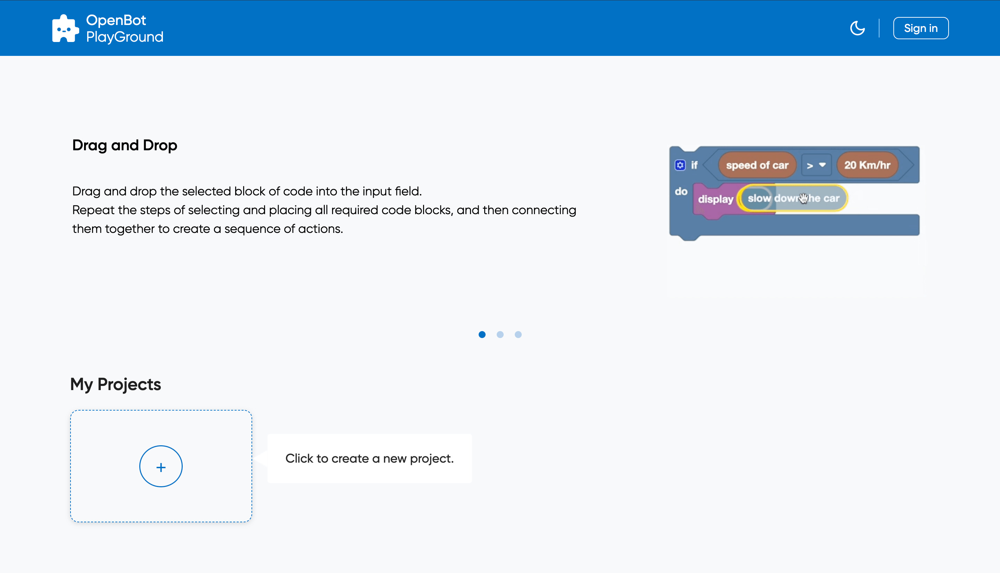
  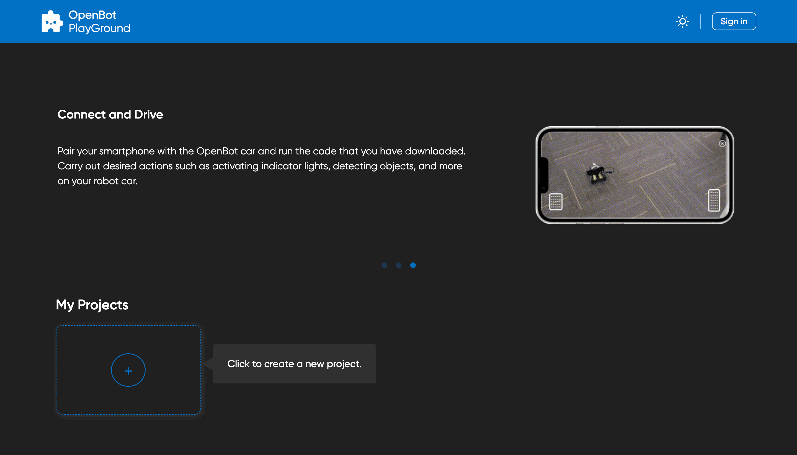
  </p>

- #### Anmelden

  Die Schaltfläche "Anmelden" öffnet ein Google-Anmelde-Popup auf dem Bildschirm und fordert Sie auf, Ihre E-Mail für die Anmeldung einzugeben, wobei alle erforderlichen Berechtigungen erteilt werden, einschließlich der Änderung von ***Google Drive***.
  <p align="left">
  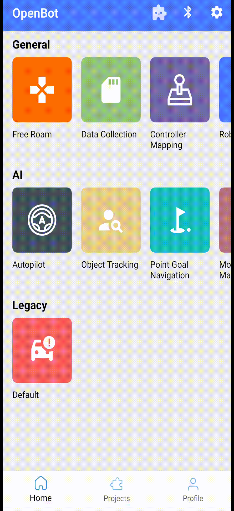
  </p>

- #### Profiloptionen
  Nach erfolgreicher Anmeldung haben Sie die Möglichkeit, Ihr Profil zu bearbeiten und sich abzumelden. Die Schaltfläche "Profil bearbeiten" öffnet ein Popup, in dem Sie Ihr Profilbild, Ihren Anzeigenamen und Ihr Geburtsdatum aktualisieren können.
  <p align="left">
  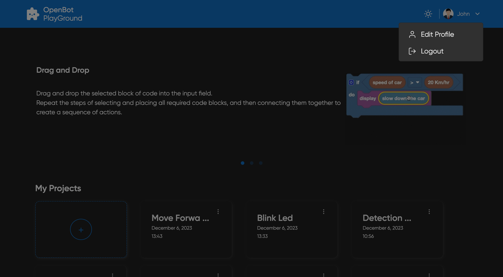
  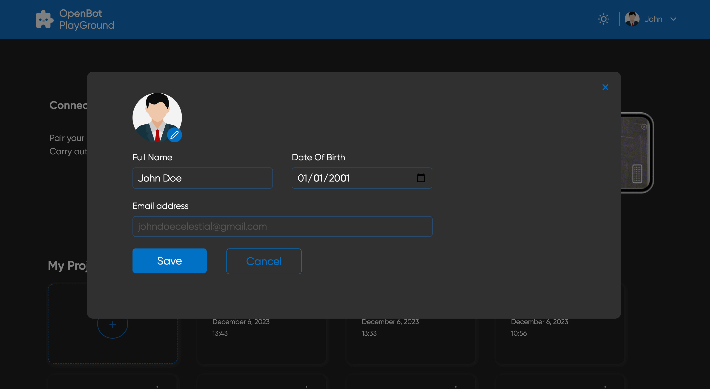
  </p>

- #### AutoSync:
    - AutoSync ermöglicht es Benutzern, alle maschinellen Lernmodelle (Tflite-Modelle) nahtlos mit der OpenBot-Roboter-App zu synchronisieren und bequem in ihren jeweiligen ``Künstliche Intelligenz``-Blöcken anzuzeigen. Darüber hinaus haben Benutzer die Flexibilität, das gewünschte KI-Modell direkt in der Blockoberfläche auszuwählen, während sie den Code strukturieren.
    - #### Wie es funktioniert
        - Die Roboter-App lädt eine aktualisierte config.json-Datei auf das Google Drive des Benutzers hoch, einschließlich aller neu hinzugefügten Modelle. Diese Datei listet alle Modelle zusammen mit ihren Konfigurationen im JSON-Format auf.
        - Wenn der Benutzer auf ``Auto Sync`` klickt, werden alle heruntergeladenen Modelle, einschließlich derer für Erkennung, Autopilot und Punktzielnavigation, gefiltert und in ihren jeweiligen KI-Blöcken angezeigt.
        - Nach diesem Prozess wird das Modell dann in den OpenBot-Playground-Blöcken angezeigt. Mit Hilfe von Google Drive können Sie dieses Modell nahtlos direkt aus den jeweiligen KI-Blöcken auswählen.

- #### Zusätzliche Funktionen der Playground-Seite

    - Der Header der Playground-Seite behält das gleiche Design wie der Header der Startseite bei, während zusätzliche Funktionen integriert sind. In der Mitte wird der Projektname mit einem Abwärtspfeil angezeigt, der Optionen zum Umbenennen und Löschen des Projekts bietet.
       <p align="left">
       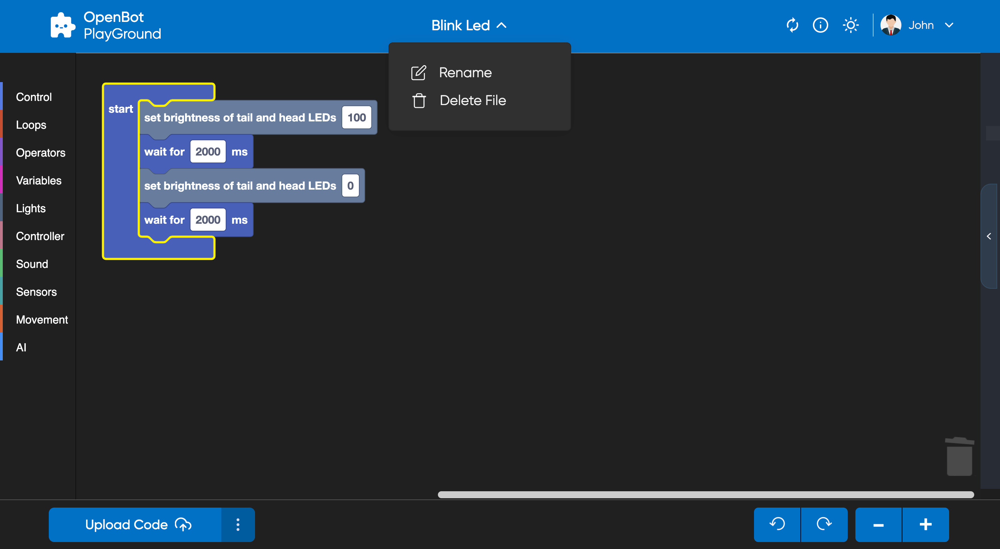
       </p>

    - Auf der rechten Seite wurde eine Hilfeschaltfläche hinzugefügt, die drei Abschnitte enthält, die erklären, wie man Blöcke effektiv zieht und ablegt, den Projektfortschritt speichert und herunterlädt und in Drive hochlädt, um nahtlos zusammenzuarbeiten.

        <p align="left">
        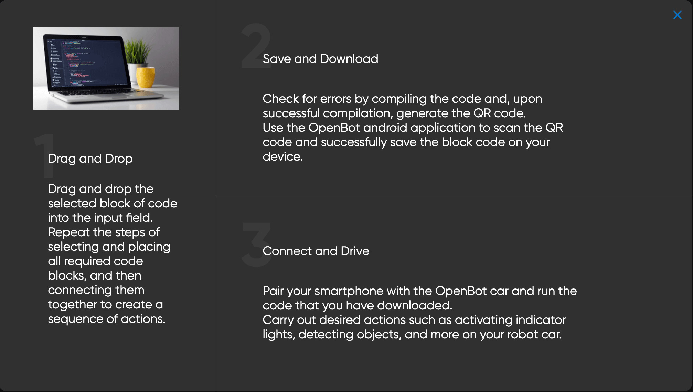
        </p>

### Karussell

Der Container des Karussells erklärt, wie die Anwendung funktioniert.
<p>
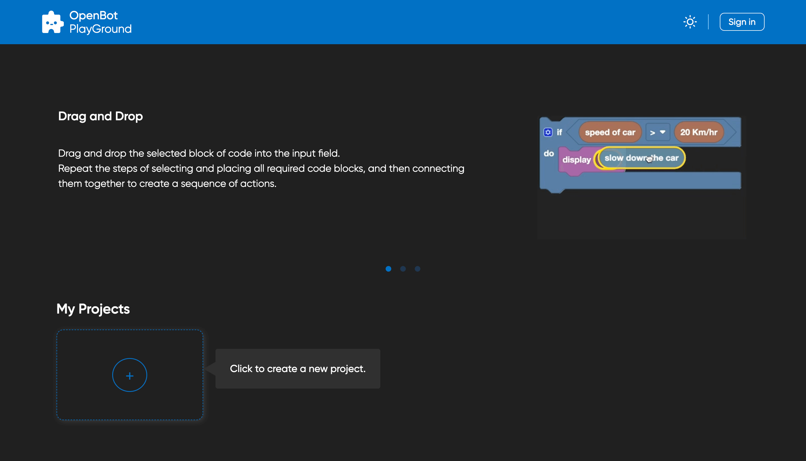
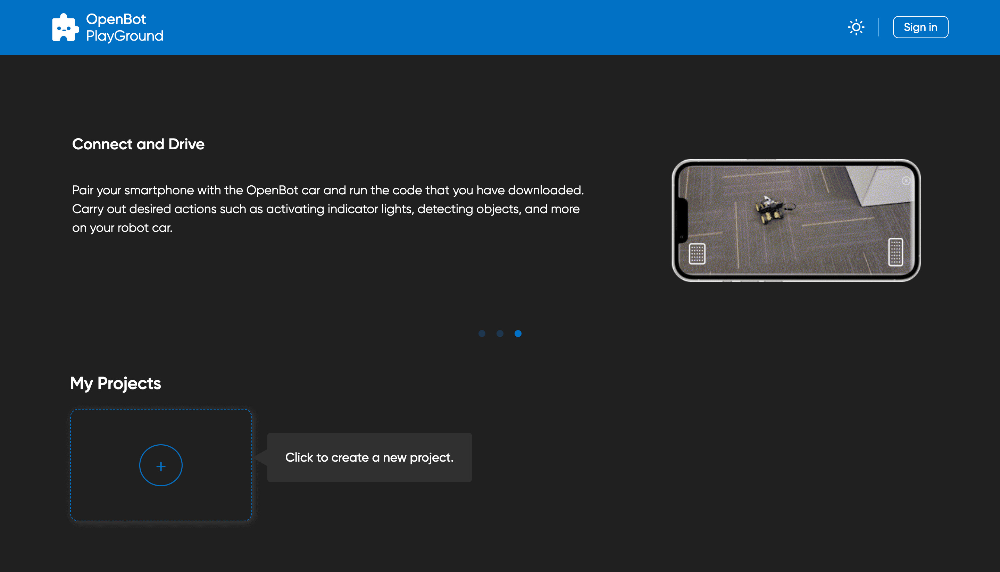
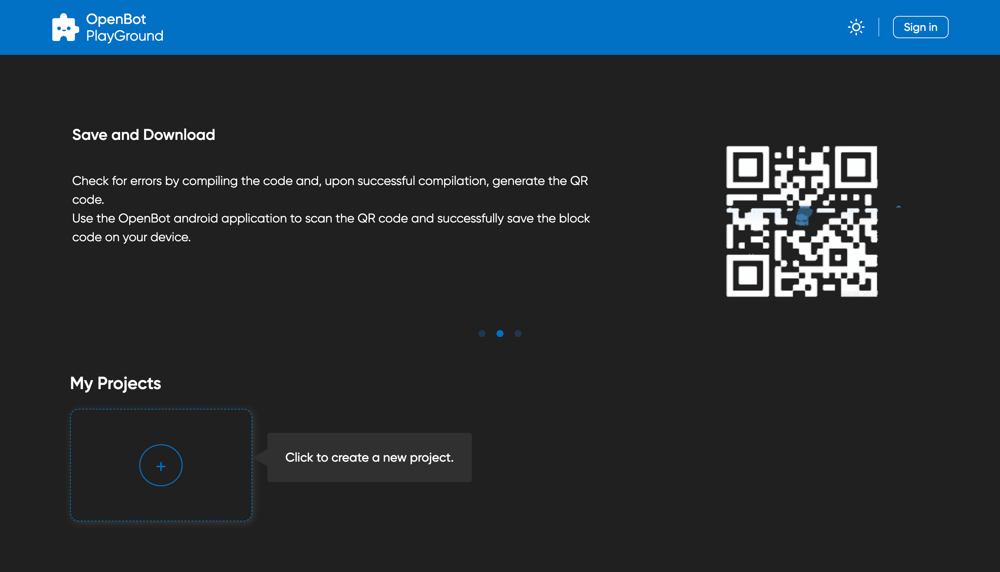
</p>

### Projektabschnitt

Der Abschnitt 'Meine Projekte' zeigt die im lokalen Speicher und auf Google Drive gespeicherten Projekte (wenn der Benutzer angemeldet ist) an, wobei jedes Projekt seinen Namen, das Erstellungs-/Bearbeitungsdatum und frühere Blockversionen anzeigt. Durch Klicken auf ein Projekt wird der Benutzer auf dessen Playground-Seite weitergeleitet. Um ein neues Projekt zu erstellen, klicken Sie einfach auf das `Erstellen-Symbol`.

Durch Klicken auf das 'Erstellen'-Symbol wird ein Popup 'Neues Projekt erstellen' mit einem Eingabefeld für den Projektnamen und einer 'Erstellen'-Schaltfläche geöffnet. Sobald ein geeigneter Name eingegeben und die 'Erstellen'-Schaltfläche oder die Eingabetaste gedrückt wird, öffnet sich der Playground-Bildschirm des Projekts. Wenn der Benutzer einen Namen eingibt, der bereits einem anderen Projekt zugewiesen ist, generiert das System automatisch einen eindeutigen Namen, indem es eine Zahl an das Ende des Namens anhängt.

<p align="left">
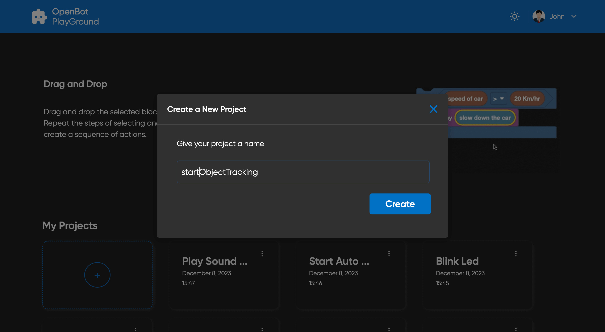
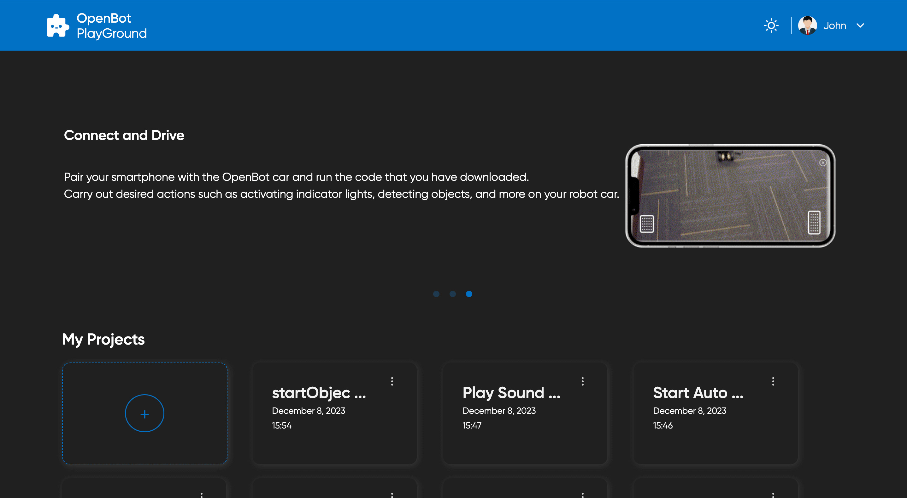
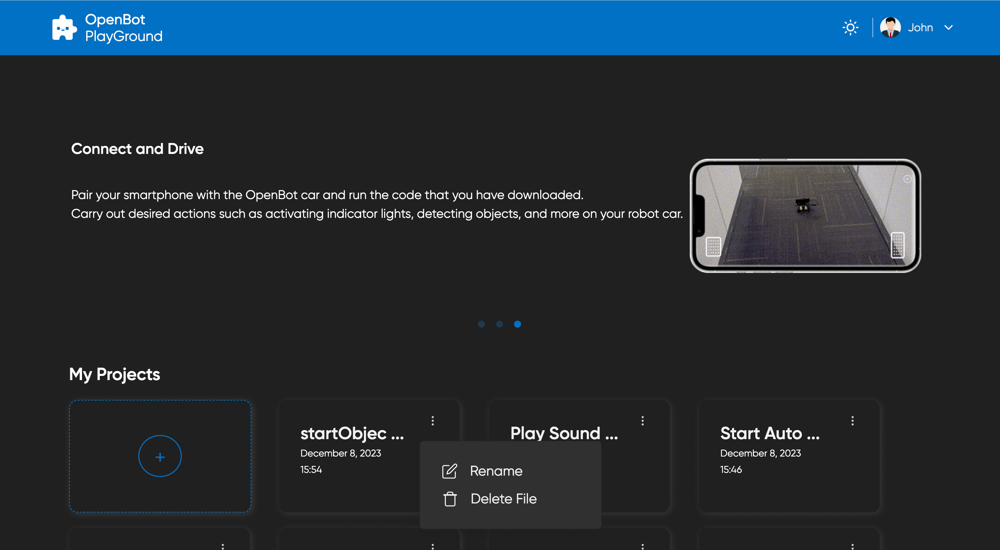
</p>

### Arbeitsbereich

Um Code zu generieren, können Benutzer Codierungsblöcke in den Arbeitsbereich ziehen und ablegen. Der Code kann sowohl in JavaScript als auch in Python umgewandelt werden.

- Blöcke können aus dem linken Bereich ausgewählt und nach Bedarf in den Arbeitsbereich gezogen werden.
- Um einen Block zu löschen, können Benutzer ihn einfach auf das Papierkorbsymbol in der unteren rechten Ecke ziehen.
- Wenn ein Block nicht in den "Start"- oder "Forever"-Block passt, wird er deaktiviert, um Fehler im generierten Code zu vermeiden.
- Benutzer können einen gelöschten Block aus dem Papierkorb wiederherstellen, indem sie darauf klicken, wodurch eine Liste der gelöschten Blöcke angezeigt wird. Sie können dann den gewünschten Block aus dem Papierkorb zurück in den Arbeitsbereich ziehen und ablegen.
- Mehr über Blöcke erfahren: [Blöcke](src/components/blockly/README.de-DE.md)
  <p align="left">
  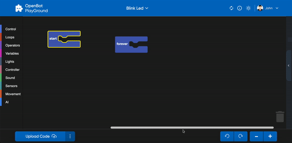
  </p>

### Playground-Bottom-Bar

- Um eine erfolgreiche Web-Erfahrung des OpenBot-PlayGrounds mit Google Drive zu gewährleisten, sollten Benutzer die folgenden Bedingungen erfüllen:
    - Der Benutzer sollte keinen anderen Ordner in seinem Google Drive haben, der denselben Namen wie der vom Website generierte OpenBot-PlayGround-Ordner hat.
    - Der Benutzer sollte keine Datei mit demselben Namen im OpenBot-PlayGround-Ordner erstellen.
  <p align="left">
  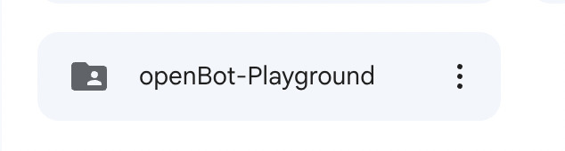
    <p></p>
  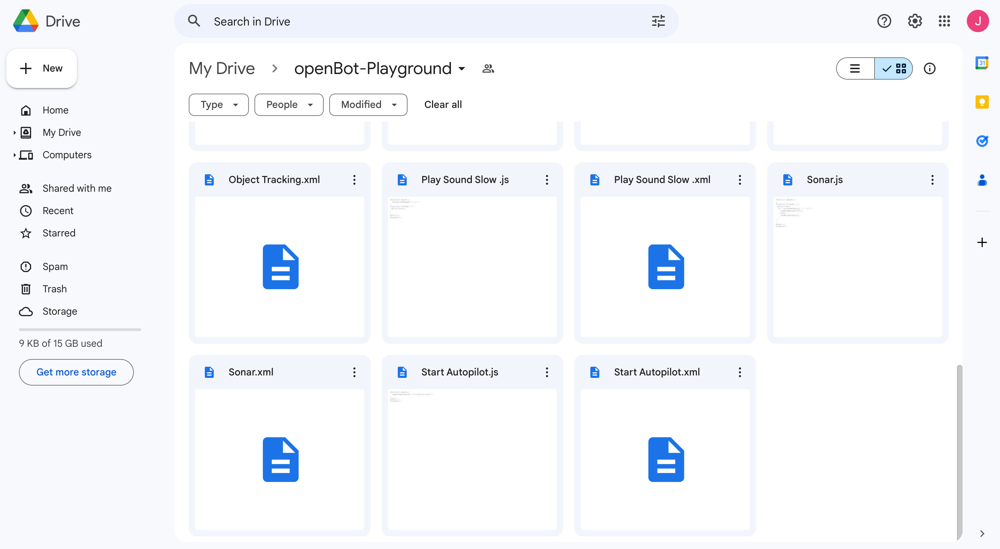

- #### Code generieren
  Die Schaltfläche "Code generieren" in der unteren Leiste des Playgrounds erfüllt drei wichtige Funktionen. Erstens generiert sie einen QR-Code, der den Link zur JavaScript/Python-Datei darstellt, die als Teil des Projekts auf das Google Drive des Benutzers hochgeladen wurde. Dieser QR-Code wird in einem Seitenfenster zur einfachen Zugriff und zum Teilen angezeigt. Zweitens lädt die Schaltfläche eine JavaScript/Python-Datei mit dem Code für das Projekt auf das Google Drive des Benutzers hoch. Und schließlich wird eine XML-Datei hochgeladen, die die aktuelle Blockkonfiguration des Projekts darstellt. Diese XML-Datei enthält die Struktur und Anordnung der im Projekt verwendeten Blöcke.

    - `Bequemes Teilen` -
      Der von der Schaltfläche generierte QR-Code bietet einen öffentlichen, teilbaren Link zur JavaScript/Python-Datei auf Google Drive. Dieser Link kann durch Scannen des QR-Codes mit der OpenBot IOS/Android-App aufgerufen werden. Dies ermöglicht es Benutzern, das Auto basierend auf dem mit den Codierungsblöcken generierten Code direkt von ihrem mobilen Gerät aus zu steuern. Die Möglichkeit, den QR-Code zu teilen und den Code auf mobilen Geräten zuzugreifen, fügt dem OpenBot-Playground eine weitere Ebene der Bequemlichkeit und Zugänglichkeit hinzu. Die Integration mit Google Drive ermöglicht es Ihnen, eine umfassende Sicherung Ihres Projekts zu haben. Durch die Einbeziehung der XML-Datei wird die genaue Struktur und Logik der im Projekt verwendeten Blöcke beibehalten. Dies ist vorteilhaft für das Teilen, die Zusammenarbeit und das erneute Aufrufen von Projekten in der Zukunft.

  <br></br>
  Hier ist eine Demo zum Hochladen in Drive und Generieren von Code:
  <p align="left">
  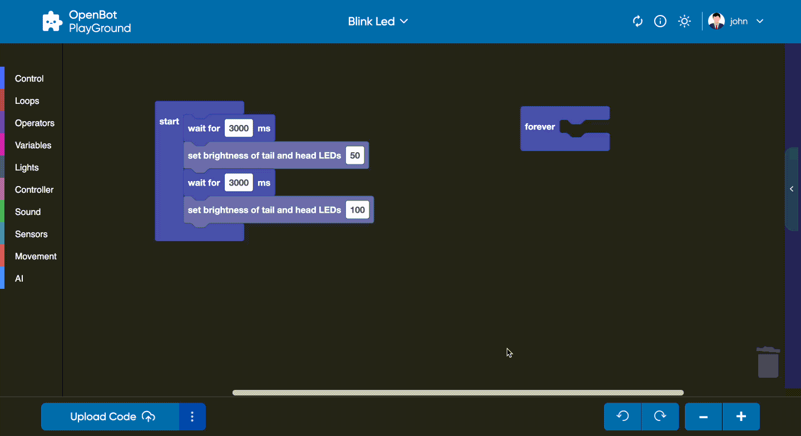
  </p>

- #### Code-Editor
  Die Schaltfläche "Code-Editor" auf der rechten Seite der QR-Generierungsschaltfläche öffnet ein Seitenfenster, das den Blockcode in einer Skriptsprache anzeigt. Die Schaltfläche bietet Optionen zur Auswahl zwischen zwei Sprachen, entweder JavaScript oder Python, und sobald ausgewählt, können Benutzer ihre Code-Snippets nur im Seitenfenster anzeigen. Sie können zwischen JavaScript und Python umschalten, um den entsprechenden Code gleichzeitig im Seitenfenster anzuzeigen. Die Optionen zur Auswahl einer Sprache ermöglichen es Ihnen, die Korrektheit der Blöcke zu überprüfen und zu bewerten.
  <p align="left">
  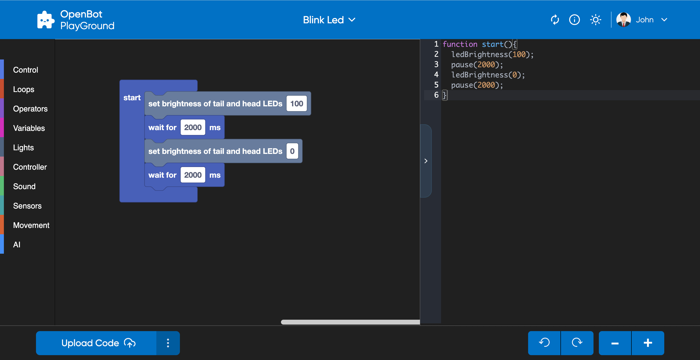
  </p>

- #### Modell hinzufügen
  Der OpenBot-Playground bietet eine Funktion zum externen Hinzufügen von KI-Modellen (.tflite) zur Roboteranwendung. Das Modell-Popup ermöglicht es dem Benutzer, die Konfiguration unseres Modells zu bearbeiten, einschließlich seines Namens, Typs, seiner Klasse und seiner Eingabegröße. Beachten Sie, dass das Modell automatisch im Google Drive des Benutzers gespeichert wird, zusammen mit der aktualisierten config.json-Datei.
  <p align="left">
  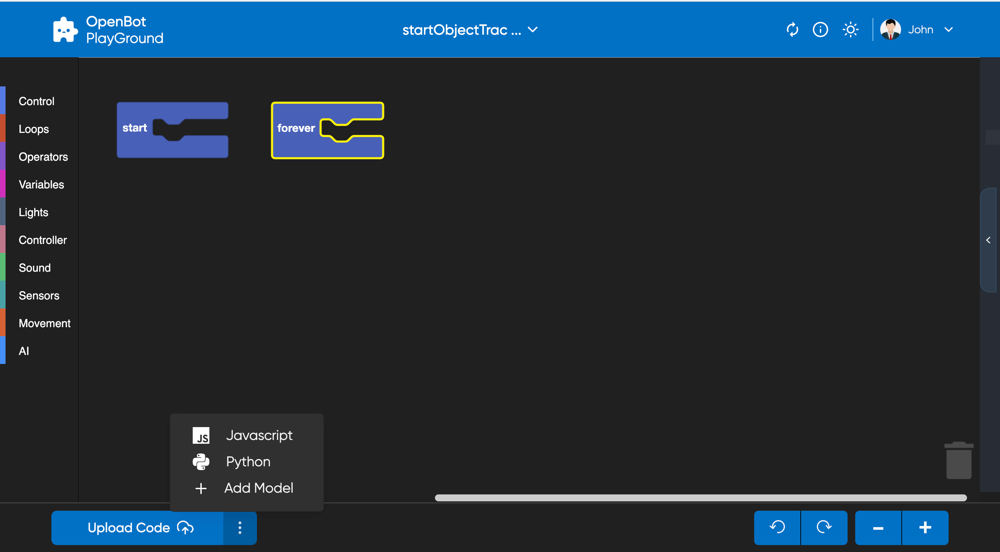
  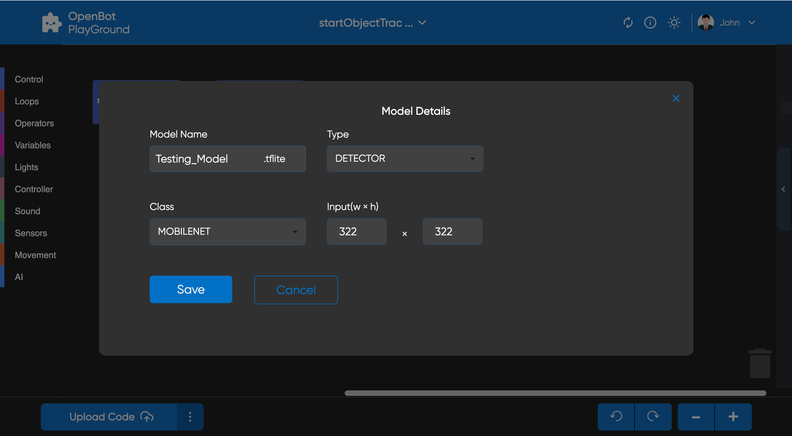
  </p>


- #### Arbeitsbereichssteuerung
  Die Schaltflächen "Rückgängig" und "Wiederherstellen" helfen, Rückgängig- und Wiederherstellen-Funktionen im Playground auszuführen. Das Plus-Symbol dient zum Vergrößern und das Minus-Symbol zum Verkleinern.

## Nächstes (optional)

Fehlerbehebung bei der Firebase-Authentifizierung [Firebase](src/services/README.de-DE.md#troubleshooting)