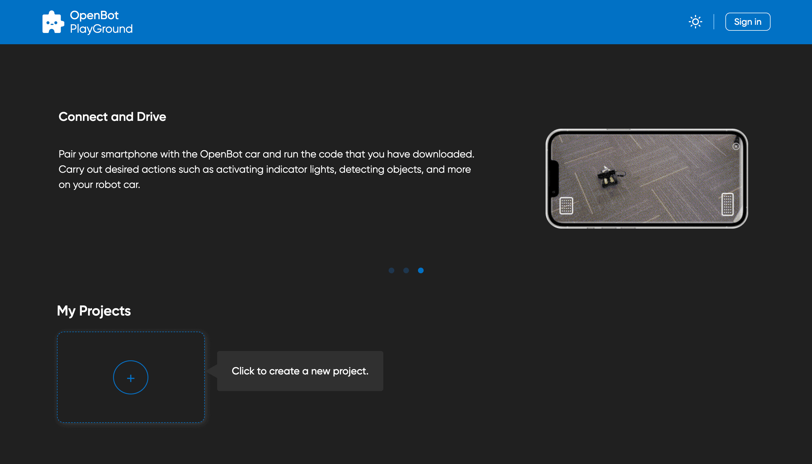
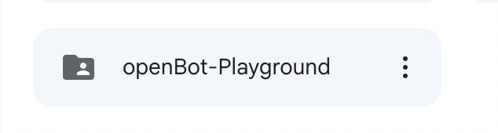
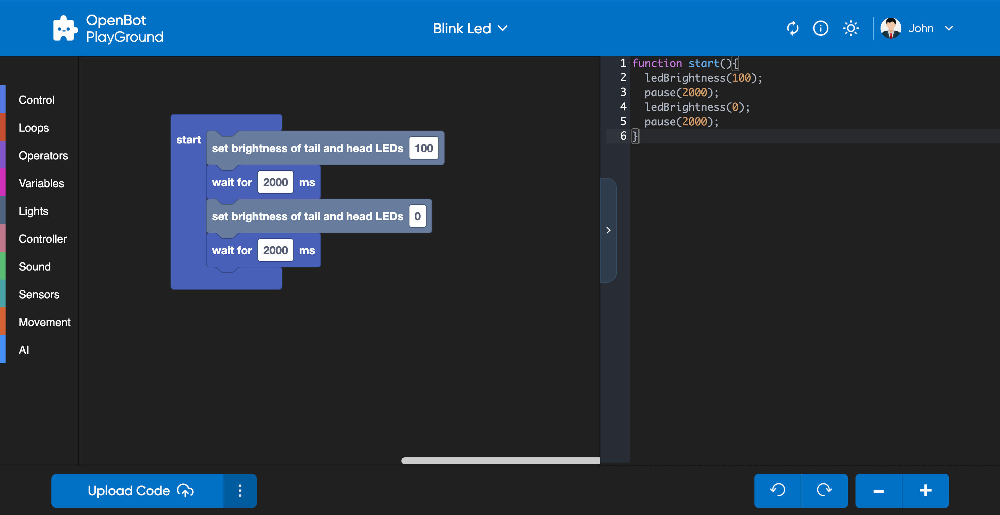
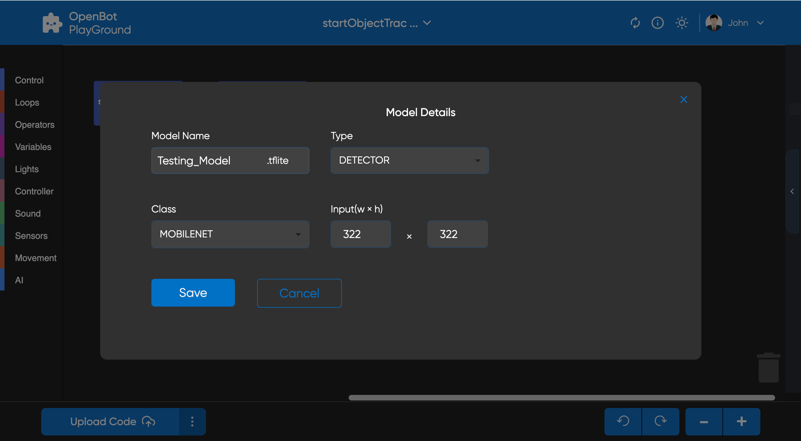

# OpenBot Playground

<p align="center">
  <a href="README.md">English</a> |
  <a href="README.zh-CN.md">简体中文</a> |
  <a href="README.de-DE.md">Deutsch</a> |
  <a href="README.fr-FR.md">Français</a> |
  <span>Español</span>
</p>

OpenBot Playground es una plataforma de arrastrar y soltar para soportar la aplicación OpenBot, donde cualquiera puede construir instrucciones para el robot.

## Empezando

Puedes ejecutar esta aplicación directamente desde el [Enlace](https://www.playground.openbot.org/ "Enlace").

También puedes ejecutarla localmente creando una copia local del proyecto. Para lograr esto, navega a la carpeta `openBot/open-code`, [configura el proyecto de firebase](src/services/README.es-ES.md) y ejecuta la aplicación. Después de la [configuración de firebase](src/services/README.es-ES.md), ejecuta los siguientes comandos:

Si estás usando npm

```bash
npm install
```

En caso de usar yarn

```bash
yarn install
```

Ejecuta la aplicación

```bash
npm start
```

### Características de la Aplicación

1. Sincroniza tu Google Drive con OpenBot, y automáticamente guardará los datos en él.
2. Almacena los datos en el almacenamiento local.
3. Escanea el código QR de salida directamente desde la aplicación OpenBot para ejecutar el programa.
4. En las aplicaciones móviles de OpenBot, después de iniciar sesión, puedes recuperar los archivos guardados de Google Drive y cargarlos con solo un clic.
5. Diseña las instrucciones para OpenBot sin necesidad de código.
6. Diseño completamente responsivo optimizado para la navegación en móviles y tabletas.

### Almacenamiento del Proyecto

Este proyecto permite a los usuarios almacenar sus datos tanto localmente como en `Google Drive`. Cuando se crea el proyecto, se almacena automáticamente en el `almacenamiento local` del dispositivo del usuario. A medida que se realizan cambios en el proyecto, el almacenamiento local se actualiza en tiempo real.

Además, los usuarios pueden subir su proyecto a Google Drive haciendo clic en el [botón de subir](#generate-Code). Esto permite a los usuarios acceder a su proyecto desde cualquier dispositivo con acceso a internet, facilitando el trabajo en el proyecto desde diferentes ubicaciones.

- #### Almacenamiento Local
  El almacenamiento local es una tecnología web incorporada que permite a las aplicaciones web almacenar datos localmente dentro del navegador del usuario. Esto significa que el proyecto se almacena en el dispositivo del usuario y puede ser accedido sin conexión a internet.

  En este proyecto, el almacenamiento local se utiliza para almacenar el proyecto cada vez que se realizan cambios en él. El proyecto se almacena en la caché del navegador, lo que significa que persistirá incluso si el usuario cierra la pestaña o el navegador.

- #### Almacenamiento en Google Drive
  Google Drive es un servicio de almacenamiento en la nube proporcionado por Google. Permite a los usuarios almacenar y compartir archivos en línea, así como acceder a ellos desde cualquier dispositivo con acceso a internet.

  En este proyecto, los usuarios pueden subir su proyecto a Google Drive haciendo clic en el icono de subir cuando hayan iniciado sesión en el sitio web. El proyecto se almacena en la cuenta de Google Drive del usuario, lo que significa que puede ser accedido desde cualquier dispositivo con acceso a internet.

  Para acceder a su proyecto desde Google Drive, los usuarios pueden simplemente iniciar sesión en su cuenta de Google y navegar a [mis proyectos](#project-section), donde se mostrarán todos sus proyectos almacenados.

## Pantallas de OpenBot Playground

### Página de Inicio

El `OpenBot Playground` comienza con una página de inicio que contiene los siguientes componentes:

- [Encabezado](#header): El encabezado contiene las siguientes dos secciones, cambiar tema e iniciar sesión.
- [Carrusel](#Carousal): El contenido del carrusel explica cómo funciona el Playground.
- [Sección de Proyectos](#project-section): La sección de proyectos contiene una lista de proyectos y un botón para crear un nuevo proyecto.

### Página del Playground

La página del `Playground` es una característica clave de la plataforma `OpenBot Playground` que proporciona una variedad de bloques de codificación para que los usuarios creen diferentes tipos de funcionalidades, como Control, Bucles, Movimiento, Operadores, Sensores y muchos más.

- [Encabezado](#header): El encabezado contiene el nombre del proyecto, centro de ayuda, AutoSync, cambiar tema y sección de usuario.
- [Espacio de Trabajo](#workSpace): Espacio donde los usuarios pueden arrastrar y soltar los bloques de codificación para generar su código, que puede ser convertido tanto en JavaScript como en Python.
- [Barra Inferior del Playground](#Playground-Bottom-Bar): La barra inferior contiene botones para generar código, subir proyecto a Drive, acercar y alejar bloques, añadir modelo, deshacer y rehacer cambios en el espacio de trabajo.

### Encabezado

El encabezado del sitio web `Openbot-Playground` tiene su logo en la sección superior izquierda. El lado derecho del encabezado tiene dos botones.

- #### Cambiar tema
  El icono de tema te permite alternar entre el modo claro y el modo oscuro, y viceversa.

  <p align="left">
  
  
  </p>

- #### Iniciar sesión

  El botón "Iniciar sesión" abre una ventana emergente de inicio de sesión de Google en la pantalla y te solicita que ingreses tu correo electrónico para iniciar sesión, con todos los permisos necesarios otorgados, incluyendo la modificación de ***Google Drive***.
  <p align="left">
  
  </p>

- #### Opciones de Perfil
  Tras iniciar sesión con éxito, tendrás opciones para editar tu perfil y cerrar sesión. El botón "Editar Perfil" abre una ventana emergente donde puedes actualizar tu imagen de perfil, nombre para mostrar y fecha de nacimiento.
  <p align="left">
  
  
  </p>

- #### AutoSync:
    - AutoSync permite a los usuarios sincronizar sin problemas todos los modelos de aprendizaje automático (modelos Tflite) desde la aplicación del robot OpenBot y mostrarlos convenientemente en sus respectivos bloques de ``Inteligencia Artificial``. Además, los usuarios tienen la flexibilidad de seleccionar el modelo de IA deseado directamente dentro de la interfaz del bloque mientras estructuran el código.
    - #### Cómo funciona
        - La aplicación del robot sube un archivo config.json actualizado a Google Drive del usuario, incluyendo cualquier modelo nuevo añadido. Este archivo lista todos los modelos junto con sus configuraciones en formato JSON.
        - Cuando el usuario hace clic en ``Auto Sync``, todos los modelos descargados, incluyendo aquellos para detección, piloto automático y navegación de punto objetivo, son filtrados y mostrados en sus respectivos bloques de IA.
        - Tras este proceso, el modelo aparecerá dentro de los bloques del playground de OpenBot. Con la ayuda de Google Drive, puedes seleccionar sin problemas este modelo directamente desde los respectivos bloques de IA.

- #### Funcionalidades adicionales de la página del Playground

    - El encabezado de la página del Playground mantiene el mismo diseño que el encabezado de la página de inicio, mientras incorpora funcionalidades adicionales. En el centro, se muestra el nombre del proyecto con una flecha hacia abajo, proporcionando opciones para renombrar y eliminar el proyecto.
       <p align="left">
       
       </p>

    - En el lado derecho, se ha añadido un botón de ayuda, con tres secciones que explican cómo arrastrar y soltar bloques de manera efectiva, guardar y descargar el progreso del proyecto, y subir a Drive para una colaboración sin problemas.

        <p align="left">
        
        </p>

### Carrusel

El contenedor del carrusel explica cómo funciona la aplicación.
<p>


</p>

### Sección de Proyectos

La sección 'Mis Proyectos' muestra los proyectos almacenados en el almacenamiento local y Google Drive (si el usuario ha iniciado sesión), con cada proyecto mostrando su nombre, fecha de creación/edición y versiones anteriores de bloques. Al hacer clic en un proyecto, el usuario es redirigido a su página de playground. Para crear un nuevo proyecto, simplemente haz clic en el `icono de crear`.

Al hacer clic en el icono 'Crear' se abre una ventana emergente 'Crear Nuevo Proyecto' con un campo de entrada para el nombre del proyecto y un botón 'Crear'. Una vez que se ingresa un nombre adecuado y se presiona el botón 'Crear' o enter, se abrirá la pantalla del playground del proyecto. Si el usuario ingresa un nombre ya asignado a otro proyecto, el sistema generará automáticamente un nombre único añadiendo un número entero al final del nombre.

<p align="left">


</p>

### Espacio de Trabajo

Para generar código, los usuarios pueden arrastrar y soltar bloques de codificación en el espacio de trabajo. El código puede ser convertido tanto en JavaScript como en Python.

- Los bloques pueden ser seleccionados desde la sección izquierda y soltados en el espacio de trabajo según sea necesario.
- Para eliminar un bloque, los usuarios pueden simplemente arrastrarlo al icono de la papelera ubicado en la esquina inferior derecha.
- Si un bloque no encaja en el bloque "Inicio" o "Siempre", será deshabilitado para evitar errores en el código generado.
- Los usuarios pueden restaurar un bloque eliminado desde la papelera haciendo clic en él, lo que mostrará una lista de bloques eliminados. Luego pueden arrastrar y soltar el bloque deseado desde la papelera de vuelta al espacio de trabajo.
- Conoce más sobre los bloques: [Bloques](src/components/blockly/README.es-ES.md)
  <p align="left">
  
  </p>

### Barra Inferior del Playground

- Para asegurar una experiencia web exitosa del openBot-PlayGround usando Google Drive, los usuarios deben cumplir con las siguientes condiciones:
    - El usuario no debe tener ninguna otra carpeta en su Google Drive con el mismo nombre que la carpeta generada por el sitio web openBot-PlayGround.
    - El usuario no debe crear archivos con el mismo nombre en la carpeta openBot-PlayGround.
  <p align="left">
  
    <p></p>
  

- #### Generar Código
  El botón Generar Código en la barra inferior del Playground cumple tres funciones importantes. Primero, genera un código QR que representa el enlace del archivo JavaScript/Python subido a Google Drive del usuario como parte del proyecto. Este código QR se muestra en una ventana lateral para fácil acceso y compartición. Segundo, el botón sube un archivo JavaScript/Python que contiene el código del proyecto a Google Drive del usuario. Y por último, sube un archivo XML que representa la configuración actual de bloques del proyecto. Este archivo XML contiene la estructura y disposición de los bloques utilizados en el proyecto.

    - `Compartición Conveniente` -
      El código QR generado por el botón proporciona un enlace público compartible al archivo JavaScript/Python en Google Drive. Este enlace puede ser accedido escaneando el código QR usando la aplicación OpenBot para IOS/Android. Esto permite a los usuarios ejecutar el coche basado en el código generado usando los bloques de codificación directamente desde su dispositivo móvil. La capacidad de compartir el código QR y acceder al código en dispositivos móviles añade otro nivel de conveniencia y accesibilidad al playground de OpenBot. La integración con Google Drive permite tener una copia de seguridad completa de su proyecto. Al incluir el archivo XML, se preserva la estructura y lógica exacta de los bloques utilizados en el proyecto. Esto es beneficioso para compartir, colaborar y revisar proyectos en el futuro.

  <br></br>
  Aquí hay una demostración de subir a Drive y generar Código:
  <p align="left">
  
  </p>

- #### Editor de Código
  El botón del editor de código en el lado derecho del botón de generar QR, abre una ventana lateral que muestra el código de los bloques en un lenguaje de scripting. El botón proporciona opciones para elegir entre dos lenguajes, ya sea JavaScript o Python, y una vez seleccionado, los usuarios pueden ver sus fragmentos de código en la ventana lateral. Pueden alternar entre JavaScript y Python para ver el código correspondiente en la ventana lateral simultáneamente. Las opciones para elegir un lenguaje permiten examinar y evaluar la corrección de los bloques.
  <p align="left">
  
  </p>

- #### Añadir Modelo
  El playground de OpenBot proporciona una función para añadir externamente un modelo de IA (.tflite) a la aplicación del robot. La ventana emergente del modelo permite al usuario editar la configuración de nuestro modelo, incluyendo su nombre, tipo, clase y tamaño de entrada. Ten en cuenta que el modelo se guardará automáticamente en Google Drive del usuario, junto con el archivo config.json actualizado.
  <p align="left">
  
  
  </p>


- #### Controlador del Espacio de Trabajo
  El botón de deshacer y rehacer ayuda a realizar las funcionalidades de deshacer y rehacer en el playground. El icono de más es para acercar y el icono de menos es para alejar.

## Siguiente (opcional)

Solución de problemas de autenticación de Firebase [Firebase](src/services/README.es-ES.md#troubleshooting)