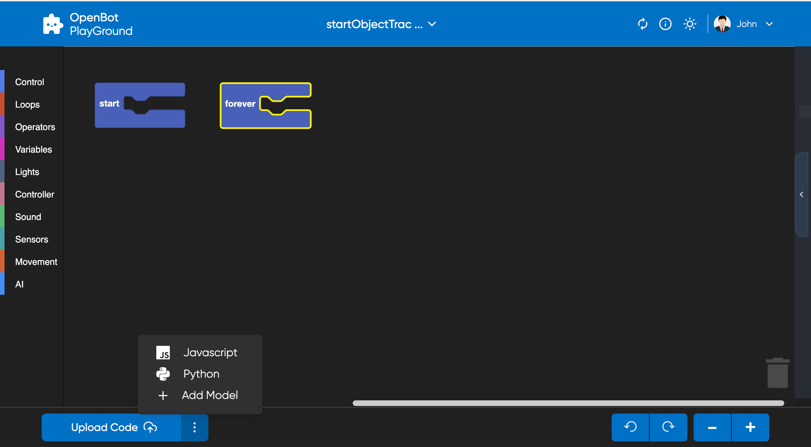

# OpenBot Playground

<p align="center">
  <a href="README.md">English</a> |
  <a href="README.zh-CN.md">简体中文</a> |
  <a href="README.de-DE.md">Deutsch</a> |
  <span>Français</span> |
  <a href="README.es-ES.md">Español</a>
</p>

OpenBot Playground est une plateforme de glisser-déposer pour soutenir l'application OpenBot, où chacun peut créer des instructions pour le robot.

## Pour Commencer

Vous pouvez exécuter cette application directement depuis le [Lien](https://www.playground.openbot.org/ "Lien").

Vous pouvez également l'exécuter localement en créant une copie locale du projet. Pour ce faire, naviguez dans le dossier `openBot/open-code`, [configurez le projet firebase](src/services/README.fr-FR.md) et exécutez l'application. Après [la configuration de firebase](src/services/README.fr-FR.md), exécutez les commandes suivantes :

Si vous utilisez npm

```bash
npm install
```

Dans le cas de yarn

```bash
yarn install
```

Exécutez l'application

```bash
npm start
```

### Fonctionnalités de l'Application

1. Synchronisez votre Google Drive avec OpenBot, et il sauvegardera automatiquement les données.
2. Stockez les données dans le stockage local.
3. Scannez le QR code de sortie directement depuis l'application OpenBot pour exécuter le programme.
4. Dans les applications mobiles OpenBot, après vous être connecté, vous pouvez récupérer les fichiers sauvegardés depuis Google Drive et les charger en un seul clic.
5. Concevez les instructions pour OpenBot sans écrire de code.
6. Design entièrement réactif optimisé pour la navigation sur mobile et tablette.

### Stockage du Projet

Ce projet permet aux utilisateurs de stocker leurs données à la fois localement et sur `Google Drive`. Lorsque le projet est créé, il est automatiquement stocké dans le `stockage local` de l'appareil de l'utilisateur. Au fur et à mesure que des modifications sont apportées au projet, le stockage local est mis à jour en temps réel.

De plus, les utilisateurs peuvent télécharger leur projet sur Google Drive en cliquant sur le [bouton de téléchargement](#generate-Code). Cela permet aux utilisateurs d'accéder à leur projet depuis n'importe quel appareil avec accès à Internet, facilitant ainsi le travail sur le projet depuis différents endroits.

- #### Stockage Local
  Le stockage local est une technologie web intégrée qui permet aux applications web de stocker des données localement dans le navigateur de l'utilisateur. Cela signifie que le projet est stocké sur l'appareil de l'utilisateur et peut être accessible sans connexion Internet.

  Dans ce projet, le stockage local est utilisé pour stocker le projet chaque fois que des modifications y sont apportées. Le projet est stocké dans le cache du navigateur, ce qui signifie qu'il persistera même si l'utilisateur ferme l'onglet ou le navigateur.

- #### Stockage Google Drive
  Google Drive est un service de stockage en ligne fourni par Google. Il permet aux utilisateurs de stocker et de partager des fichiers en ligne, ainsi que d'y accéder depuis n'importe quel appareil avec accès à Internet.

  Dans ce projet, les utilisateurs peuvent télécharger leur projet sur Google Drive en cliquant sur l'icône de téléchargement lorsqu'ils sont connectés au site web. Le projet est alors stocké sur le compte Google Drive de l'utilisateur, ce qui signifie qu'il peut être accessible depuis n'importe quel appareil avec accès à Internet.

  Pour accéder à leur projet depuis Google Drive, les utilisateurs peuvent simplement se connecter à leur compte Google et naviguer vers [mes projets](#project-section), où tous leurs projets stockés seront affichés.

## Écrans de OpenBot Playground

### Page d'Accueil

Le `OpenBot Playground` commence par une page d'accueil qui contient les composants suivants :

- [En-tête](#header) : L'en-tête contient les deux sections suivantes, changer de thème et se connecter.
- [Carrousel](#Carousal) : Le contenu du carrousel explique comment fonctionne le Playground.
- [Section Projet](#project-section) : La section projet contient la liste des projets et le bouton Créer un nouveau projet.

### Page Playground

La page `Playground` est une fonctionnalité clé de la plateforme `OpenBot Playground` qui fournit une variété de blocs de codage pour que les utilisateurs puissent créer différents types de fonctionnalités, telles que le contrôle, les boucles, le mouvement, les opérateurs, les capteurs, et bien plus encore.

- [En-tête](#header) : L'en-tête contient le nom du projet, le centre d'aide, l'AutoSync, le changement de thème et la section de connexion.
- [Espace de Travail](#workSpace) : Espace où les utilisateurs peuvent glisser-déposer les blocs de codage pour générer leur code, qui peut être converti en JavaScript et en Python.
- [Barre Inférieure du Playground](#Playground-Bottom-Bar) : La barre inférieure contient des boutons pour générer du code, télécharger le projet sur le drive, zoomer et dézoomer les blocs, ajouter un modèle, annuler et refaire les modifications dans l'espace de travail.

### En-tête

L'en-tête du site web `Openbot-Playground` a son logo dans la section supérieure gauche. Le côté droit de l'en-tête a deux boutons.

- #### Changer de thème
  L'icône de thème vous permet de passer du mode clair au mode sombre, et vice versa.

  <p align="left">
  
  
  </p>

- #### Se connecter

  Le bouton "Se connecter" ouvre une fenêtre contextuelle de connexion Google à l'écran et vous invite à entrer votre email pour vous connecter, avec toutes les autorisations nécessaires accordées, y compris la modification de ***Google Drive***.
  <p align="left">
  
  </p>

- #### Options de Profil
  Après une connexion réussie, vous aurez des options pour modifier votre profil et vous déconnecter. Le bouton "Modifier le Profil" ouvre une fenêtre contextuelle où vous pouvez mettre à jour votre image de profil, votre nom d'affichage et votre date de naissance.
  <p align="left">
  
  
  </p>

- #### AutoSync:
    - AutoSync permet aux utilisateurs de synchroniser sans effort tous les modèles d'apprentissage automatique (modèles Tflite) de l'application robot OpenBot et de les afficher commodément dans leurs blocs ``Intelligence Artificielle`` respectifs. De plus, les utilisateurs ont la flexibilité de sélectionner le modèle d'IA souhaité directement dans l'interface du bloc lors de la structuration du code.
    - #### Comment ça marche
        - L'application robot télécharge un fichier config.json mis à jour sur le Google Drive de l'utilisateur, y compris tous les nouveaux modèles ajoutés. Ce fichier répertorie tous les modèles ainsi que leurs configurations au format JSON.
        - Lorsque l'utilisateur clique sur ``Auto Sync``, tous les modèles téléchargés, y compris ceux pour la détection, le pilote automatique et la navigation par point de destination, sont filtrés et affichés dans leurs blocs d'IA respectifs.
        - Suite à ce processus, le modèle apparaîtra alors dans les blocs du playground OpenBot. Avec l'aide de Google Drive, vous pouvez sélectionner ce modèle directement depuis les blocs d'IA respectifs.

- #### Page Playground supplémentaire

    - L'en-tête de la page Playground conserve le même design que l'en-tête de la page d'accueil, tout en incorporant des fonctionnalités supplémentaires. Au centre, le nom du projet est affiché avec une flèche vers le bas, offrant des options pour renommer et supprimer le projet.
       <p align="left">
       
       </p>

    - Sur le côté droit, un bouton d'aide a été ajouté, comportant trois sections qui expliquent comment faire glisser et déposer efficacement les blocs, sauvegarder et télécharger les progrès du projet, et télécharger sur le drive pour une collaboration sans faille.

        <p align="left">
        
        </p>

### Carrousel

Le conteneur du carrousel explique comment fonctionne l'application.
<p>


</p>

### Section Projet

La section 'Mes Projets' affiche les projets stockés dans le stockage local et Google Drive (si l'utilisateur est connecté), chaque projet affichant son nom, sa date de création/modification et les versions précédentes des blocs. Cliquer sur un projet redirige l'utilisateur vers sa page playground. Pour créer un nouveau projet, il suffit de cliquer sur l'icône `créer`.

Cliquer sur l'icône 'Créer' ouvre une fenêtre contextuelle 'Créer un Nouveau Projet' avec un champ de saisie pour le nom du projet et un bouton 'Créer'. Une fois qu'un nom approprié est entré et que le bouton 'Créer' ou la touche entrée est pressé, l'écran du playground du projet s'ouvrira. Si l'utilisateur entre un nom déjà attribué à un autre projet, le système générera automatiquement un nom unique en ajoutant un entier à la fin du nom.

<p align="left">


</p>

### Espace de Travail

Pour générer du code, les utilisateurs peuvent glisser-déposer des blocs de codage dans l'espace de travail. Le code peut être converti en JavaScript et en Python.

- Les blocs peuvent être sélectionnés dans la section de gauche et déposés dans l'espace de travail selon les besoins.
- Pour supprimer un bloc, les utilisateurs peuvent simplement le faire glisser vers l'icône de la corbeille située dans le coin inférieur droit.
- Si un bloc ne s'adapte pas au bloc "Démarrer" ou "Toujours", il sera désactivé pour éviter les erreurs dans le code généré.
- Les utilisateurs peuvent restaurer un bloc supprimé depuis la corbeille en cliquant dessus, ce qui affichera une liste des blocs supprimés. Ils peuvent ensuite faire glisser et déposer le bloc souhaité depuis la corbeille dans l'espace de travail.
- En savoir plus sur les Blocs : [Blocs](src/components/blockly/README.fr-FR.md)
  <p align="left">
  
  </p>

### Barre Inférieure du Playground

- Pour garantir une expérience web réussie de l'openBot-PlayGround en utilisant Google Drive, les utilisateurs doivent remplir les conditions suivantes :
    - L'utilisateur ne doit pas avoir d'autre dossier dans son Google Drive avec le même nom que le dossier généré par le site web openBot-PlayGround.
    - L'utilisateur ne doit pas créer de fichier du même nom dans le dossier openBot-PlayGround.
  <p align="left">
  
    <p></p>
  

- #### Générer du Code
  Le bouton Générer du Code sur la barre inférieure du Playground remplit trois fonctions importantes. Premièrement, il génère un code QR qui représente le lien du fichier JavaScript/Python téléchargé sur le Google Drive de l'utilisateur dans le cadre du projet. Ce code QR est affiché dans une fenêtre latérale pour un accès et un partage faciles. Deuxièmement, le bouton télécharge un fichier JavaScript/Python contenant le code du projet sur le Google Drive de l'utilisateur. Et enfin, il télécharge un fichier XML qui représente la configuration des blocs du projet actuel. Ce fichier XML contient la structure et l'agencement des blocs utilisés dans le projet.

    - `Partage Pratique` -
      Le code QR généré par le bouton fournit un lien public partageable vers le fichier JavaScript/Python sur Google Drive. Ce lien peut être accessible en scannant le code QR à l'aide de l'application OpenBot IOS/Android. Cela permet aux utilisateurs de faire fonctionner la voiture en fonction du code généré à l'aide des blocs de codage directement depuis leur appareil mobile. La possibilité de partager le code QR et d'accéder au code sur les appareils mobiles ajoute un autre niveau de commodité et d'accessibilité au playground openBot. L'intégration avec Google Drive permet d'avoir une sauvegarde complète de leur projet. En incluant le fichier XML, la structure et la logique exactes des blocs utilisés dans le projet sont préservées. Cela est bénéfique pour partager, collaborer et revisiter les projets à l'avenir.

  <br></br>
  Voici une démonstration de téléchargement sur Drive et de génération de Code :
  <p align="left">
  
  </p>

- #### Éditeur de Code
  Le bouton de l'éditeur de code à droite du bouton de génération de QR ouvre une fenêtre latérale affichant le code des blocs dans un langage de script. Le bouton offre des options pour choisir entre deux langages, soit JavaScript soit Python, et une fois sélectionné, les utilisateurs peuvent uniquement visualiser leurs extraits de code dans la fenêtre latérale. Ils peuvent basculer entre JavaScript et Python pour voir le code correspondant dans la fenêtre latérale simultanément. Les options pour choisir un langage permettent d'examiner et d'évaluer la justesse des blocs.
  <p align="left">
  
  </p>

- #### Ajouter un Modèle
  Le playground OpenBot fournit une fonctionnalité pour ajouter un modèle d'IA (.tflite) à l'application robot de manière externe. La fenêtre contextuelle du modèle permet à l'utilisateur de modifier la configuration de notre modèle, y compris son nom, son type, sa classe et sa taille d'entrée. Notez que le modèle sera automatiquement sauvegardé dans le Google Drive de l'utilisateur, ainsi que le fichier config.json mis à jour.
  <p align="left">
  
  
  </p>


- #### Contrôleur de l'Espace de Travail
  Le bouton annuler et refaire aide à effectuer les fonctionnalités d'annulation et de rétablissement dans le playground. L'icône plus est pour zoomer et l'icône moins est pour dézoomer.

## Suivant (optionnel)

Dépannage de l'authentification Firebase [Firebase](src/services/README.fr-FR.md#troubleshooting)