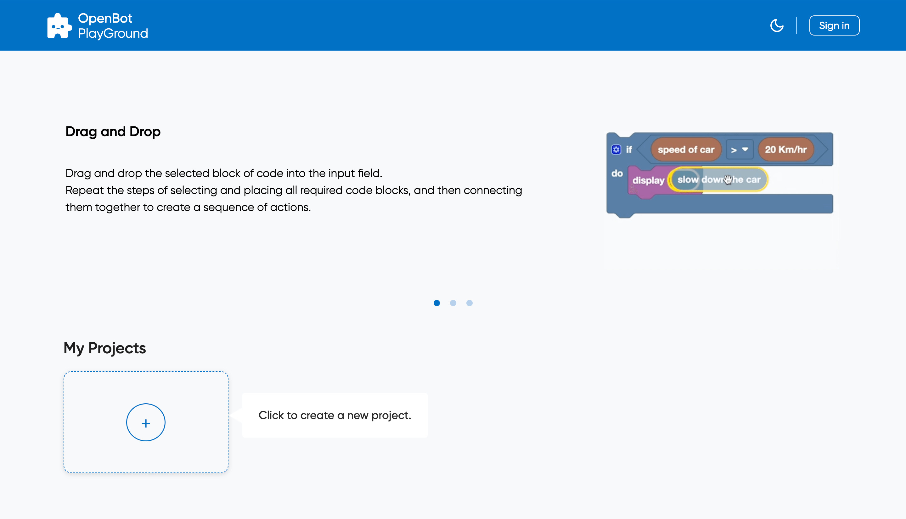
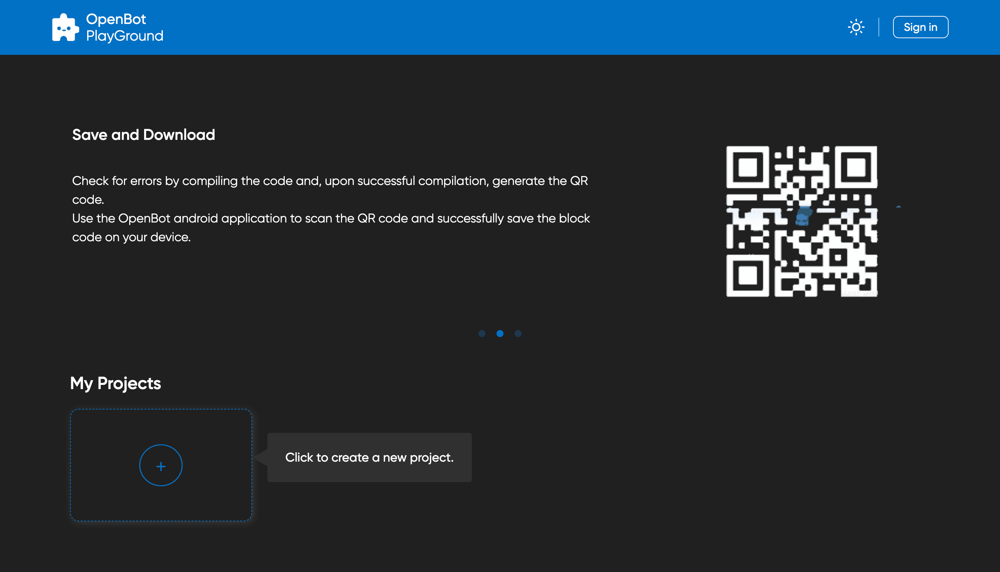
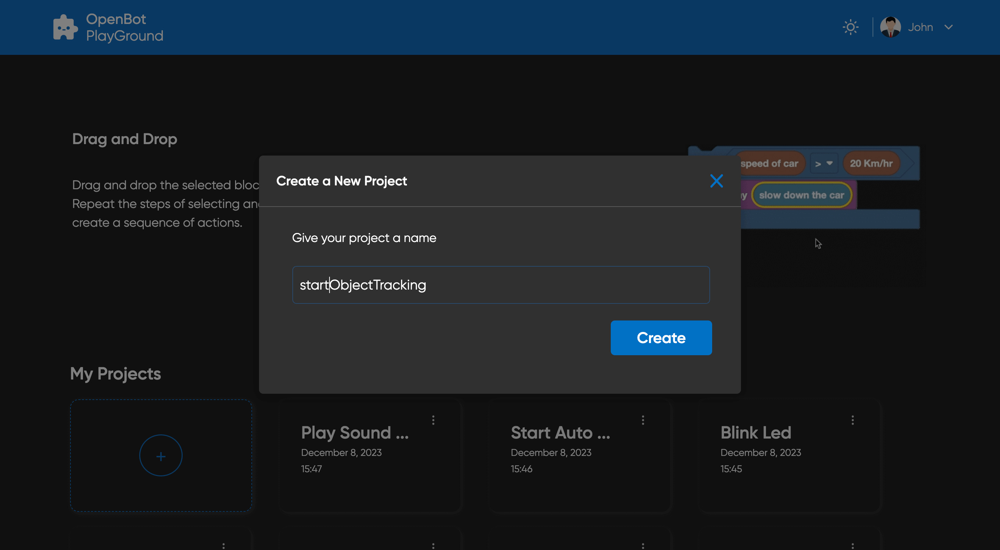
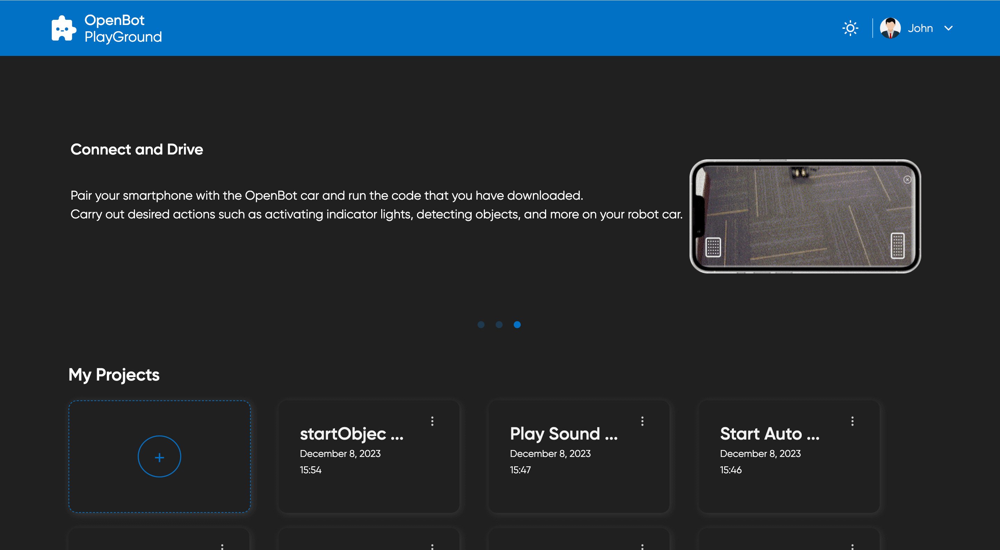
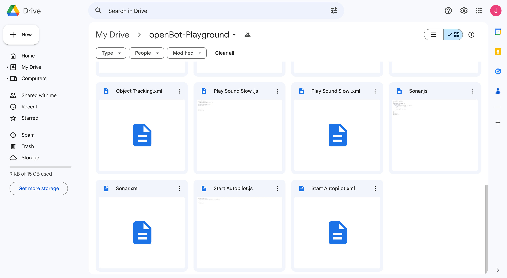
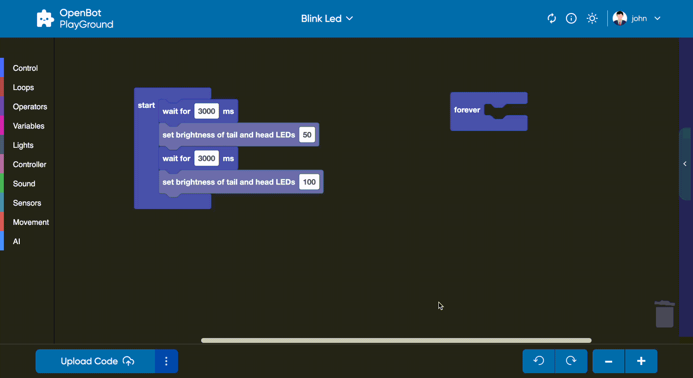

# OpenBot 놀이터

<p align="center">
  <a href="README.md">English</a> |
  <a href="README.zh-CN.md">简体中文</a> |
  <a href="README.de-DE.md">Deutsch</a> |
  <a href="README.fr-FR.md">Français</a> |
  <a href="README.es-ES.md">Español</a> |
  <span>한국어</span>
</p>

OpenBot 놀이터는 OpenBot 애플리케이션을 지원하는 드래그 앤 드롭 플랫폼으로, 누구나 로봇을 위한 지시 사항을 만들 수 있습니다.

## 시작하기

이 애플리케이션은 [링크](https://www.playground.openbot.org/ "Link")에서 바로 실행할 수 있어요.

또한, 프로젝트의 로컬 복사본을 만들어서 로컬에서 실행할 수도 있어요. 이를 위해 `openBot/open-code` 폴더로 이동한 후, [firebase 프로젝트 설정](src/services/README.ko-KR.md)을
진행하고 애플리케이션을 실행하세요. [firebase 설정](src/services/README.ko-KR.md) 후에는 다음 명령어를 실행하면 돼요:

npm을 사용하는 경우

```bash
npm install
```

yarn을 사용하는 경우:

```bash
yarn install
```

애플리케이션 실행:

```bash
npm start
```

### 애플리케이션 기능

1. Google Drive와 OpenBot을 동기화하면, 데이터가 자동으로 저장돼요.
2. 데이터를 로컬 스토리지에 저장할 수 있어요.
3. OpenBot 애플리케이션에서 출력된 QR 코드를 바로 스캔해서 프로그램을 실행할 수 있어요.
4. OpenBot 모바일 앱에서 로그인 후, Google Drive에서 저장된 파일을 한 번의 클릭으로 불러올 수 있어요.
5. 코딩 없이 OpenBot에 대한 명령을 디자인할 수 있어요.
6. 모바일과 태블릿 브라우징에 최적화된 완전 반응형 디자인이에요.

### 프로젝트 저장소

이 프로젝트는 사용자가 데이터를 로컬 저장소와 `Google Drive`에 모두 저장할 수 있도록 해요. 프로젝트가 생성되면 자동으로 사용자의 기기 `로컬 저장소`에 저장되고, 프로젝트에 변경사항이 생길 때마다 로컬
저장소가 실시간으로 업데이트돼요.

또한, 사용자는 [업로드 버튼](#코드-생성)을 클릭하여 프로젝트를 Google Drive에 업로드할 수 있어요. 이렇게 하면 인터넷에 연결된 어떤 기기에서도 프로젝트에 접근할 수 있어, 다른 위치에서
프로젝트를 작업하는 것이 더 쉬워져요.

- #### 로컬 저장소
  로컬 저장소는 웹 애플리케이션이 사용자의 브라우저 내에 데이터를 로컬로 저장할 수 있도록 하는 웹 기술이에요. 즉, 프로젝트가 사용자의 기기에 저장되어 인터넷 연결 없이도 접근할 수 있어요.

  이 프로젝트에서는 변경사항이 생길 때마다 프로젝트를 로컬 저장소에 저장해요. 프로젝트는 브라우저의 캐시에 저장되므로, 사용자가 탭이나 브라우저를 닫아도 지속적으로 저장돼요.

- #### Google Drive 저장소
  Google Drive는 구글에서 제공하는 클라우드 기반의 저장 서비스에요. 사용자는 파일을 온라인으로 저장하고 공유할 수 있으며, 인터넷에 연결된 모든 기기에서 접근할 수 있어요.

  이 프로젝트에서는 사용자가 웹사이트에 로그인한 후 업로드 아이콘을 클릭하여 프로젝트를 Google Drive에 업로드할 수 있어요. 프로젝트는 사용자의 Google Drive 계정에 저장되며, 인터넷에 연결된
  어떤 기기에서든 접근할 수 있어요.

  Google Drive에서 프로젝트에 접근하려면, 사용자는 자신의 Google 계정에 로그인하고 [내 프로젝트](#프로젝트-섹션)로 이동하면 저장된 모든 프로젝트를 확인할 수 있어요.

## OpenBot Playground 화면

### 홈 페이지

`OpenBot Playground`는 다음과 같은 구성 요소를 포함한 홈 페이지로 시작돼요:

- [헤더](#헤더): 헤더에는 테마 변경과 사용자 로그인 섹션이 있어요.
- [캐러셀](#캐러셀): 캐러셀의 콘텐츠는 Playground가 어떻게 작동하는지 설명해요.
- [프로젝트 섹션](#프로젝트-섹션): 프로젝트 섹션에는 프로젝트 목록과 새 프로젝트 만들기 버튼이 있어요.

### Playground 페이지

`Playground` 페이지는 `OpenBot Playground` 플랫폼의 핵심 기능으로, 사용자가 다양한 기능을 만들 수 있도록 여러 코딩 블록을 제공해요. 제어, 반복문, 이동, 연산자, 센서 등 다양한
기능을 생성할 수 있어요.

- [헤더](#헤더): 헤더에는 프로젝트 이름, 도움말 센터, 자동 동기화, 테마 변경, 사용자 로그인 섹션이 있어요.
- [워크스페이스](#워크스페이스): 사용자가 코딩 블록을 드래그 앤 드롭하여 코드를 생성할 수 있는 공간이에요. 생성된 코드는 JavaScript와 Python으로 변환할 수 있어요.
- [Playground 하단 바](#Playground-하단-바): 하단 바에는 코드 생성, 프로젝트 업로드, 블록 확대/축소, 모델 추가, 워크스페이스에서 변경 사항 되돌리기 및 다시 실행 버튼이
  있어요.

### 헤더

`Openbot-Playground` 웹사이트의 헤더는 왼쪽 상단에 로고가 위치해 있어요. 헤더의 오른쪽에는 두 개의 버튼이 있어요.

- #### 테마 변경
  테마 아이콘을 사용하면 라이트 모드와 다크 모드를 전환할 수 있어요.

  <p align="left">
  
  
  </p>

- #### 로그인

  "로그인" 버튼을 클릭하면 구글 로그인 팝업이 화면에 나타나며, 이메일을 입력하고 모든 필요한 권한(구글 드라이브 수정 권한 포함)을 부여하여 로그인할 수 있어요.
  <p align="left">
  
  </p>

- #### 프로필 옵션
  로그인에 성공하면 프로필을 편집하거나 로그아웃할 수 있는 옵션이 제공돼요. "프로필 편집" 버튼을 클릭하면 팝업창이 열리고, 여기서 프로필 이미지, 표시 이름, 생일 등을 업데이트할 수 있어요.
  <p align="left">
  
  
  </p>

- #### 자동 동기화 (AutoSync)
    - AutoSync는 OpenBot 로봇 앱에서 모든 기계 학습 모델(Tflite 모델)을 원활하게 동기화하고, 이를 해당 "인공지능(AI)" 블록에 편리하게 표시할 수 있게 해줘요. 또한 사용자는 코드를
      구조화하는 동안 원하는 AI 모델을 블록 인터페이스에서 직접 선택할 수 있어요.
    - #### 작동 방식
        - 로봇 앱은 업데이트된 config.json 파일을 구글 드라이브에 업로드하고, 새로 추가된 모델을 포함시켜요. 이 파일은 모델과 그 설정을 JSON 형식으로 나열해요.
        - 사용자가 "Auto Sync"를 클릭하면, 다운로드된 모든 모델 (탐지, 자율주행, 목표 지점 탐색 모델 포함)이 필터링되어 해당 AI 블록에 표시돼요.
        - 이 과정 후에, 모델은 OpenBot Playground 블록 내에서 나타나요. 구글 드라이브 덕분에 이 모델을 해당 AI 블록에서 직접 선택할 수 있어요.

- #### Playground 페이지 추가 기능

    - Playground 페이지 헤더는 홈페이지 헤더와 같은 디자인을 유지하면서, 추가 기능들이 포함돼요. 중앙에는 프로젝트 이름이 표시되며, 아래쪽 화살표를 클릭하면 프로젝트 이름을 바꾸거나 삭제할 수 있는
      옵션이 나와요.
       <p align="left">
       
       </p>

    - 오른쪽에는 도움말 버튼이 추가돼요. 이 버튼은 블록을 드래그 앤 드롭하는 방법, 프로젝트 진행 상황을 저장하고 다운로드하는 방법, 드라이브에 업로드하여 협업하는 방법을 설명하는 세 가지 섹션으로 구성돼
      있어요.

        <p align="left">
        
        </p>

### 캐러셀

캐러셀 컨테이너는 애플리케이션이 어떻게 작동하는지 설명해요.
<p>



</p>

### 프로젝트 섹션

'내 프로젝트' 섹션은 로컬 스토리지와 구글 드라이브(사용자가 로그인한 경우)에 저장된 프로젝트들을 표시하며, 각 프로젝트는 이름, 생성/수정 날짜, 이전 블록 버전을 보여줘요. 프로젝트를 클릭하면 해당 프로젝트의
Playground 페이지로 이동해요. 새 프로젝트를 만들려면 `생성 아이콘`을 클릭하면 돼요.

'생성' 아이콘을 클릭하면 '새 프로젝트 생성' 팝업이 열리고, 프로젝트 이름을 입력할 수 있는 필드와 '생성' 버튼이 나타나요. 적절한 이름을 입력하고 '생성' 버튼이나 Enter 키를 누르면 프로젝트의
Playground 화면이 열려요. 만약 이미 다른 프로젝트에 할당된 이름을 입력하면 시스템이 자동으로 이름 뒤에 숫자를 추가하여 고유한 이름을 생성해줘요.

<p align="left">



</p>

### 워크스페이스

코드를 생성하려면 사용자가 코딩 블록을 워크스페이스로 드래그 앤 드롭할 수 있어요. 생성된 코드는 JavaScript와 Python으로 변환할 수 있어요.

- 블록은 왼쪽 섹션에서 선택하여 필요한 곳에 드래그하여 추가할 수 있어요.
- 블록을 삭제하려면 해당 블록을 오른쪽 하단에 위치한 휴지통 아이콘으로 드래그하면 돼요.
- 만약 블록이 "시작" 또는 "영원히" 블록에 맞지 않으면, 오류를 방지하기 위해 비활성화돼요.
- 삭제된 블록은 휴지통을 클릭하여 복원할 수 있어요. 복원한 블록은 삭제된 블록 목록에서 선택할 수 있고, 원하는 블록을 드래그하여 워크스페이스로 다시 추가할 수 있어요.
- 블록에 대해 더 알아보려면: [블록](src/components/blockly/README.ko-KR.md)

<p align="left">

</p>

### Playground 하단 바

- OpenBot-Playground 웹 경험이 성공적으로 이루어지도록 하려면 사용자가 다음 조건을 충족해야 해요:
    - 사용자의 Google Drive에 OpenBot-Playground 웹사이트에서 생성된 폴더와 동일한 이름의 다른 폴더가 없어야 해요.
    - OpenBot-Playground 폴더 안에 동일한 이름의 파일을 생성하면 안 돼요.

<p align="left">

<p></p>


- #### 코드 생성
  "Generate Code" 버튼은 Playground 하단 바에서 세 가지 중요한 기능을 수행해요. 첫 번째로, 사용자가 업로드한 JavaScript/Python 파일의 링크를 나타내는 QR 코드를 생성해요. 이 QR 코드는 사이드 윈도우에 표시되어 쉽게 접근하고 공유할 수 있어요. 두 번째로, 이 버튼은 프로젝트의 코드를 담고 있는 JavaScript/Python 파일을 사용자의 Google Drive에 업로드해요. 마지막으로, 현재 프로젝트의 블록 구성 상태를 나타내는 XML 파일을 업로드해요. 이 XML 파일은 프로젝트에서 사용된 블록들의 구조와 배치를 담고 있어요.

    - `편리한 공유` -
      이 버튼으로 생성된 QR 코드는 Google Drive에 저장된 JavaScript/Python 파일의 공개 가능한 링크를 제공해요. 이 링크는 OpenBot iOS/Android 앱을 사용하여 QR
      코드를 스캔함으로써 접근할 수 있어요. 이렇게 하면 사용자가 모바일 기기에서 생성된 코드를 기반으로 자동차를 직접 실행할 수 있어요. QR 코드를 공유하고 모바일 장치에서 코드를 액세스할 수 있는 기능은
      OpenBot Playground에 추가적인 편리함과 접근성을 제공해요. Google Drive와의 통합을 통해 프로젝트의 포괄적인 백업을 유지할 수 있어요. XML 파일을 포함함으로써 프로젝트에서 사용된
      블록의 정확한 구조와 논리를 보존할 수 있어요. 이는 프로젝트를 공유하고 협업하거나 나중에 다시 방문할 때 유용해요.

  <br></br>
  여기 Google Drive에 업로드하고 코드 생성하는 데모입니다:
  <p align="left">
  
  </p>

- #### 코드 에디터
  코드 에디터 버튼은 QR 코드 생성 버튼 오른쪽에 위치하며, 클릭 시 블록 코드를 스크립트 언어로 표시하는 사이드 창이 열려요. 이 버튼은 사용자가 JavaScript 또는 Python 중 하나의 언어를 선택할 수 있는 옵션을 제공해요. 선택 후, 사용자는 사이드 창에서 해당 언어의 코드 스니펫만 볼 수 있어요. JavaScript와 Python을 번갈아 선택하여 두 언어에서 대응하는 코드를 동시에 볼 수 있어요. 언어 선택 옵션을 통해 블록의 정확성을 확인하고 평가할 수 있어요.
  <p align="left">
  
  </p>

- #### 모델 추가
  OpenBot Playground는 외부 AI 모델(.tflite)을 로봇 애플리케이션에 추가할 수 있는 기능을 제공해요. 모델 팝업을 통해 사용자는 모델의 이름, 유형, 클래스 및 입력 크기 등의 구성을 편집할 수
  있어요. 모델은 사용자의 Google Drive에 자동으로 저장되며, 업데이트된 config.json 파일도 함께 저장돼요.
  <p align="left">
  
  
  </p>

- #### 작업 공간 컨트롤러
  '되돌리기'와 '다시 실행' 버튼은 Playground에서 되돌리기와 다시 실행 기능을 제공해요. 더하기 아이콘은 줌 인, 빼기 아이콘은 줌 아웃을 위한 기능이에요.

## 다음 (선택 사항)

Firebase 인증 문제 해결 [Firebase](src/services/README.ko-KR.md#troubleshooting)

