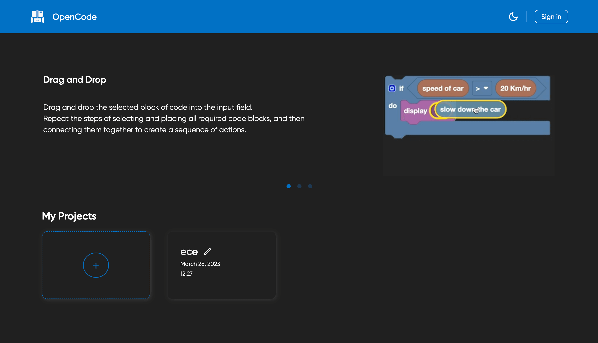
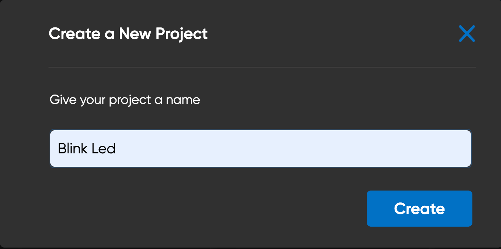
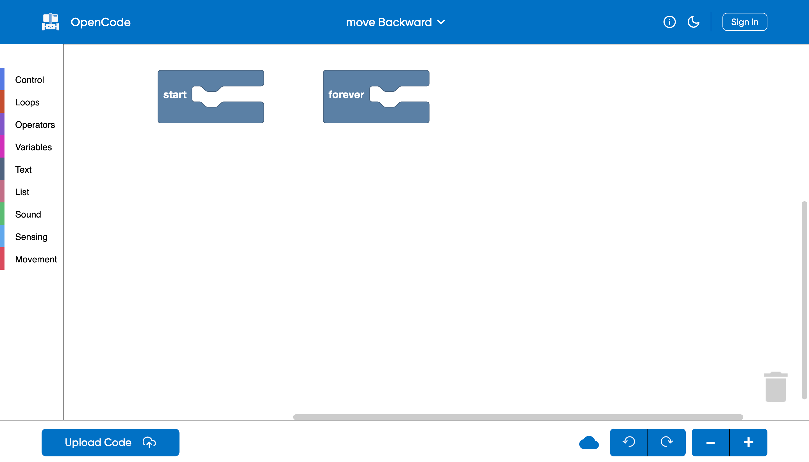
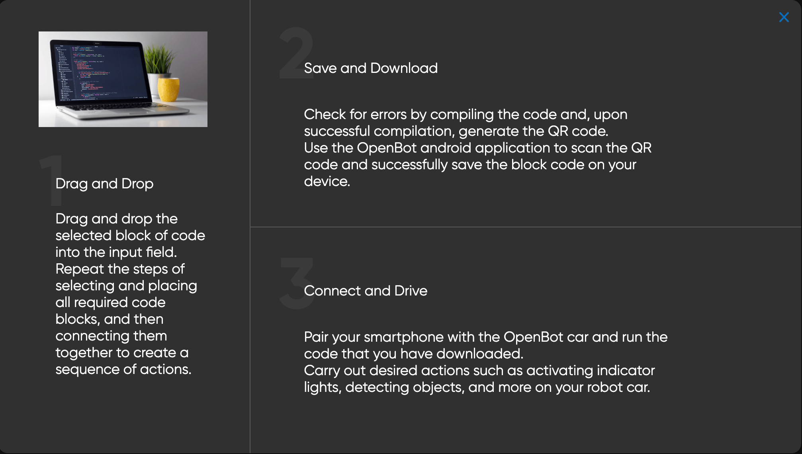
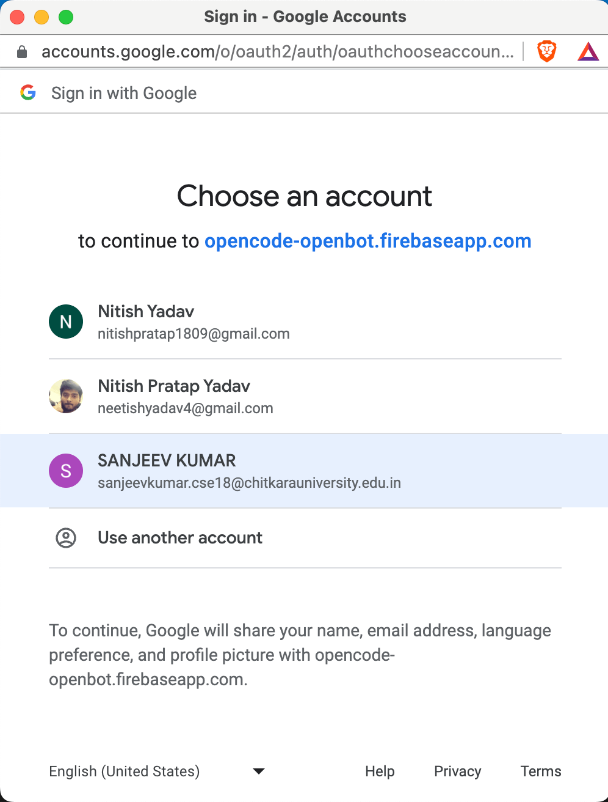
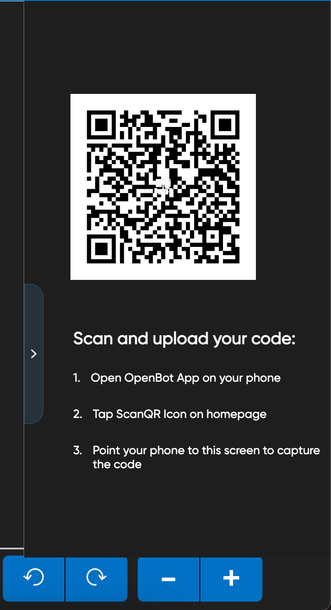

# OpenBot Playground

## Introduction

OpenBot Playground is open source project, to play with the components of OpenBot into Block Coding format.

In playground, you can create your set of instructions that you want to give to the OpenBot robot, and it follows them.

## Getting Started

You can run this application directly from the [Link](http://openbot-playground.com "Link").

or you can run it locally via creating a local copy of the project.
then navigate into the `open-code` folder

run

```bash
    npm install
```

if you're using npm or

```bash
yarn install
```

in case of yarn

## Key features

### Application Features

1. Sync your Google Drive with the OpenBot, and it automatically saved the data on it.
2. Store the data into local storage.
3. Scan the output QR directly from OpenBot Application and run the program.
4. In OpenBot Mobile apps, login with Google Drive to see saved files and load them with one click.
5. Design the instructions for OpenBot with zero code.

## Playground Screens

### Home Page

The `OpenBot Playground` starts with homepage that contains a header, a carousel to explain how the playground works and `My projects` sections. The header contains a change theme icon and a sign-in button. The theme can be changed by clicking the `theme icon` and a google login popup will be opened by clicking the `Sign In` button.
In the `My Projects` section there is a create new project button, click here to create a new project with the given name and navigate to the playground page.
<p align="left">

</p>

#### Create New project
On clicking `create icon` a popup of `Create New Project` will open on screen. This popup contains a input of project name and a button name `Create`. After giving suitable name to the project and pressing `Create` button playground of the project will open.
<p align="left">

</p>

#### Project

If there is any existing project inside localstorage of system or inside drive signin these projects will be displayed on the all projects section. Project model contains project name, date and time of project created/edited. On selecting a project we will redirect to playground of that project with its previous version of blocks.

### Workspace

The `Workspace` page of `OpenBot Playground` offers coding blocks of different types like `Control, Loops, Movement, Operators, Sensors etc. `. This page have `header` `Block Type` `Footer` section. The functionalities of various buttons of  this page are explained in subsequent sections.
<p align="left">

</p>

#### Header

The header of the `workspace` screen has the `OpenCode` logo in the left section. This will redirect to the homepage. In the centre, the name of the project will be displayed with a downward arrow. The right side of the header have three buttons.
-  help
-  change theme
-  sign-in

#### Help

The help icon opens a popup on the screen. It has 3 sections which explain how to drag and drop the blocks, save and downward and upload to drive.
<p align="left">

</p>

#### Change theme

Change theme change the theme from dark mode to light and vice-versa.

#### Sign-in

This icon opens google sign-in popup on screen and ask to choose email to for login. Make sure to give permission of modify google drive.
After sign-in we have options of edit profile and logout.
Edit profile opens a popup. Updation of profile image, display name can be done here.
<p align="left">

</p>

#### Upload Code

The upload code button generates the QR code of blocks inside the workspace. A side window will appear after the successful generation of the QR code. It also uploads a javascript file of the Project on google drive. The file contains the javascript code of generated blocks.
The generated QR have a public shareable link to a javascript file on the drive and it can be scanned by OpenBot IOS/Android app for and run the car.
<p align="left">

</p>

#### Cloud Undo Redo and Zoom
The footer of the playground has these buttons. Cloud icon upload xml file of current project block to google drive. The undo-redo button helps to do undo redo functionalities in the playground.
The plus icon is for zoom-in and the minus icon is for zoom-out.
