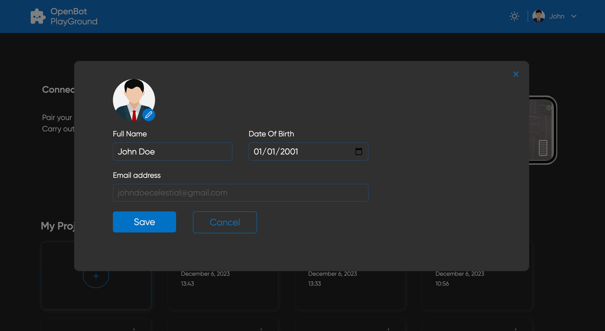
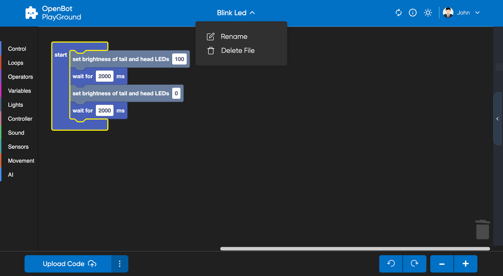
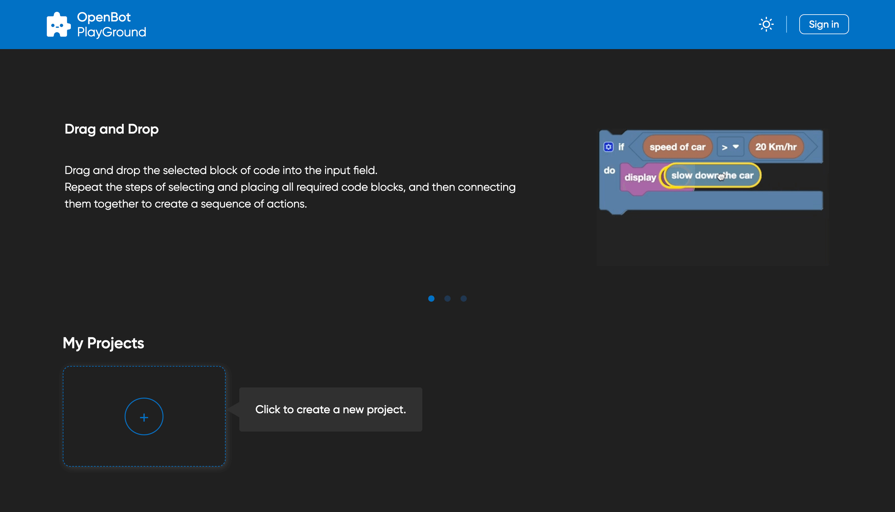
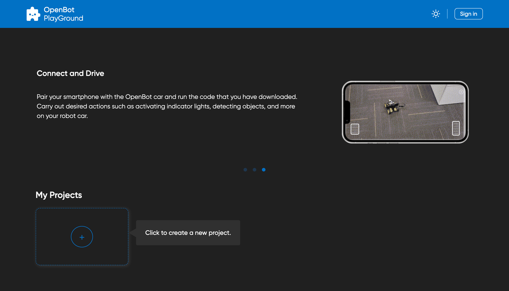

# OpenBot Playground

<p align="center">
  <a href="README.md">English</a> |
  <span>简体中文</span> |
  <a href="README.de-DE.md">Deutsch</a> |
  <a href="README.fr-FR.md">Français</a> |
  <a href="README.es-ES.md">Español</a>
</p>

OpenBot Playground 是一个支持 OpenBot 应用程序的拖放平台，任何人都可以在这里为机器人构建指令。

## 入门指南

你可以直接从 [链接](https://www.playground.openbot.org/ "Link") 运行此应用程序。

你也可以通过创建项目的本地副本在本地运行它。为此，请导航到 `openBot/open-code` 文件夹，[设置 firebase 项目](src/services/README.zh-CN.md) 并运行应用程序。在 [firebase 设置](src/services/README.zh-CN.md) 完成后，运行以下命令：

如果你使用 npm

```bash
npm install
```

如果使用 yarn

```bash
yarn install
```

运行应用程序

```bash
npm start
```

### 应用程序功能

1. 将你的 Google Drive 与 OpenBot 同步，它会自动保存数据。
2. 将数据存储到本地存储中。
3. 直接从 OpenBot 应用程序扫描输出的二维码以运行程序。
4. 在 OpenBot 移动应用中，登录后可以从 Google Drive 中检索保存的文件，并一键加载。
5. 零代码设计 OpenBot 的指令。
6. 完全响应式设计，优化了移动设备和平板电脑的浏览体验。

### 项目存储

该项目允许用户将数据存储在本地和 `Google Drive` 上。当项目创建时，它会自动存储在用户设备的 `本地存储` 中。随着项目的更改，本地存储会实时更新。

此外，用户可以通过点击 [上传按钮](#generate-Code) 将项目上传到 Google Drive。这使得用户可以从任何有互联网访问的设备上访问他们的项目，从而更容易在不同地点工作。

- #### 本地存储
  本地存储是一种内置的 Web 技术，允许 Web 应用程序在用户的浏览器中本地存储数据。这意味着项目存储在用户的设备上，可以在没有互联网连接的情况下访问。

  在这个项目中，每当对项目进行更改时，本地存储会存储项目。项目存储在浏览器的缓存中，这意味着即使用户关闭标签页或浏览器，它也会持续存在。

- #### Google Drive 存储
  Google Drive 是 Google 提供的基于云的存储服务。它允许用户在线存储和共享文件，并可以从任何有互联网访问的设备上访问这些文件。

  在这个项目中，用户可以在登录网站时点击上传图标将项目上传到 Google Drive。项目存储在用户的 Google Drive 账户中，这意味着可以从任何有互联网访问的设备上访问。

  要从 Google Drive 访问他们的项目，用户只需登录到他们的 Google 账户并导航到 [我的项目](#project-section)，所有存储的项目都会显示在那里。

## OpenBot Playground 屏幕

### 主页

`OpenBot Playground` 从包含以下组件的主页开始：

- [头部](#header) ：头部包含两个部分，切换主题和用户登录。
- [轮播](#Carousal)：轮播内容解释了 Playground 的工作原理。
- [项目部分](#project-section) ：项目部分包含项目列表和创建新项目按钮。

### Playground 页面

`Playground` 页面是 `OpenBot Playground` 平台的一个关键功能，提供各种编码块，用户可以创建不同类型的功能，如控制、循环、移动、运算符、传感器等。

- [头部](#header) ：头部包含项目名称、帮助中心、自动同步、切换主题和用户登录部分。
- [工作区](#workSpace)：用户可以在工作区拖放编码块生成代码，可以转换为 JavaScript 和 Python。
- [Playground 底部栏](#Playground-Bottom-Bar) ：底部栏包含生成代码、上传项目到 Google Drive、放大和缩小块、添加模型、撤销和重做工作区更改的按钮。

### 头部

`Openbot-Playground` 网站的头部左上角有其标志。头部右侧有两个按钮。

- #### 切换主题
  主题图标允许你在浅色模式和深色模式之间切换，反之亦然。

  <p align="left">
  
  
  </p>

- #### 登录

  "登录" 按钮会在屏幕上打开一个 Google 登录弹出窗口，并提示你输入电子邮件进行登录，授予所有必要的权限，包括修改 ***Google Drive***。
  <p align="left">
  
  </p>

- #### 个人资料选项
  成功登录后，你将有选项编辑个人资料和注销。"编辑个人资料" 按钮会打开一个弹出窗口，你可以在其中更新个人资料图片、显示名称和出生日期。
  <p align="left">
  
  
  </p>

- #### 自动同步:
    - 自动同步使用户能够无缝同步所有机器学习模型（Tflite 模型），从 OpenBot 机器人应用程序中方便地显示在各自的 ``人工智能`` 块中。此外，用户可以在构建代码时直接在块界面中选择所需的 AI 模型。
    - #### 工作原理
        - 机器人应用程序将更新的 config.json 文件上传到用户的 Google Drive，包括任何新添加的模型。该文件以 JSON 格式列出所有模型及其配置。
        - 当用户点击 ``自动同步`` 时，所有下载的模型，包括检测、自驾和目标导航模型，都会被过滤并显示在各自的 AI 块中。
        - 之后，模型将出现在 OpenBot playground 块中。在 Google Drive 的帮助下，你可以无缝地从各自的 AI 块中选择此模型。

- #### Playground 页面附加功能

    - Playground 页面头部保留了与主页头部相同的设计，同时增加了附加功能。中间显示项目名称，并带有向下箭头，提供重命名和删除项目的选项。
       <p align="left">
       
       </p>

    - 右侧添加了一个帮助按钮，包含三个部分，解释如何有效地拖放块、保存和下载项目进度，以及上传到 Google Drive 以实现无缝协作。

        <p align="left">
        
        </p>

### 轮播

轮播容器解释了应用程序的工作原理。
<p>



</p>

### 项目部分

“我的项目”部分显示存储在本地存储和 Google Drive（如果用户已登录）中的项目，每个项目显示其名称、创建/编辑日期和以前的块版本。点击项目会将用户重定向到其 playground 页面。要创建新项目，只需点击 `创建图标`。

点击“创建”图标会打开一个“创建新项目”弹出窗口，输入项目名称并点击“创建”按钮。一旦输入合适的名称并按下“创建”按钮或回车键，项目的 playground 屏幕将打开。如果用户输入的名称已分配给另一个项目，系统会自动生成一个唯一名称，在名称末尾附加一个整数。

<p align="left">


</p>

### 工作区

要生成代码，用户可以将编码块拖放到工作区。代码可以转换为 JavaScript 和 Python。

- 可以从左侧选择块并根据需要拖放到工作区。
- 要删除块，用户只需将其拖到右下角的垃圾桶图标。
- 如果块不适合“开始”或“永远”块，它将被禁用以防止生成代码时出错。
- 用户可以通过点击垃圾桶恢复已删除的块，这将显示已删除块的列表。然后他们可以将所需的块从垃圾桶拖回工作区。
- 了解更多关于块的信息：[Blocks](src/components/blockly/README.zh-CN.md)
  <p align="left">
  
  </p>

### Playground 底部栏

- 为确保使用 Google Drive 的 openBot-PlayGround 的成功 Web 体验，用户应满足以下条件：
    - 用户的 Google Drive 中不应有与网站生成的 openBot-PlayGround 文件夹同名的其他文件夹。
    - 用户不应在 openBot-PlayGround 文件夹中创建同名文件。
  <p align="left">
  
    <p></p>
  

- #### 生成代码
  Playground 底部栏的生成代码按钮有三个重要功能。首先，它生成一个二维码，表示上传到用户 Google Drive 的 JavaScript/Python 文件的链接。此二维码显示在侧窗口中，便于访问和共享。其次，该按钮将包含项目代码的 JavaScript/Python 文件上传到用户的 Google Drive。最后，上传一个 XML 文件，该文件表示当前项目的块配置。此 XML 文件包含项目中使用的块的结构和排列。

    - `便捷共享` -
      按钮生成的二维码提供了 Google Drive 上 JavaScript/Python 文件的公共共享链接。可以通过使用 OpenBot IOS/Android 应用程序扫描二维码来访问此链接。这允许用户直接从移动设备运行基于编码块生成的代码。共享二维码和在移动设备上访问代码的能力为 openBot playground 增加了另一个便利性和可访问性层次。与 Google Drive 的集成允许你对项目进行全面备份。通过包含 XML 文件，项目中使用的块的确切结构和逻辑得以保留。这对你分享、协作和将来重新访问项目非常有益。

  <br></br>
  这是在 Google Drive 中上传和生成代码的演示：
  <p align="left">
  
  </p>

- #### 代码编辑器
  生成二维码按钮右侧的代码编辑器按钮会打开一个侧窗口，显示块代码的脚本语言。按钮提供选择两种语言的选项，JavaScript 或 Python，一旦选择，用户只能在侧窗口中查看他们的代码片段。他们可以在 JavaScript 和 Python 之间切换，同时在侧窗口中查看相应的代码。选择语言的选项使你能够检查和评估块的正确性。
  <p align="left">
  
  </p>

- #### 添加模型
  OpenBot playground 提供了一个功能，可以将外部 AI 模型（.tflite）添加到机器人应用程序。模型弹出窗口允许用户编辑模型的配置，包括其名称、类型、类别和输入大小。请注意，模型将自动保存在用户的 Google Drive 中，并附带更新的 config.json 文件。
  <p align="left">
  
  
  </p>


- #### 工作区控制器
  撤销和重做按钮有助于在 playground 中执行撤销重做功能。加号图标用于放大，减号图标用于缩小。

## 下一步（可选）

Firebase 身份验证故障排除 [Firebase](src/services/README.zh-CN.md#troubleshooting)