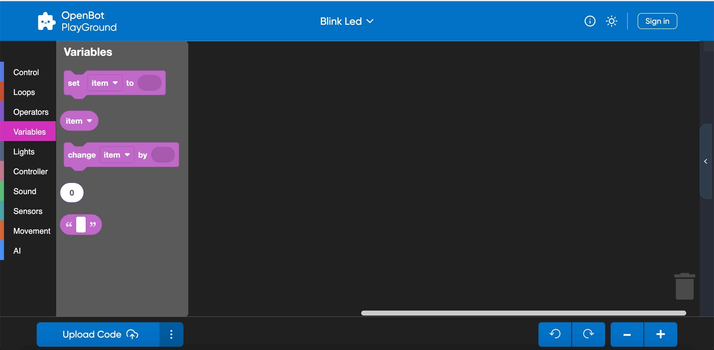
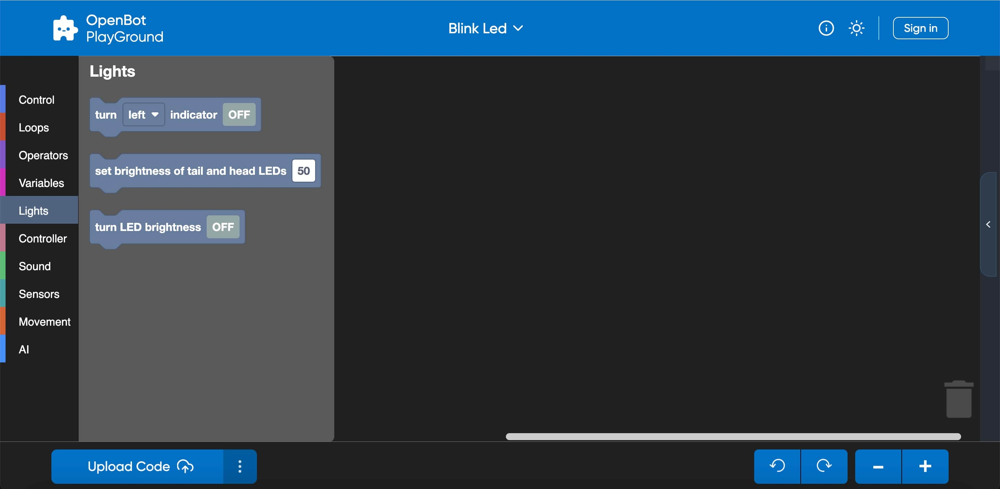
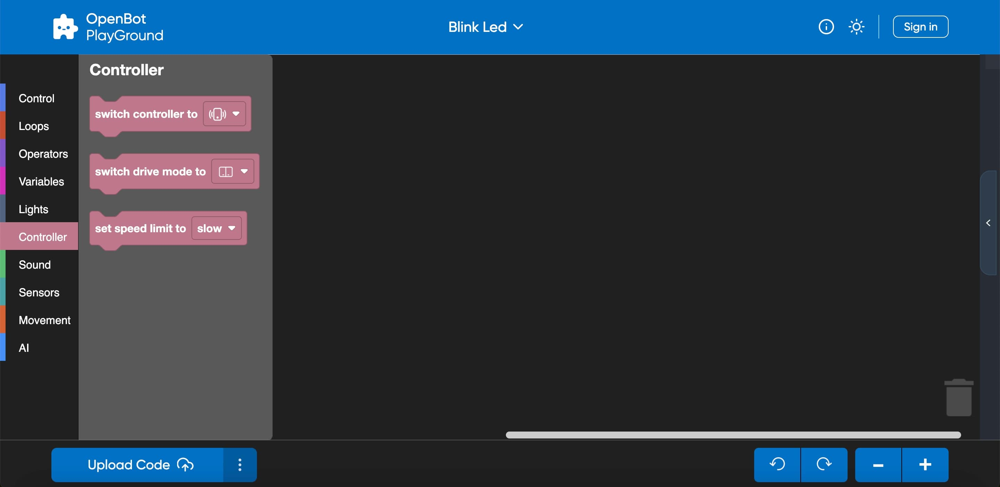

## OpenBot PlayGround:

  <a href="README.md">English</a> |
  <a href="README.zh-CN.md">简体中文</a> |
  Deutsch |
  <a href="README.fr-FR.md">Français</a> |
  <a href="README.es-ES.md">Español</a>

### OpenBot Robot Info:

- OpenBot Robot konfiguriert die folgenden Komponenten in sich.
    - Sensoren: Spannungsteiler, Sonar, Stoßfänger, Geschwindigkeit.
    - Raddrehzahlmesser: Vorder- und Hinterräder.
    - LEDs: Blinker, Vorder-, Rücklichter, Status.
    - Motoren: Vorwärts und Rückwärts.

### OpenBot PlayGround Kategorien:

- ### Steuerung:

  OpenBot PlayGround enthält anpassbare Blöcke, die verwendet werden können, um den Programmfluss zu steuern, wie Schleifen, Ereignisse und Bedingungen. Es bietet eine visuelle Möglichkeit für Benutzer, die Logik ihrer Programme zu strukturieren.

    

  Ein kurzer Überblick über einige Steuerungsblöcke:
    - Start: Startet die Ausführung des Programms und führt den Blockcode einmal aus.
    - Bedingungen: ``If``- und ``If-else``-Blöcke werden verwendet, um bedingte Verzweigungen in Ihrem Code zu erstellen.
        - Warten: Bringt Pausen oder Verzögerungen in die Codeausführung.
        - Für immer: Sobald der Für-immer-Block eingebettet ist, wird er eine Endlosschleife erstellen, was bedeutet, dass die Schleife unendlich weiterläuft.

- ### Schleifen:

  Die Kategorie Schleifen bietet verschiedene Blöcke, die helfen, den Programmfluss durch Wiederholung zu steuern.

     

  Einige Beispiele für Schleifenblöcke sind hier unten aufgeführt:

    - Wiederholen: Der ``Wiederholen``-Block ermöglicht es Ihnen, die Anzahl der Iterationen für einen Satz von Blöcken zu definieren.
    - Während: Der ``Während``-Block führt einen Satz von Blöcken aus, solange eine bestimmte Bedingung wahr bleibt.

- ### Operatoren:

  Operatoren ermöglichen es Ihnen, verschiedene Operationen oder Berechnungen innerhalb Ihres Programms durchzuführen. Die Blöcke ermöglichen es Ihnen, komplexe Ausdrücke und Bedingungen nach Bedarf zu erstellen.

  

  Hier sind einige gängige Arten von Operatoren, die Sie in OpenBot PlayGround finden könnten:

    - Arithmetik: Addition, Subtraktion, Multiplikation, Division und andere arithmetische Operationen sind in dieser Kategorie verfügbar.
    - Mathematische Operatoren: Blöcke wie "Potenz", "Quadratwurzel" und "Zufallsbruch" werden verwendet, um fortgeschrittenere mathematische Berechnungen durchzuführen.

- ### Variablen:

  Variablen werden zur Datenspeicherung innerhalb Ihrer Blöcke verwendet, und in der Variablenkategorie ermöglichen Blöcke es Ihnen, Variablen zu deklarieren, zu setzen, zu ändern und zu manipulieren. Das Konzept der Variablen in OpenBot PlayGround hilft Ihnen, Daten in Ihren Programmen zu verwalten und zu manipulieren.

  

  Schauen Sie sich einige Beispiele für Variablenblöcke an:

    - Setzen: Der Setzen-Variablen-Block weist einer Variablen einen Wert zu.
    - Ändern: Es hilft Ihnen, den Wert einer vorhandenen Variablen zu ändern.

- ### Lichter:

  Lichter sind eine weitere Kategorie, die von OpenBot PlayGround bereitgestellt wird und hilft, die Verwendung von Blinkern zu ermöglichen und die Helligkeitswerte dynamisch einzustellen.

  

  Hier sind einige Beispiele:
    - Blinker: Block, der verwendet wird, um Blinker durch Ein- und Ausschalten zu aktivieren.
    - Helligkeit: Wird verwendet, um die Helligkeit der Heck- und Front-LEDs durch dynamische Werte einzustellen.

  HINWEIS: Wenn die Helligkeit auf null gesetzt wird, wird der Helligkeitsmodus ausgeschaltet, und wenn die Helligkeit auf den höchsten Punkt, d.h. 100, gesetzt wird, wird der Helligkeitsmodus eingeschaltet.

- ### Controller:

  Sicherlich! Wenn Sie einen Modus im Controller-Block auswählen, wird dieser einheitlich auf alle anderen Fragmente innerhalb der OpenBot-Roboter-App angewendet.

  

  Hier sind die Beispiele für den Controller-Block:

    - Controller wechseln: Es hilft Ihnen, die Controller-Methode entweder durch Gamepad oder Telefon auszuwählen.
    - Fahrmodus: Es hilft Ihnen, den Fahrmodus entweder durch Joystick, Spiel oder dual zu wechseln.

   
TIPP: Wenn Sie das Telefon als Controller auswählen, wird der Fahrmodus in der Roboter-App unabhängig vom gewählten Fahrmodus-Block automatisch auf dual gesetzt. 

- ### Sound:

  Sound-Blöcke können verwendet werden, um Sound für Fahrmodi und statische Geschwindigkeit des Roboters abzuspielen.

  

  Lassen Sie uns einige Beispiele ansehen:

    - Geschwindigkeit: Hilft Ihnen, den Sound als langsam, mittel und schnell abzuspielen.
    - Modus: Hilft Ihnen, den Sound als dual, Joystick oder Spiel abzuspielen.

- ### Sensoren:

  Sensoren sind die Blöcke, die verschiedene Messwerte für den Zustand und die Umgebung des OpenBot zurückgeben.

  

  Überblick:
    - Telefonsensoren: Helfen, Gyroskop-, Beschleunigungs- und Magnetfeldmessungen an verschiedenen Achsen (3-dimensional) zu messen.
    - Autosensoren: Helfen, verschiedene Messwerte wie Sonar, Geschwindigkeit bereitzustellen. Außerdem wird überprüft, ob der Stoßfänger mit einem Hindernis kollidiert.

- ### Bewegung:

  Wie der Name schon sagt, ist es verantwortlich für die Bewegung des Roboters mit jeder Geschwindigkeit und in jede Richtung, und das Geschwindigkeitslimit beträgt 0-255.

  

  Lassen Sie uns einige Beispiele ansehen:

    - Geschwindigkeit einstellen: Hilft, die Geschwindigkeit als langsam, mittel und schnell einzustellen.
    - Bewegen: Hilft, die Bewegung vorwärts oder rückwärts und links oder rechts mit der erforderlichen Geschwindigkeit zu machen.

  Wichtige Punkte:
    - Wenn der linke Geschwindigkeitswert niedriger als der rechte eingestellt ist, bewegt sich der Roboter gegen den Uhrzeigersinn, oder umgekehrt.
    - Wenn Sie die linke und rechte Geschwindigkeit gleichsetzen, bewegt er sich geradeaus.
    - Wenn Sie einen positiven Wert auf der linken Seite und einen negativen Wert auf der rechten Seite einstellen, dreht sich der Roboter.

- ### Künstliche Intelligenz (KI):

  OpenBot Playground bietet eine weitere wichtige Kategorie namens Künstliche Intelligenz, die viele Funktionen wie Objektverfolgung, Autopilot, Punktzielnavigation konfiguriert.

  

  Lassen Sie uns dieses Konzept anhand einiger Blockbeispiele verstehen:
    - ``Objektverfolgung``: Ihre Hauptfunktion besteht darin, Objekte zu erkennen. Dieses KI-Fragment ermöglicht es Ihnen, ein beliebiges Objekt zur Verfolgung auszuwählen. Abhängig von der Leistung Ihres Telefons haben Sie die Flexibilität, ein Objekterkennungsmodell auszuwählen. Standardmäßig ist dieser Block mit dem Modell "MobileNetV1-300" ausgestattet. Zusätzlich haben Sie die Möglichkeit, manuell ein beliebiges Modell hinzuzufügen.
    - ``Autopilot``: Dieses Snippet ist auch über OpenBot Playground verfügbar und nutzt die Datenerfassung, wobei ein vortrainiertes Datenset (ML-Modell CIL-Mobile-Cmd) bereits integriert ist. Anschließend wird das Kamerafragment auf dem Bildschirm angezeigt und die Verfolgung des erfassten Pfades gestartet.
    - ``Punktzielnavigation``: Das Hauptziel dieses Blocks besteht darin, durch Navigation einen bestimmten Punkt zu erreichen. Sie können die Vorwärts- und Links-Werte in einer 3-dimensionalen Ansicht mit den Navigationsmodellen darin konfigurieren. Wenn das Projekt auf einem Telefon ausgeführt wird, wird das Punktnavigationsfragment auf dem Bildschirm mit einer Augmented Reality (AR)-Ansicht angezeigt. Anschließend wird der Roboter die Bewegung initiieren, bis er das Ziel erfolgreich erreicht.

   
 TIPP: Wenn Sie ein externes Modell integriert haben, stellen Sie sicher, dass AutoSync im Playground aktiviert ist. Diese Funktion hilft Ihnen, das neu hinzugefügte Modell im Block anzuzeigen und die Verfügbarkeit und den erfolgreichen Download des Modells in der Roboter-App zu überprüfen.

- ### Fortgeschrittene Künstliche Intelligenz (KI):

  Der OpenBotPlayground führt mehrere Fortschritte ein und bietet eine fortgeschrittene Künstliche Intelligenz (KI), die modulare Blöcke für Erkennung und Autopilot-Funktionalität bietet.

  

  #### Mehrfacherkennungsblock:

    - Dieses fortschrittliche Modul ist für die Objektverfolgung konzipiert und unterstützt verschiedene Klassen wie Person, Auto, Buch, Ampel usw. Die Identifizierung des Objekts erfolgt durch das integrierte KI-Modell. Die Funktionalität dieses Moduls hängt von den angegebenen Bedingungen ab.
    - Der Block ist so konzipiert, dass er mehrere Objekterkennungen ermöglicht und den Prozess für die angegebene Klasse initialisiert. Sobald die gewählte Klasse erkannt wird, führt der Roboter alle Aufgaben aus, die in der nachfolgenden ``do``-Anweisung aufgeführt sind. Wenn die angegebene Klasse innerhalb der definierten Anzahl kontinuierlicher Frames nicht erkannt wird, fährt der Roboter mit der Ausführung der Aufgaben fort, die in der nachfolgenden ``do``-Anweisung angegeben sind. Der Block kann mehrfach innerhalb des Playgrounds für verschiedene Klassen verwendet werden.