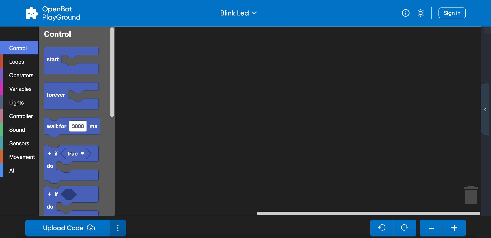
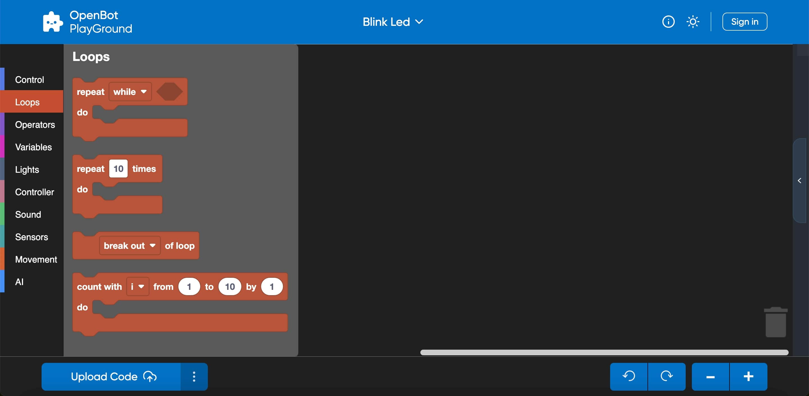
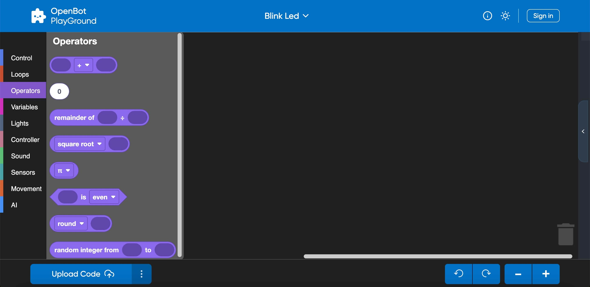
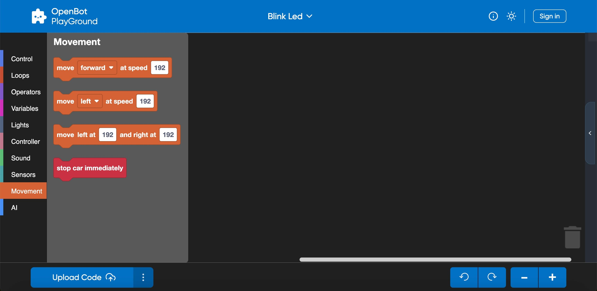
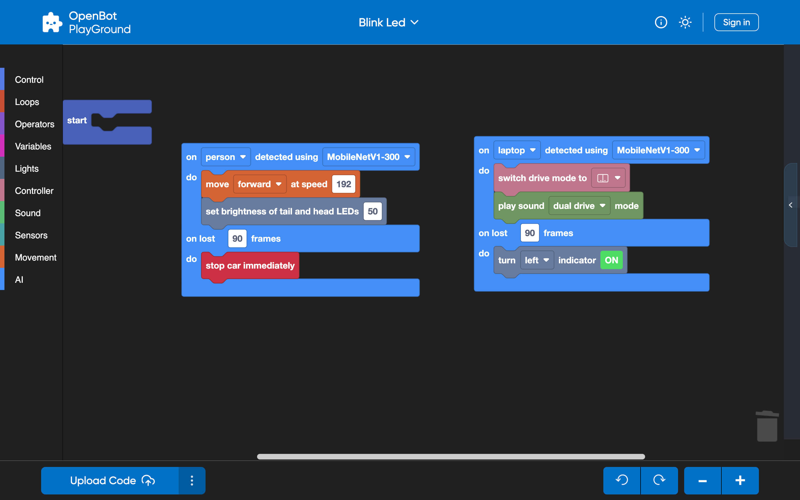

## OpenBot PlayGround:

  <a href="README.md">English</a> |
  <a href="README.zh-CN.md">简体中文</a> |
  <a href="README.de-DE.md">Deutsch</a> |
  <a href="README.fr-FR.md">Français</a> |
  Español

### Información del Robot OpenBot:

- El Robot OpenBot configura los siguientes componentes dentro de él.
    - Sensores: Divisor de voltaje, Sonar, Parachoques, Velocidad.
    - Odómetro de Ruedas: Ruedas delanteras y traseras.
    - Luces LED: Indicadores, Delanteras, Traseras, estado.
    - Motores: Adelante y Atrás.

### Categorías del OpenBot PlayGround:

- ### Control:

  OpenBot PlayGround incluye bloques personalizables que se pueden usar para controlar el flujo del programa, como bucles, eventos y condicionales. Proporciona una forma visual para que los usuarios estructuren la lógica de sus programas.

    

  Una breve descripción de algunos bloques de control:
    - Inicio: Inicia la ejecución del programa y ejecuta el código del bloque una sola vez.
    - Condicionales: Los bloques ``If`` y ``If-else`` se utilizan para crear ramas condicionales en tu código.
        - Esperar: Introduce pausas o retrasos en la ejecución del código.
        - Para Siempre: Una vez que el bloque Para Siempre está incrustado en su lugar, creará un bucle infinito que indica que el bucle continuará indefinidamente con cada iteración.

- ### Bucles:

  La categoría de Bucles proporciona varios bloques que ayudan a controlar el flujo de tu programa a través de la repetición.

     

  Algunos ejemplos de bloques de bucles son los siguientes:

    - Repetir: El bloque ``Repetir`` te permite definir el número de iteraciones para un conjunto de bloques a ejecutar.
    - Mientras: El bloque ``Mientras`` continúa ejecutando un conjunto de bloques mientras una condición especificada sea verdadera.

- ### Operadores:

  Los operadores te permiten realizar varias operaciones o cálculos dentro de tu programa. Los bloques te permiten construir expresiones y condiciones complejas según sea necesario.

  

  Aquí hay algunos tipos comunes de operadores que podrías encontrar en OpenBot PlayGround:

    - Aritmética: Suma, resta, multiplicación, división y otras operaciones aritméticas están disponibles en esta categoría.
    - Operadores Matemáticos: Bloques como "Potencia", "Raíz Cuadrada" y "Fracción Aleatoria" se utilizan para realizar cálculos matemáticos más avanzados.

- ### Variables:

  Las variables se utilizan para el almacenamiento de datos dentro de tus bloques y dentro de la categoría de variables, los bloques te permiten declarar, establecer, cambiar y manipular variables. El concepto de variables en OpenBot PlayGround te ayuda a gestionar y manipular datos en tus programas.

  

  Echa un vistazo a algunos ejemplos de bloques de Variables:

    - Establecer: El bloque Establecer Variable asignará un valor a una variable.
    - Cambiar: Te ayudará a modificar el valor de una variable existente.

- ### Luces:

  Las luces son otro tipo de categoría proporcionada por OpenBot PlayGround que ayuda a utilizar los indicadores y puede establecer los valores de brillo dinámicamente.

  

  A continuación, se presentan algunos ejemplos:
    - Indicadores: Bloque utilizado para habilitar los indicadores encendiéndolos/apagándolos.
    - Brillo: Se utiliza para establecer el brillo de los LED traseros y delanteros tomando valores dinámicos.

  NOTA: Mantener el brillo en cero apagará el modo de brillo y si el brillo está en el punto más alto, es decir, 100, encenderá el modo de brillo.

- ### Controlador:

  ¡Por supuesto! Al seleccionar un modo dentro del bloque del controlador, se aplicará uniformemente a todos los demás fragmentos dentro de la aplicación del robot OpenBot.

  

  A continuación, se presentan ejemplos del Bloque de Controlador:

    - Cambiar Controlador: Te ayuda a elegir el método de Controlador ya sea Gamepad o Teléfono.
    - Modo de Conducción: Te ayuda a cambiar el Modo de Conducción ya sea Joystick o Juego o dual.

   
CONSEJO: Si seleccionas Teléfono como controlador, el modo de conducción se establece automáticamente en dual en la aplicación del robot independientemente del modo de conducción elegido en el bloque.

- ### Sonido:

  Los Bloques de Sonido se pueden utilizar para reproducir sonido para los modos de conducción y la velocidad estática del robot.

  

  Veamos algunos ejemplos:

    - Velocidad: Te ayuda a reproducir el sonido como lento, medio y rápido.
    - Modo: Te ayuda a reproducir el sonido como dual, joystick o juego.

- ### Sensores:

  Los sensores son los bloques que van a devolver diferentes lecturas para la condición de OpenBot y el estado del entorno.

  

  Descripción general:
    - Sensores del Teléfono: Ayudan a medir las lecturas del Giroscopio, Aceleración y Magnéticas en diferentes ejes (3-Dimensional).
    - Sensores del Coche: Ayudan a proporcionar diferentes lecturas como Sonar, Velocidad. Además, comprobará si el parachoques choca con un obstáculo.

- ### Movimiento:

  Como su nombre indica, es responsable del movimiento del Robot a cualquier velocidad y en cualquier dirección y el límite de velocidad es 0-255.

  

  Veamos algunos ejemplos:

    - Establecer velocidad: Ayuda a establecer la velocidad como lenta, media y rápida.
    - Mover: Ayuda a realizar el movimiento hacia adelante o hacia atrás y hacia la izquierda o derecha a la velocidad requerida.

  Puntos Clave:
    - Si el valor de la velocidad izquierda se establece más bajo que el derecho, el robot se moverá en sentido antihorario, o viceversa.
    - Si igualas las velocidades izquierda y derecha, se moverá en línea recta.
    - Establecer un valor positivo en la izquierda y un valor negativo en la derecha hará que el robot gire.

- ### Inteligencia Artificial (IA):

  OpenBot Playground proporciona otra categoría importante llamada Inteligencia Artificial que configura muchas características como Seguimiento de Objetos, Piloto Automático, Navegación a Punto de Destino.

  

  Entendamos este concepto con algunos ejemplos de bloques:
    - ``Seguimiento de Objetos``: Su función principal gira en torno a la detección de objetos. Este fragmento de IA te permite elegir cualquier objeto para el seguimiento. Dependiendo del rendimiento de tu teléfono, tienes la flexibilidad de elegir un modelo de detector de objetos. Por defecto, este bloque viene equipado con el modelo "MobileNetV1-300". Además, tienes la opción de agregar manualmente cualquier modelo de tu elección.
    - ``Piloto Automático``: Este fragmento también está disponible a través de OpenBot Playground, utilizando la recopilación de datos, donde un conjunto de datos preentrenado (modelo ML CIL-Mobile-Cmd) ya está integrado. Posteriormente, el fragmento de la cámara se muestra en la pantalla, iniciando el seguimiento del camino capturado.
    - ``Navegación a Punto de Destino``: El objetivo principal de este bloque es llegar a un punto designado a través de la navegación. Puedes configurar los valores de avance e izquierda en vista tridimensional utilizando los modelos de navegación dentro de él. Cuando el proyecto se ejecuta en un teléfono, el fragmento de navegación a punto se mostrará en la pantalla con una vista de Realidad Aumentada (AR). Posteriormente, el robot iniciará el movimiento hasta que alcance con éxito el objetivo.

   
 CONSEJO: Si has incorporado un modelo externo, asegúrate de habilitar AutoSync en el playground. Esta función te ayudará a mostrar el nuevo modelo agregado en el bloque y verificar la disponibilidad y descarga exitosa del modelo en la aplicación del robot.

- ### Inteligencia Artificial Avanzada (IA):

  OpenBotPlayground introduce varios avances, presentando una Inteligencia Artificial (IA) Avanzada que ofrece bloques modulares para la detección y la funcionalidad de piloto automático.

  

  #### Bloque de Detección Múltiple:

    - Este módulo avanzado está diseñado para el seguimiento de objetos, acomodando varias clases como persona, coche, libro, semáforo, etc. La identificación del objeto se lleva a cabo por el modelo de IA integrado. La funcionalidad de este módulo depende de las condiciones especificadas.
    - El bloque está diseñado para habilitar la detección de múltiples objetos, iniciando el proceso para la clase especificada. Una vez que se detecta la clase elegida, el robot ejecutará todas las tareas descritas en la declaración ``do`` subsiguiente. Si la clase especificada no se detecta dentro del número definido de cuadros continuos, el robot procederá a ejecutar las tareas especificadas en la declaración ``do`` subsiguiente. El bloque se puede usar múltiples veces dentro del playground para diferentes clases también.