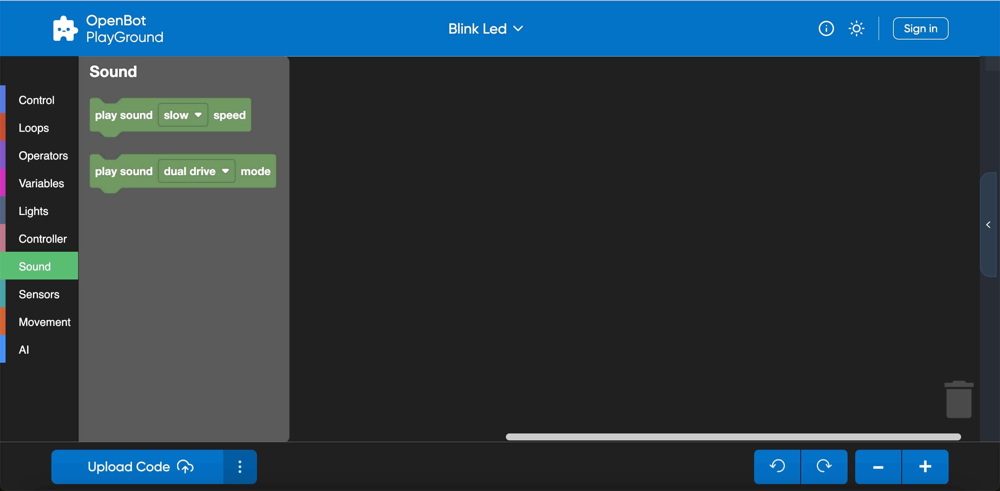
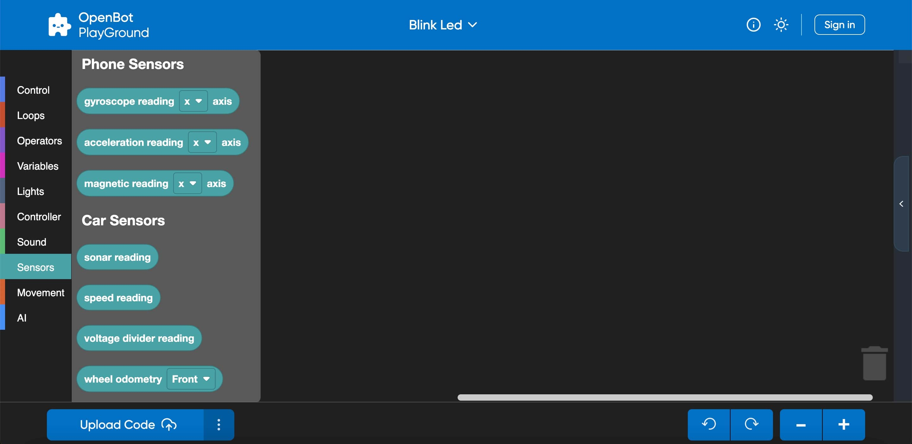

## OpenBot PlayGround:

  <a href="README.md">English</a> |
  <a href="README.zh-CN.md">简体中文</a> |
  <a href="README.de-DE.md">Deutsch</a> |
  Français |
  <a href="README.es-ES.md">Español</a>

### Informations sur le robot OpenBot :

- Le robot OpenBot configure les composants suivants à l'intérieur :
    - Capteurs : Diviseur de tension, Sonar, Pare-chocs, Vitesse.
    - Odomètre de roue : Roues avant et arrière.
    - LED : Indicateurs, avant, arrière, statut.
    - Moteurs : Avant et arrière.

### Catégories de l'OpenBot PlayGround :

- ### Contrôle :

  OpenBot PlayGround inclut des blocs personnalisables qui peuvent être utilisés pour contrôler le flux du programme tels que les boucles, les événements et les conditionnels. Il offre une manière visuelle pour les utilisateurs de structurer la logique de leurs programmes.

    

  Un bref aperçu de certains blocs de contrôle :
    - Démarrer : Initie l'exécution du programme et exécute le code du bloc une seule fois.
    - Conditionnels : Les blocs ``If`` et ``If-else`` sont utilisés pour créer des branches conditionnelles dans votre code.
        - Attendre : Introduit des pauses ou des délais dans l'exécution du code.
        - Toujours : Une fois le bloc Toujours intégré, il créera une boucle infinie indiquant que la boucle continuera indéfiniment à chaque itération.

- ### Boucles :

  La catégorie Boucles fournit divers blocs qui aident à contrôler le flux de votre programme par la répétition.

     

  Voici quelques exemples de blocs de boucle :

    - Répéter : Le bloc ``Répéter`` vous permet de définir le nombre d'itérations pour un ensemble de blocs à exécuter.
    - Tant que : Le bloc ``Tant que`` continue d'exécuter un ensemble de blocs tant qu'une condition spécifiée reste vraie.

- ### Opérateurs :

  Les opérateurs vous permettent d'effectuer plusieurs opérations ou calculs au sein de votre programme. Les blocs vous permettent de construire des expressions et des conditions complexes selon les besoins.

  

  Voici quelques types courants d'opérateurs que vous pourriez trouver dans OpenBot PlayGround :

    - Arithmétique : Addition, soustraction, multiplication, division et autres opérations arithmétiques sont disponibles dans cette catégorie.
    - Opérateurs mathématiques : Des blocs comme "Puissance", "Racine carrée" et "Fraction aléatoire" sont utilisés pour effectuer des calculs mathématiques plus avancés.

- ### Variables :

  Les variables sont utilisées pour le stockage de données au sein de vos blocs et dans la catégorie des variables, les blocs vous permettent de déclarer, définir, modifier et manipuler des variables. Le concept de variables dans OpenBot PlayGround vous aide à gérer et manipuler les données dans vos programmes.

  

  Voici quelques exemples de blocs de variables :

    - Définir : Le bloc Définir une variable va assigner une valeur à une variable.
    - Changer : Il vous aidera à modifier la valeur d'une variable existante.

- ### Lumières :

  Les lumières sont une autre catégorie fournie par OpenBot PlayGround qui aide à utiliser les indicateurs et peut définir les valeurs de luminosité de manière dynamique.

  

  Voici quelques exemples :
    - Indicateurs : Bloc utilisé pour activer les indicateurs en les allumant/éteignant.
    - Luminosité : Utilisé pour définir la luminosité des LED avant et arrière en prenant des valeurs dynamiques.

  REMARQUE : Garder la luminosité à zéro désactivera le mode luminosité et si la luminosité est au maximum, c'est-à-dire 100, cela activera le mode luminosité.

- ### Contrôleur :

  Certainement ! Lors de la sélection d'un mode dans le bloc contrôleur, il sera appliqué uniformément à tous les autres fragments de l'application robot OpenBot.

  

  Voici des exemples de blocs de contrôleur :

    - Changer de contrôleur : Il vous aide à choisir la méthode de contrôle soit par Gamepad soit par téléphone.
    - Mode de conduite : Il vous aide à changer le mode de conduite soit par Joystick, soit par Jeu, soit par double.

   
ASTUCE : Si vous sélectionnez le téléphone comme contrôleur, le mode de conduite se règle automatiquement sur double dans l'application robot, quel que soit le mode de conduite choisi dans le bloc.

- ### Son :

  Les blocs de son peuvent être utilisés pour jouer des sons pour les modes de conduite et la vitesse statique du robot.

  

  Voici quelques exemples :

    - Vitesse : Aide à jouer le son comme lent, moyen et rapide.
    - Mode : Aide à jouer le son comme double, joystick ou jeu.

- ### Capteurs :

  Les capteurs sont les blocs qui vont renvoyer différentes lectures pour l'état et l'environnement de l'OpenBot.

  

  Aperçu :
    - Capteurs de téléphone : Aident à mesurer les lectures du gyroscope, de l'accélération et du magnétisme sur différents axes (3D).
    - Capteurs de voiture : Aident à fournir différentes lectures comme le sonar, la vitesse. De plus, ils vérifieront si le pare-chocs entre en collision avec un obstacle.

- ### Mouvement :

  Comme son nom l'indique, il est responsable du mouvement du robot à n'importe quelle vitesse et dans n'importe quelle direction, et la limite de vitesse est de 0-255.

  

  Voici quelques exemples :

    - Définir la vitesse : Aide à définir la vitesse comme lente, moyenne et rapide.
    - Mouvement : Aide à effectuer le mouvement en avant ou en arrière et à gauche ou à droite à la vitesse requise.

  Points clés :
    - Si la valeur de la vitesse gauche est inférieure à celle de la droite, le robot se déplacera dans le sens antihoraire, ou vice versa.
    - Si vous égalisez les vitesses gauche et droite, il se déplacera en ligne droite.
    - Définir une valeur positive à gauche et une valeur négative à droite fera tourner le robot.

- ### Intelligence Artificielle (IA) :

  OpenBot Playground fournit une autre catégorie importante nommée Intelligence Artificielle qui configure de nombreuses fonctionnalités telles que le suivi d'objets, le pilote automatique, la navigation vers un point.

  

  Comprenons ce concept par quelques exemples de blocs :
    - ``Suivi d'objet`` : Sa fonction principale tourne autour de la détection d'objets. Ce fragment d'IA vous permet de choisir n'importe quel objet à suivre. En fonction des performances de votre téléphone, vous avez la flexibilité de choisir un modèle de détecteur d'objets. Par défaut, ce bloc est équipé du modèle "MobileNetV1-300". De plus, vous avez la possibilité d'ajouter manuellement n'importe quel modèle de votre choix.
    - ``Pilote automatique`` : Ce fragment est également disponible via OpenBot Playground, utilisant la collecte de données, où un ensemble de données pré-entraîné (modèle ML CIL-Mobile-Cmd) est déjà intégré. Ensuite, le fragment de la caméra est affiché à l'écran, initiant le suivi du chemin capturé.
    - ``Navigation vers un point`` : L'objectif principal de ce bloc est d'atteindre un point désigné par la navigation. Vous pouvez configurer les valeurs avant et gauche en vue tridimensionnelle en utilisant les modèles de navigation à l'intérieur. Lorsque le projet est exécuté sur un téléphone, le fragment de navigation vers un point sera affiché à l'écran avec une vue en réalité augmentée (AR). Ensuite, le robot commencera à se déplacer jusqu'à ce qu'il atteigne avec succès le but.

   
 ASTUCE : Si vous avez incorporé un modèle externe, assurez-vous d'activer AutoSync dans le playground. Cette fonctionnalité vous aidera à afficher le nouveau modèle ajouté dans le bloc et à vérifier la disponibilité et le téléchargement réussi du modèle dans l'application robot.

- ### Intelligence Artificielle Avancée (IA) :

  OpenBotPlayground introduit plusieurs avancées, avec une Intelligence Artificielle Avancée (IA) qui offre des blocs modulaires pour la détection et la fonctionnalité de pilote automatique.

  

  #### Bloc de détection multiple :

    - Ce module avancé est conçu pour le suivi d'objets, en accommodant diverses classes telles que personne, voiture, livre, feu de circulation, etc. L'identification de l'objet est effectuée par le modèle d'IA intégré. La fonctionnalité de ce module dépend des conditions spécifiées.
    - Le bloc est conçu pour permettre la détection de plusieurs objets, en initiant le processus pour la classe spécifiée. Une fois la classe choisie détectée, le robot exécutera toutes les tâches décrites dans l'instruction ``do`` suivante. Si la classe spécifiée n'est pas détectée dans le nombre défini de cadres continus, le robot procédera à l'exécution des tâches spécifiées dans l'instruction ``do`` suivante. Le bloc peut être utilisé plusieurs fois dans le playground pour différentes classes également.