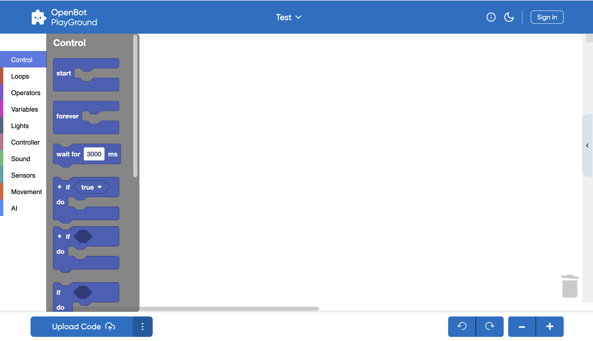
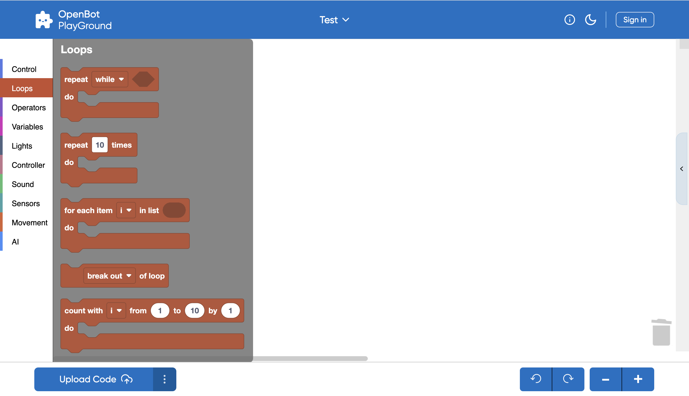
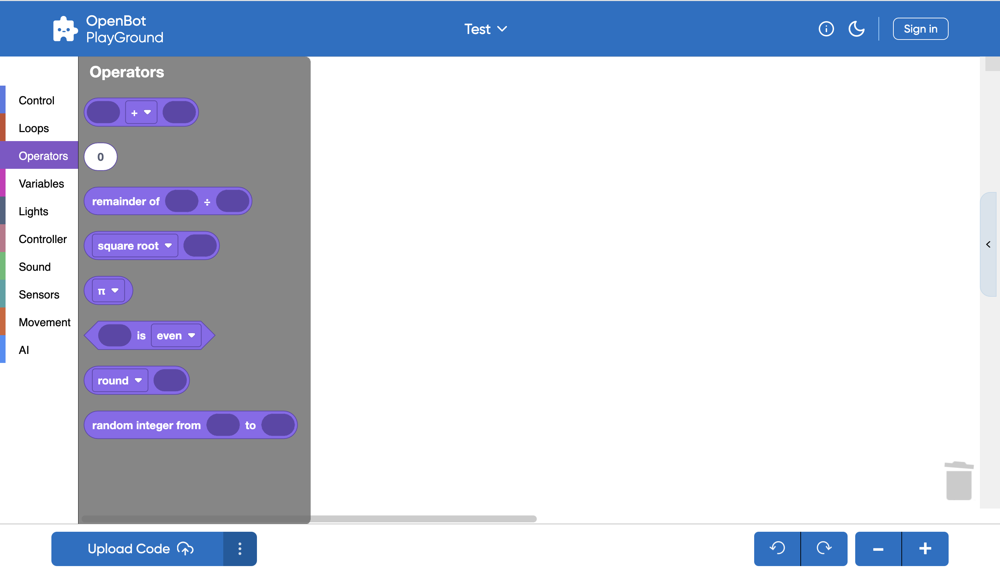
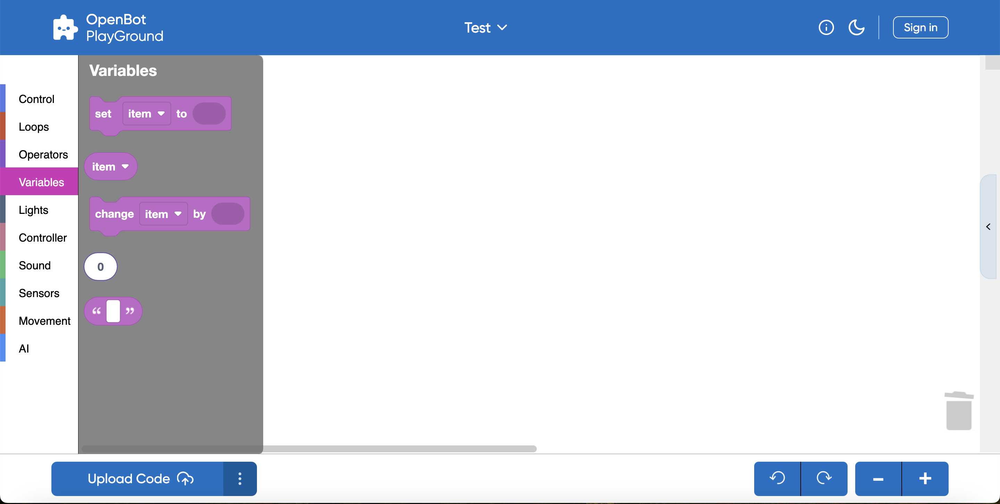
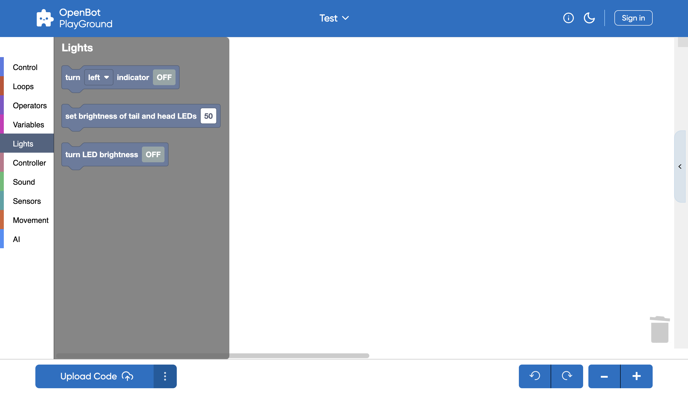
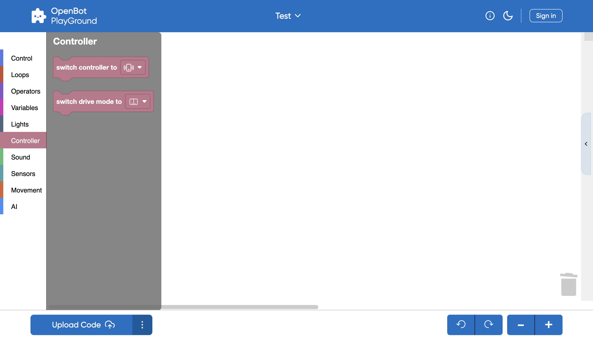
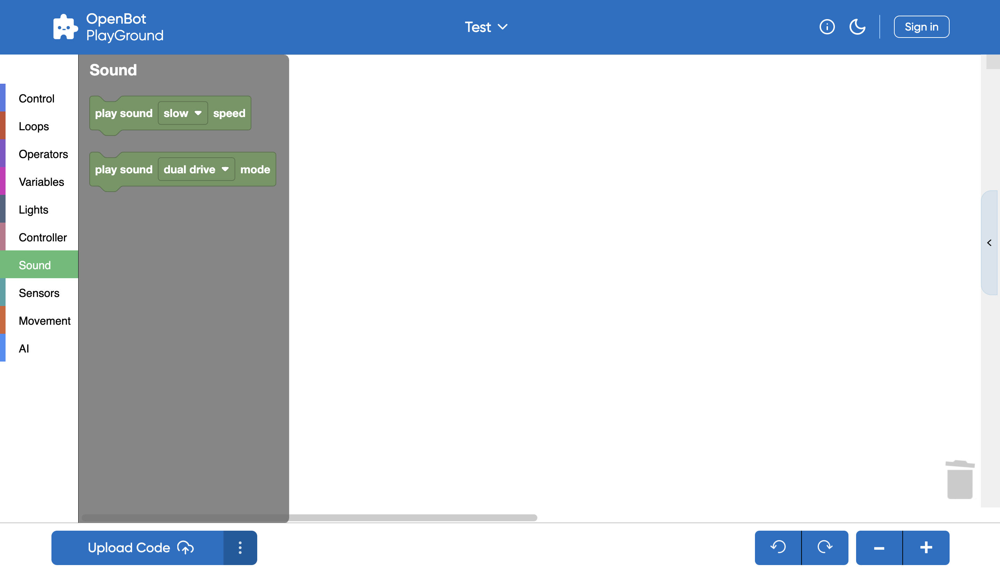
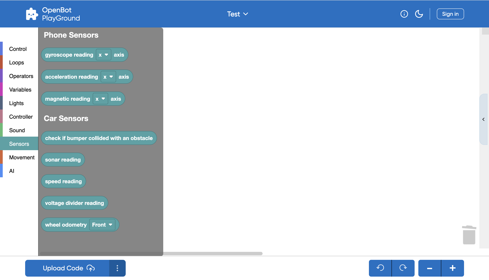
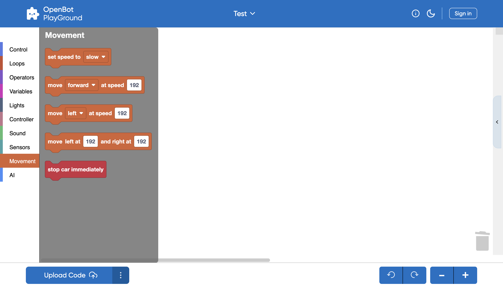
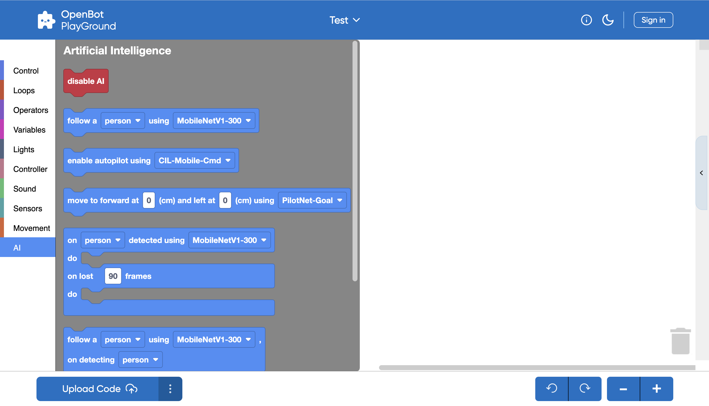

## OpenBot PlayGround:

### OpenBot Robot Info:
- OpenBot Robot configures the following features inside it.
     - Sensors: include Voltage divider, Sonar, Bumpers, Sonar readings, Speed readings
     - Wheel Odometer: includes Front and Back wheels.
     - Leds: include Indicators, Front, Back, status.
     - Send Commands: Motors, Forward, Backward and Stop.

### OpenBot PlayGround Categories:

- ### Control:

  OpenBot PlayGround includes customizable blocks that can be used to control the flow of program such as loops, events and conditionals. It provides a visual way for users to structure the logic of their programs.
 
 
     
   
   
  
  A brief overview of some control blocks:
  
  - Start: Initiates the execution of program and used to start a script when a program is run.
  - Conditionals: 'If' and 'If-else' blocks are used to create conditional branches in your code.
  - Wait: Brings pauses or delays in the code execution.
  - Forever: Once the Forever block is embedded in place then it will create an infinite loop which indicates that loop will continue indefinitely with each iteration.

- ### Loops:

  Loops category provides various blocks that helps to control the flow of your program through repetition.
 
 
     
   
   

  Some loop blocks examples are listed here below:

  - Repeat: The "Repeat" block enables you to define the number of iterations for a set of blocks to be executed.
  - While: The "While" block continues executing a set of blocks as long as a specified condition remains true.
  - For: The "For" block facilitates iteration over a specified range of values, executing a set of blocks for each iteration.
  - For Each: The "For Each" block is used to iterate over elements in a list or collection.

- ### Operators:

  Operators allow you to perform several operations or calculations within your program.All the Operator blocks allow you to build complex expressions and conditions according to the requirement.
 
 
  
   
   

  Here are some common types of operators that you might find in OpenBot PlayGround:

   - Arithmetic: Addition, subtraction, multiplication, division, and other arithmetic operations are available in this category.
   - Math Operators: Blocks like "Power," "Square Root," and "Random Fraction" are used to perform more advanced mathematical computations.

- ### Variables:

  Variables are used for data storage within your blocks and inside variables category blocks allow you to declare, set, change and manipulate variables.The concept of variables in OpenBot PlayGround help you to manage and manipulate data in your programs.
 
 
  
   
   

  Have a look on some Variable block examples:

   - Set: Set Variable block is going to assign a value to a variable.
   - Change: It will help you to modify the value of an existing variable.

- ### Lights:

  Lights are another type of block that is provided by OpenBot PlayGround which helps to make the use of indicators and can set the values of brightness as per requirement of your modal.
 
 
  
    
   

  Below are some examples:

    - Indicators: Block used to enable indicators by turning them ON/OFF.
    - Brightness: used to set the brightness of tail and head LED by taking dynamic values.
   
   
  NOTE: Keeping the brightness at zero will make the brightness mode OFF and if the brightness is at the highest point ie.100 will turn ON the brightness mode.

- ### Controller:

  Controller block tells you by which method you can control your modal and driving mode as well.
 
 
  
   
   

  Below are the examples of Controller Block:

    - Switch Controller: It helps you to choose the Controller method by either Gamepad or Phone.
    - Drive Mode: It helps you to switch the Drive Mode by either Joystick or Game or dual.
   
   
  
   
TIP: If you are selecting Phone as a controller then you can have only Dual as your static drive mode.  

- ### Sound:

  Sound blocks are used to manage the sound speed of all kind of Drive Modes.
 
 
  
   
   

  Let's have some examples:

    - Playsound Speed: Helps you to regulate the sound speed as slow, medium and fast. 
    - Playsound Mode: Helps you to select the sound from any mode you want.

- ### Sensors:
 
  Sensors are the blocks which are going to measure the different readings.
 
 
  
   
   

  Overview:
   - Phone Sensors: Help to measure Gyroscope,Acceleration, and Magnetic readings at different axis. 
   - Car Sensors: Help to provide the different readings like Sonar, Speed. Also, it will check if bumper gets collide with an obstacle.

- ### Movement:

  As the name suggests it is responsible for the movement of Robot at any speed and in any direction.
 
 
  
   
   
  
  Let's have some examples:

    - Set speed: Helps to set the speed as slow, medium and fast.
    - Move: Helps to make the movement in forward or backward and left or right direction at required speed.
   
   

  Key Points:
  - if the left speed value is set lower than the right, the robot will move counterclockwise, or vice versa.
  - If you equalize the left and right speeds, it will move straight.
  - Setting a positive value on the left and a negative value on the right will cause the robot to spin.

### Artificial Intelligence(AI):
  OpenBot Playground provides another important block named Artificial Intelligence which further configures many features such as Object Tracking, Autopilot, Point Goal Navigation.

  
 
  
Lets understand this concept by some examples of blocks:
   - Object Tracking: Its primary function revolves around detecting objects. This AI fragment allows you to pick any object for tracking. Depending on your phone's performance, you have the flexibility to choose an object detector model. By default, this block comes equipped with the "MobileNetV1-300" model. Additionally, you have the option to manually add any model of your choice.
 
 
    
 TIP: If you've incorporated an external modal, ensure to enable AutoSync in the playground. This feature will assist you in verifying the availability and successful download of the modal.

   - AutoPilot: This snippet is also available through OpenBot Playground, utilizing data collection, wherein a pre-trained dataset (ML model CIL-Mobile-Cmd) is already integrated. Subsequently, the camera fragment is displayed on the screen, initiating the tracking of the captured path.

   - Point Goal Navigation: The primary objective of this fragment is to reach a designated point through navigation. You can configure the forward and left values using the embedded models within it. When the project is executed on a phone, the point navigation fragment will be displayed on the screen with an Augmented Reality (AR) view. Subsequently, the robot will initiate movement until it successfully reaches the goal.

###  Advanced Artificial Intelligence(AI):
  OpenBotPlayground comes with some advancements in it and this Advanced Artificial Intelligence(AI)  is another important block inside it.

  
 
 
    Overview:
 
      This advanced module is designed for object tracking, accommodating various classes such as a person, car, book, traffic light, etc. The identification of the object is carried out by the integrated AI model. The functionality of this module is contingent upon the specified conditions.

Consider two objects: a person and a hairdryer. If the robot initially detects the person as the object, it will execute actions based on the predefined conditions. For instance, it will activate the right indicator and, after loosing 80 frames, initiate backward movement in response to the detected person. However, if 80 frames are not captured or if another object, such as a hairdryer, is identified, the module will not execute actions for the person object. Instead, it will adhere to the conditions set for the hairdryer object.
