## OpenBot PlayGround:

  <a href="README.md">English</a> |
  简体中文 |
  <a href="README.de-DE.md">Deutsch</a> |
  <a href="README.fr-FR.md">Français</a> |
  <a href="README.es-ES.md">Español</a>

### OpenBot 机器人信息：

- OpenBot 机器人配置了以下组件：
    - 传感器：分压器、声纳、碰撞传感器、速度传感器。
    - 车轮里程计：前轮和后轮。
    - LED：指示灯、前灯、后灯、状态灯。
    - 电机：前进和后退。

### OpenBot PlayGround 类别：

- ### 控制：

  OpenBot PlayGround 包含可自定义的模块，用于控制程序的流程，如循环、事件和条件。它为用户提供了一种可视化的方式来构建程序的逻辑。

    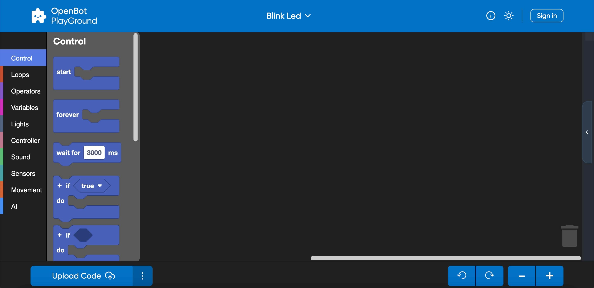

  一些控制模块的简要概述：
    - 开始：启动程序的执行，并单次执行块代码。
    - 条件：``If`` 和 ``If-else`` 块用于在代码中创建条件分支。
        - 等待：在代码执行中引入暂停或延迟。
        - 永远：一旦嵌入了永远块，它将创建一个无限循环，表示循环将无限期地继续每次迭代。

- ### 循环：

  循环类别提供了各种模块，帮助通过重复控制程序的流程。

     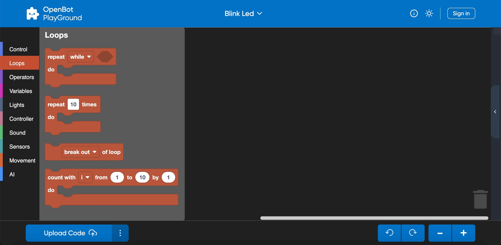

  下面列出了一些循环模块的示例：

    - 重复：``Repeat`` 块允许您定义一组块执行的迭代次数。
    - 当：``While`` 块在指定条件为真时继续执行一组块。

- ### 运算符：

  运算符允许您在程序中执行多种操作或计算。这些模块允许您根据需要构建复杂的表达式和条件。

  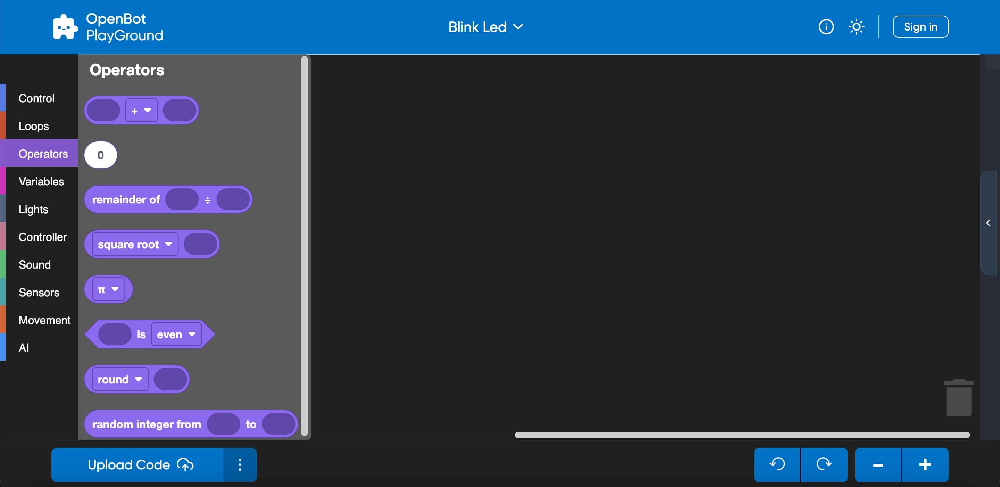

  这里是一些常见的运算符类型，您可能会在 OpenBot PlayGround 中找到：

    - 算术：加法、减法、乘法、除法和其他算术操作在此类别中可用。
    - 数学运算符：像“幂”、“平方根”和“随机分数”这样的模块用于执行更高级的数学计算。

- ### 变量：

  变量用于在块内存储数据，并且在变量类别块中允许您声明、设置、更改和操作变量。OpenBot PlayGround 中的变量概念帮助您在程序中管理和操作数据。

  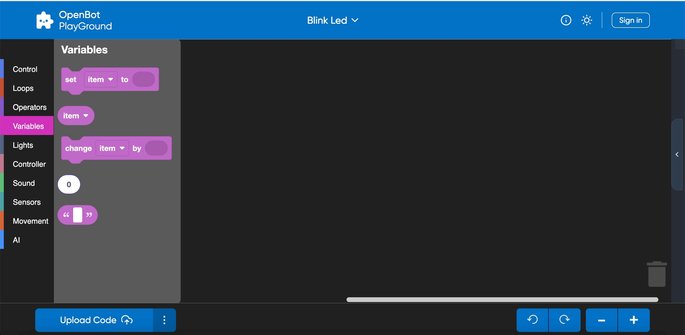

  看看一些变量块的示例：

    - 设置：设置变量块将为变量分配一个值。
    - 更改：它将帮助您修改现有变量的值。

- ### 灯光：

  灯光是 OpenBot PlayGround 提供的另一种类别，帮助使用指示灯并动态设置亮度值。

  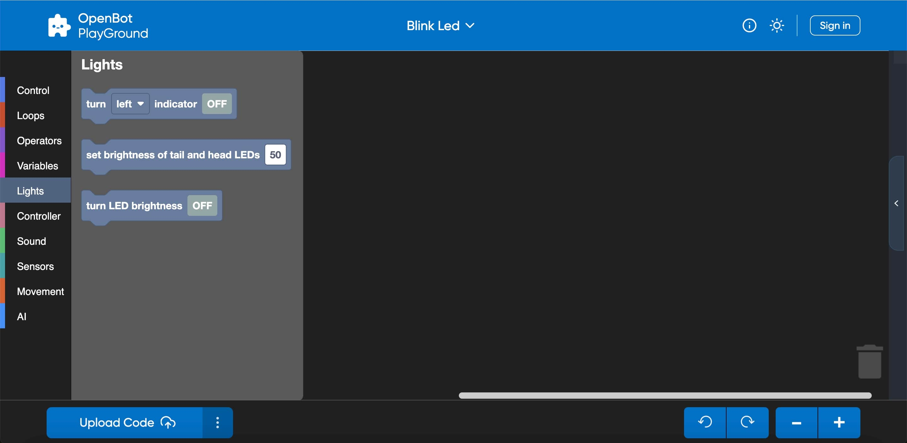

  下面是一些示例：
    - 指示灯：用于通过打开/关闭来启用指示灯的块。
    - 亮度：用于通过动态值设置尾灯和前灯的亮度。

  注意：将亮度保持在零将使亮度模式关闭，如果亮度达到最高点即100，将打开亮度模式。

- ### 控制器：

  当然！在控制器块中选择模式时，它将统一应用于 OpenBot 机器人应用程序中的所有其他片段。

  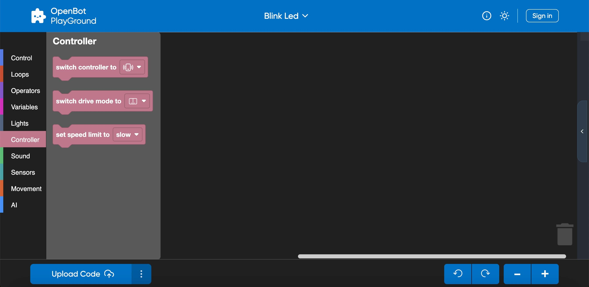

  下面是控制器块的示例：

    - 切换控制器：帮助您选择控制器方法，使用游戏手柄或手机。
    - 驾驶模式：帮助您切换驾驶模式，使用摇杆、游戏或双重模式。

   
提示：如果您选择手机作为控制器，那么在机器人应用程序中驾驶模式将自动设置为双重模式，而不管选择的块驾驶模式如何。

- ### 声音：

  声音块可用于播放驾驶模式和机器人静态速度的声音。

  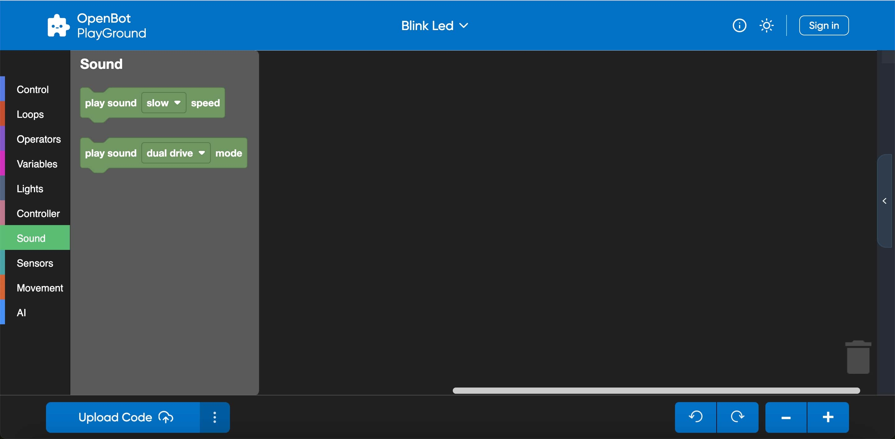

  让我们看一些示例：

    - 速度：帮助您播放慢速、中速和快速的声音。
    - 模式：帮助您播放双重、摇杆或游戏模式的声音。

- ### 传感器：

  传感器块将返回 OpenBot 状态和环境状态的不同读数。

  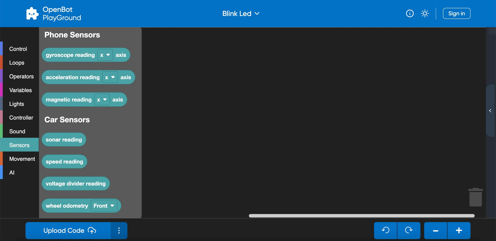

  概述：
    - 手机传感器：帮助测量不同轴（3维）的陀螺仪、加速度和磁性读数。
    - 车传感器：帮助提供不同的读数，如声纳、速度。还会检查碰撞传感器是否与障碍物碰撞。

- ### 移动：

  顾名思义，它负责机器人在任何速度和任何方向上的移动，速度限制为0-255。

  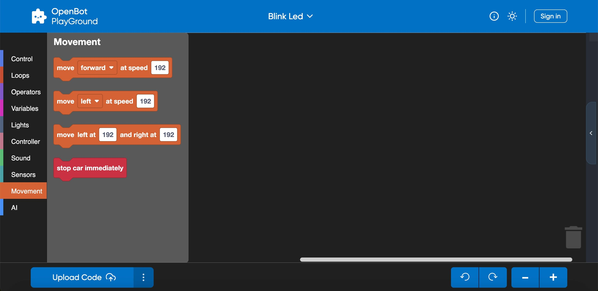

  让我们看一些示例：

    - 设置速度：帮助设置慢速、中速和快速的速度。
    - 移动：帮助以所需速度向前或向后、向左或向右移动。

  关键点：
    - 如果左侧速度值设置低于右侧，机器人将逆时针移动，反之亦然。
    - 如果您使左右速度相等，它将直线移动。
    - 在左侧设置正值，在右侧设置负值将使机器人旋转。

- ### 人工智能（AI）：

  OpenBot Playground 提供了另一个重要类别，名为人工智能，进一步配置了许多功能，如物体跟踪、自动驾驶、目标导航。

  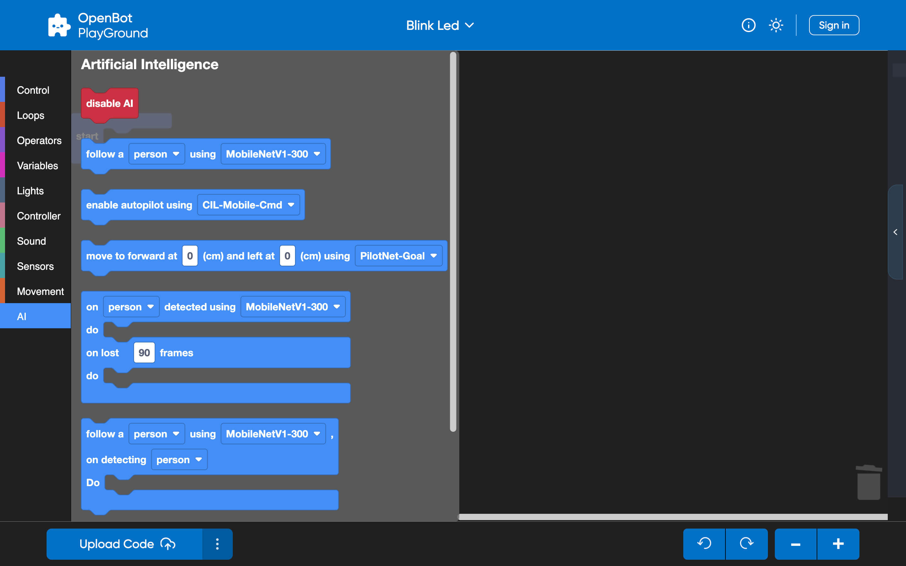

  让我们通过一些块示例来理解这个概念：
    - ``物体跟踪``：其主要功能是检测物体。这个 AI 片段允许您选择任何物体进行跟踪。根据您的手机性能，您可以灵活选择物体检测模型。默认情况下，此块配备了“MobileNetV1-300”模型。此外，您还可以手动添加任何您选择的模型。
    - ``自动驾驶``：此片段也可通过 OpenBot Playground 使用，利用数据收集，其中预训练的数据集（ML 模型 CIL-Mobile-Cmd）已集成。随后，摄像头片段显示在屏幕上，开始跟踪捕获的路径。
    - ``目标导航``：此块的主要目标是通过导航到达指定点。您可以使用其中的导航模型在三维视图中配置前进和左转值。当项目在手机上执行时，点导航片段将显示在屏幕上，带有增强现实（AR）视图。随后，机器人将开始移动，直到成功到达目标。

   
提示：如果您已集成外部模型，请确保在 Playground 中启用 AutoSync。此功能将帮助您在块中显示新添加的模型，并验证模型在机器人应用程序中的可用性和成功下载。

- ### 高级人工智能（AI）：

  OpenBotPlayground 引入了几个进步，具有高级人工智能（AI），提供用于检测和自动驾驶功能的模块化块。

  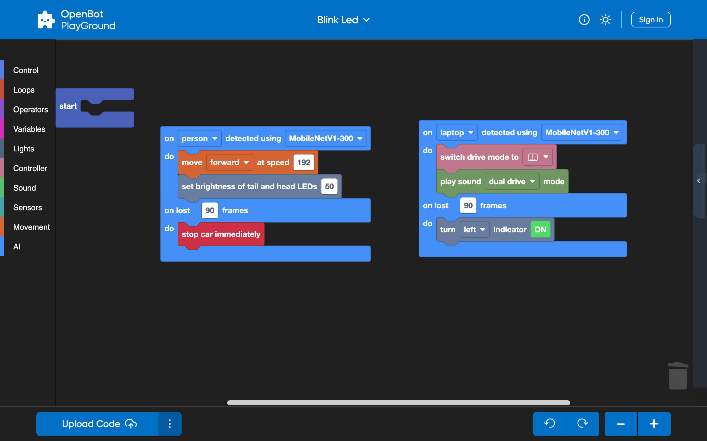

  #### 多重检测块：

    - 这个高级模块设计用于物体跟踪，适用于各种类别，如人、车、书、交通灯等。物体的识别由集成的 AI 模型进行。此模块的功能取决于指定的条件。
    - 该块设计用于启用多重物体检测，初始化指定类别的过程。一旦检测到所选类别，机器人将执行后续“do”语句中列出的所有任务。如果在定义的连续帧数内未检测到指定类别，机器人将继续执行后续``do``语句中指定的任务。该块可以在 Playground 中多次使用，用于不同的类别。