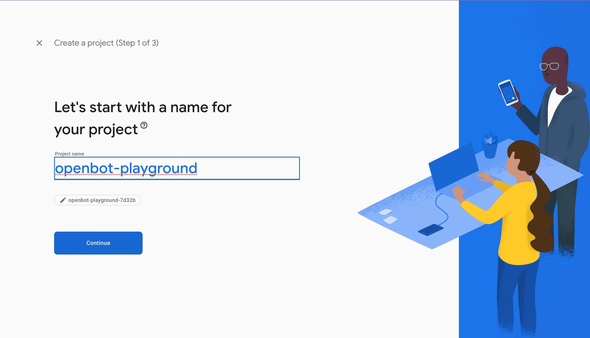
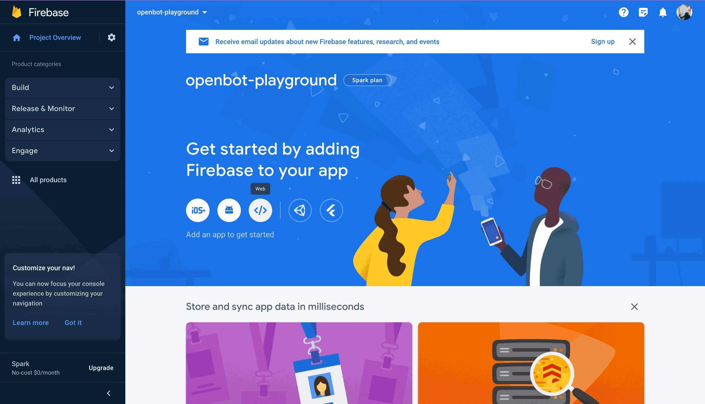
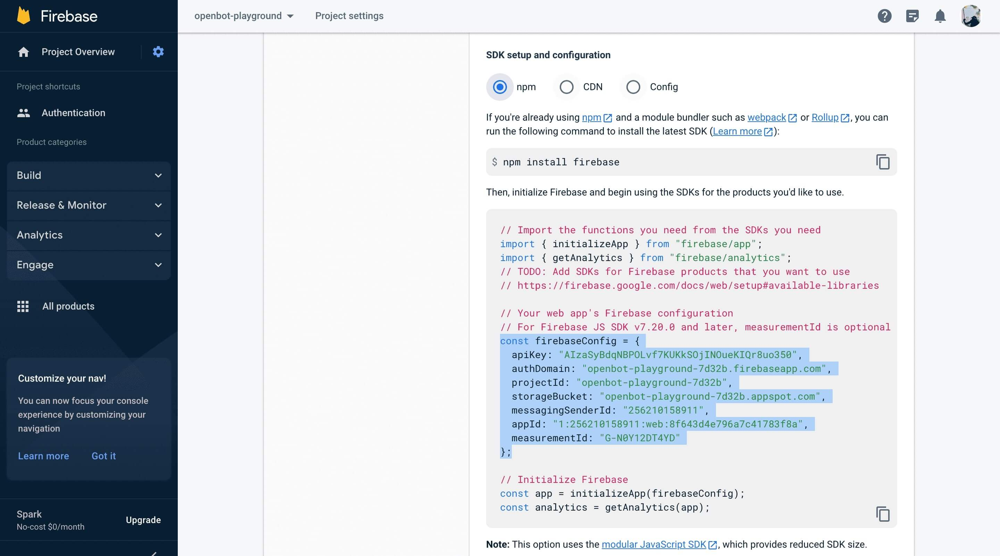
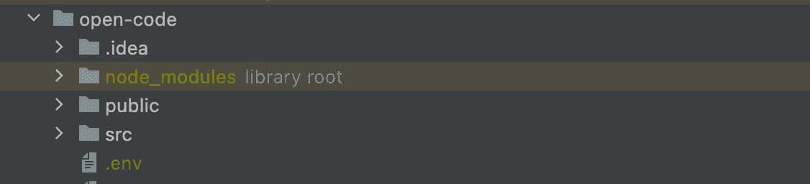
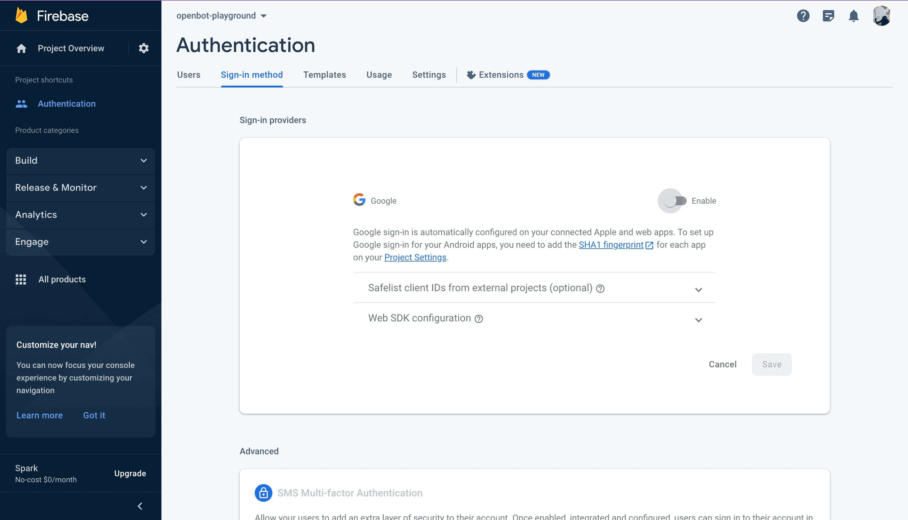
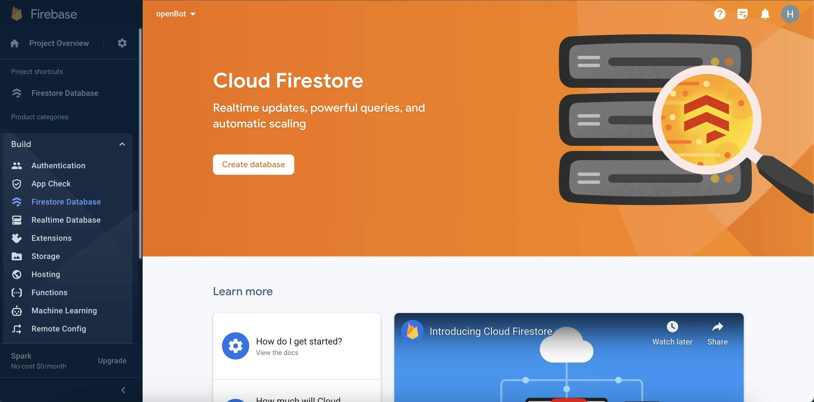
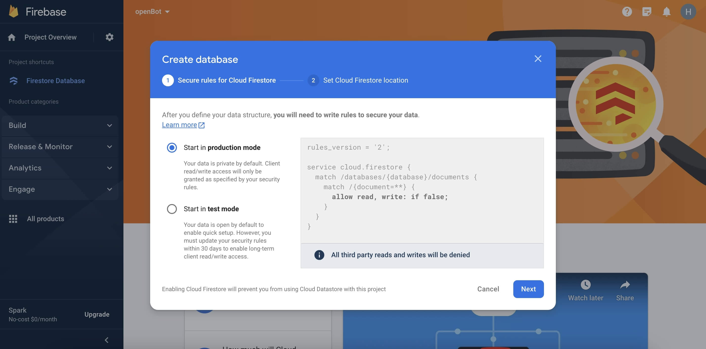
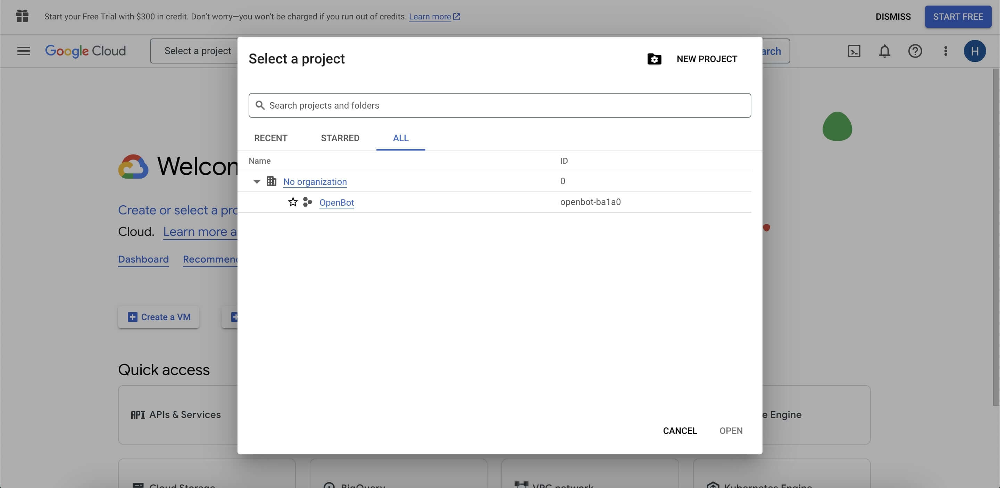

## Firebase Google Sign-In Authentifizierung

<p align="center">
  <a href="README.md">English</a> |
  <a href="README.zh-CN.md">简体中文</a> |
  <span>Deutsch</span> |
  <a href="README.fr-FR.md">Français</a> |
  <a href="README.es-ES.md">Español</a>
</p>

- #### Nutzung
  In Webanwendungen verwenden wir Firebase für die Google-Anmeldung, um OpenBot Playground-Projekte auf Google Drive hochzuladen. Wenn Sie dieses Projekt klonen und auf Ihrem Gerät ausführen, müssen Sie Ihr eigenes Firebase-Projekt einrichten, da die Firebase-Konfiguration für die Anmeldung erforderlich ist.
- #### Über Google Sign-In
  Firebase Google Sign-In Authentifizierung ist eine Funktion der Firebase-Plattform, die es Benutzern ermöglicht, sich mit ihren Google-Anmeldedaten bei mobilen oder Web-Apps anzumelden. Dieser Dienst bietet eine sichere und bequeme Möglichkeit für Benutzer, auf Apps zuzugreifen, ohne sich separate Anmeldeinformationen merken und verwalten zu müssen. Firebase verwaltet den gesamten Authentifizierungsprozess, von der Überprüfung der Identität des Benutzers bei Google bis hin zur Bereitstellung einer eindeutigen Benutzer-ID, die zur Personalisierung der Benutzererfahrung innerhalb der App verwendet werden kann. Diese Funktion umfasst auch zusätzliche Sicherheitsmaßnahmen wie die Zwei-Faktor-Authentifizierung, um Benutzerkonten vor unbefugtem Zugriff zu schützen.

****

### Einrichten eines Firebase-Projekts

- Gehen Sie zur Firebase-Konsole (https://console.firebase.google.com/) und melden Sie sich mit Ihrem Google-Konto an.

- Klicken Sie auf die Schaltfläche `Projekt hinzufügen`, um ein neues Firebase-Projekt zu erstellen.

- Geben Sie einen Namen für Ihr Projekt ein, wählen Sie Ihr Land/Ihre Region aus und klicken Sie dann auf die Schaltfläche `Projekt erstellen`.
    <p align="left">
    
    
    </p>

- Sobald Ihr Projekt erstellt ist, klicken Sie auf das `Web`-Symbol, um Firebase zu Ihrer Web-App hinzuzufügen, geben Sie einen App-Spitznamen ein und klicken Sie auf die Schaltfläche `App registrieren`.
  <p align="left">
  
  
  </p>

    - Fügen Sie `firebase SDK` zur `env`-Datei Ihres Projekts hinzu.
        - Beim Erstellen des Projekts erhalten Sie Firebase hier oder Sie können es aus den Projekteinstellungen abrufen.
          <p align="left">
          
          
          
          </p>

        - Verwendung von Umgebungsvariablen: Wenn Sie Firebase Authentication verwenden, müssen Sie möglicherweise sensible Informationen wie API-Schlüssel, Datenbankanmeldeinformationen und andere Geheimnisse speichern. Um dies sicher zu tun, können Sie Umgebungsvariablen verwenden, um diese Informationen außerhalb Ihres Codes zu speichern, indem Sie die folgenden Schritte ausführen.

            1. Erstellen Sie eine neue Datei im OpenBot Playground namens .env.
                 <p align="left">
                
                 </p> 

            3. Fügen Sie die folgenden Umgebungsvariablen zur .env-Datei hinzu, die in der firebase.js-Datei verwendet werden.

            ```bash
              REACT_APP_FIREBASE_API_KEY=<REACT_APP_FIREBASE_API_KEY>
              REACT_APP_AUTH_DOMAIN=<REACT_APP_AUTH_DOMAIN>
              REACT_APP_PROJECT_ID=<REACT_APP_PROJECT_ID>
              REACT_APP_STORAGE_BUCKET=<REACT_APP_STORAGE_BUCKET>
              REACT_APP_MESSAGING_SENDER_ID=<REACT_APP_MESSAGING_SENDER_ID>
              REACT_APP_APP_ID=<REACT_APP_APP_ID>
              REACT_APP_MEASUREMENT_ID=<REACT_APP_MEASUREMENT_ID>
              GENERATE_SOURCEMAP=false
            ```

- Aktivieren Sie die Firebase-Authentifizierungsmethode SignIn mit Google.

  <p align="left">

  

  

  

  </p>


- Aktivieren Sie die Firestore-Datenbank, indem Sie im linken Seitenmenü zum Menü "Build" navigieren.
  Klicken Sie auf ``Firestore Database`` aus den Optionen. Klicken Sie dann auf die Schaltfläche ``Datenbank erstellen``.

  

    - Für sichere Regeln wählen Sie ``Im Produktionsmodus starten`` und wählen Sie den Firestore-Standort für die
      App und klicken Sie auf die Schaltfläche ``Aktivieren``.

      
      

        - Sobald Ihre Datenbank erstellt ist, klicken Sie auf ``Regeln``, um Berechtigungen für Lesen und Schreiben zu konfigurieren.

          

        - Ersetzen Sie die Standardregeln durch den folgenden Code und klicken Sie auf die Schaltfläche ``Veröffentlichen``.

          ```bash
          rules_version = '2';
          service cloud.firestore {
              match /databases/{database}/documents {
                  match /{document=**} {
                      allow read, write: if request.auth != null;
                  }
              }
          }
          ```
        
### Einrichten von Google Drive-Diensten

- #### API aktivieren
  Gehen Sie zur Google Cloud
  Console (https://console.cloud.google.com/) und melden Sie sich
  mit demselben Google-Konto an, das Sie
  für Firebase verwenden. Dies gewährleistet eine nahtlose Integration zwischen den Diensten. Oben auf der Seite sehen Sie den aktuellen Projektnamen. Klicken Sie darauf, um den Projektauswähler zu öffnen. Wählen Sie im Abschnitt `ALLE` das Projekt aus, das Sie zu Firebase hinzugefügt haben, und wechseln Sie zu diesem.

  
  

- Nach dem Wechseln sollten Sie unter "Schnellzugriff" eine Option sehen, die als ``APIs & Services`` bezeichnet ist. Klicken Sie darauf.
  Wenn Sie es nicht sofort sehen, müssen Sie möglicherweise auf das Menüsymbol (normalerweise drei horizontale Linien) in der oberen linken Ecke klicken, um das Menü zu erweitern und die Optionen anzuzeigen.

  

    - Nachdem Sie "APIs & Services" geöffnet haben, navigieren Sie zum Abschnitt ``Bibliothek``. Hier können Sie nach der Google Drive API suchen.
      

    - Die Google Drive API sollte in den Suchergebnissen erscheinen. Klicken Sie darauf.
      Auf der nächsten Seite finden Sie Informationen zur API. Klicken Sie auf die Schaltfläche "Aktivieren", um sie für Ihr Projekt zu aktivieren.
      Sobald sie aktiviert ist, können Sie auf die Google Drive- und Drive API-Einstellungen zugreifen und diese verwalten.
  
      
      

### Fehlerbehebung

Hier sind einige häufige Probleme, die während des Firebase-Konfigurationsprozesses auftreten können, und deren entsprechende Lösungen.

```bash
  1. Fehler bei ungültigen Anmeldeinformationen: Überprüfen Sie die Browserkonsole auf Fehlermeldungen oder Warnungen im Zusammenhang mit ungültigen Anmeldeinformationen.
```

- Überprüfen Sie, ob Sie die richtige Client-ID und den richtigen API-Schlüssel in der Firebase-Konsole eingegeben haben.
- Stellen Sie sicher, dass keine Tippfehler oder Fehler in den in den Umgebungsvariablen eingegebenen Werten vorhanden sind.
- Stellen Sie sicher, dass Sie die Konfigurationseinstellungen ordnungsgemäß aktiviert haben, wenn Sie die Funktion firebase.auth().signInWithPopup() aufrufen.
- Stellen Sie sicher, dass Sie die richtige Firebase SDK-Version angegeben haben und sich mit dem gültigen Google-Konto anmelden.

```bash
  2. Fehler: Benutzerkonto deaktiviert.
```

- Der einzige Weg, dieses Problem zu beheben, besteht darin, das vorhandene Konto zu reaktivieren oder ein neues zu erstellen.
- Zusätzlich können Sie überprüfen, ob das Konto deaktiviert oder gelöscht wurde, bevor Sie versuchen, es mit Firebase Google Sign-in zu authentifizieren, und eine Fehlermeldung anzeigen, wenn das Konto nicht aktiv ist.

```bash
  3. Fehler bei der Cross-Origin Resource Sharing (CORS): Wenn Sie feststellen, dass das erwartete Verhalten der Webanwendung nicht auftritt, z. B. dass Daten nicht korrekt geladen oder angezeigt werden.
```

- Gehen Sie zur Firebase-Konsole, wählen Sie im Abschnitt Authentifizierung die Registerkarte "Anmeldemethode". Stellen Sie im Abschnitt "Autorisierte Domains" sicher, dass Ihre Webanwendungsdomain hinzugefügt wurde und dass CORS dafür aktiviert ist.
- Wenn Sie einen serverseitigen Authentifizierungsfluss verwenden, stellen Sie sicher, dass Sie die erforderlichen CORS-Header zu Ihrer Serverantwort hinzugefügt haben, um Anfragen von Ihrer Webanwendungsdomain zuzulassen.
- Wenn Sie Ihre Webanwendung auf Firebase Hosting hosten, aktiviert es automatisch CORS für Ihre Domain. Sie können auch Firebase Cloud Run verwenden, um API-Anfragen mit enthaltenen CORS-Headern zu bedienen.