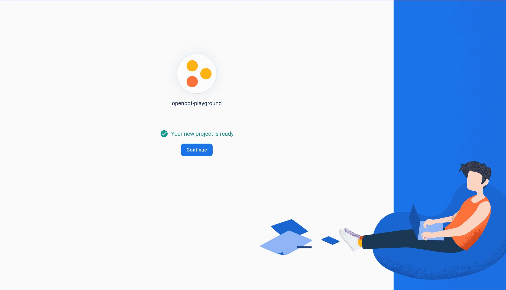
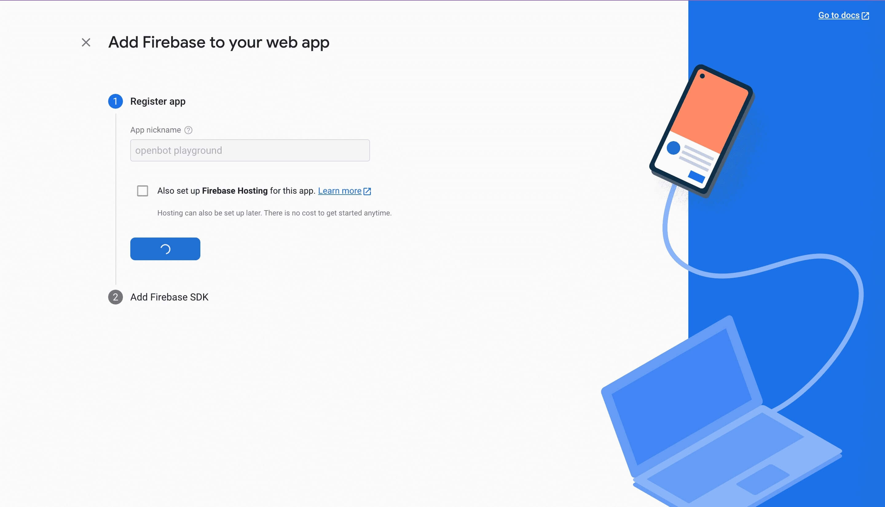
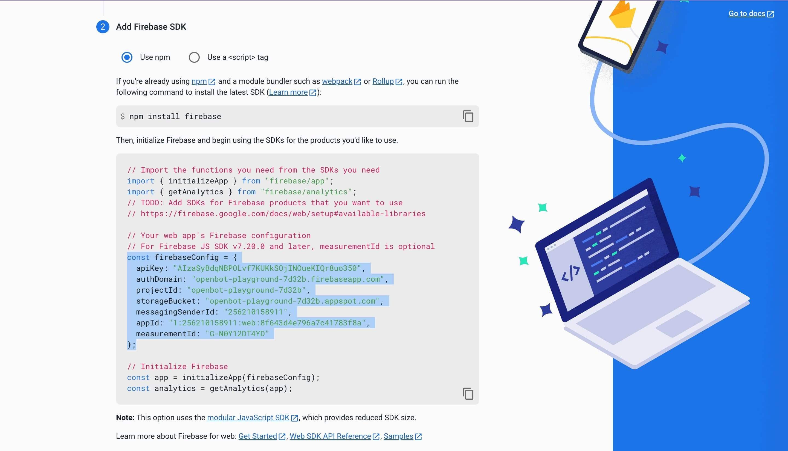
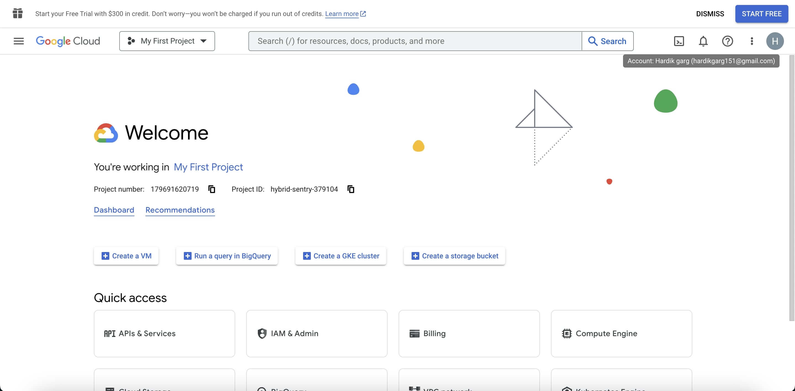
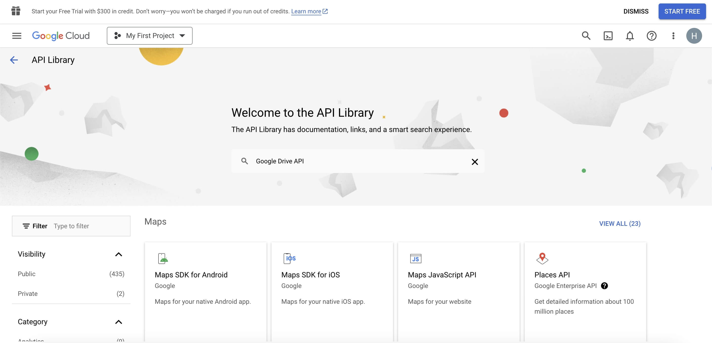

## Autenticación de Inicio de Sesión con Google en Firebase

<p align="center">
  <a href="README.md">English</a> |
  <a href="README.zh-CN.md">简体中文</a> |
  <a href="README.de-DE.md">Deutsch</a> |
  <a href="README.fr-FR.md">Français</a> |
  <span>Español</span>
</p>

- #### Uso
  En una aplicación web, utilizamos Firebase para la autenticación de inicio de sesión con Google para subir proyectos de OpenBot Playground en Google Drive. Si clonas este proyecto y lo ejecutas en tu dispositivo, debes configurar tu propio proyecto de Firebase porque se requiere la configuración de Firebase para la autenticación de inicio de sesión.
- #### Acerca del Inicio de Sesión con Google
  La Autenticación de Inicio de Sesión con Google en Firebase es una característica de la plataforma Firebase que permite a los usuarios iniciar sesión en aplicaciones móviles o web utilizando sus credenciales de Google. Este servicio proporciona una forma segura y conveniente para que los usuarios accedan a las aplicaciones sin tener que recordar y gestionar credenciales de inicio de sesión separadas. Firebase gestiona todo el proceso de autenticación, desde la verificación de la identidad del usuario con Google hasta proporcionar un ID de usuario único que puede ser utilizado para personalizar la experiencia del usuario dentro de la aplicación. Esta característica también incluye medidas de seguridad adicionales, como la autenticación de dos factores, para ayudar a proteger las cuentas de usuario contra accesos no autorizados.

****

### Configuración del Proyecto de Firebase

- Ve a la Consola de Firebase (https://console.firebase.google.com/) e inicia sesión con tu cuenta de Google.

- Haz clic en el botón `Agregar Proyecto` para crear un nuevo proyecto de Firebase.

- Ingresa un nombre para tu proyecto, selecciona tu país/región y luego haz clic en el botón `Crear Proyecto`.
    <p align="left">
    
    
    </p>

- Una vez que tu proyecto esté creado, haz clic en el icono `Web` para agregar Firebase a tu aplicación web y luego ingresa un apodo para la aplicación y haz clic en el botón `Registrar Aplicación`.
  <p align="left">
  
  
  </p>

    - Agrega el `SDK de Firebase` al archivo `env` de tu proyecto.
        - Al crear el proyecto obtendrás Firebase aquí, o puedes obtenerlo desde la configuración del proyecto.
          <p align="left">
          
          
          
          </p>

        - Uso de Variables de Entorno Cuando uses la Autenticación de Firebase, es posible que necesites almacenar información sensible como claves API, credenciales de base de datos y otros secretos. Para hacerlo de manera segura, puedes usar variables de entorno para almacenar esta información fuera de tu código, siguiendo estos pasos.

            1. Crea un nuevo archivo en OpenBot Playground llamado .env.
                 <p align="left">
                
                 </p> 

            3. Agrega las siguientes variables de entorno al archivo .env que se usarán en el archivo firebase.js.

            ```bash
              REACT_APP_FIREBASE_API_KEY=<REACT_APP_FIREBASE_API_KEY>
              REACT_APP_AUTH_DOMAIN=<REACT_APP_AUTH_DOMAIN>
              REACT_APP_PROJECT_ID=<REACT_APP_PROJECT_ID>
              REACT_APP_STORAGE_BUCKET=<REACT_APP_STORAGE_BUCKET>
              REACT_APP_MESSAGING_SENDER_ID=<REACT_APP_MESSAGING_SENDER_ID>
              REACT_APP_APP_ID=<REACT_APP_APP_ID>
              REACT_APP_MEASUREMENT_ID=<REACT_APP_MEASUREMENT_ID>
              GENERATE_SOURCEMAP=false
            ```

- Habilita el método de Inicio de Sesión de Autenticación de Firebase usando Google.

  <p align="left">

  

  

  

  </p>


- Habilita la base de datos Firestore, navega al menú Construir en la barra lateral izquierda.
  Haz clic en ``Firestore Database`` de las opciones. Luego, haz clic en el botón ``Crear base de datos``.

  

    - Para reglas seguras, selecciona ``Iniciar en modo de producción`` y elige la ubicación de Firestore para la
      aplicación y haz clic en el botón ``Habilitar``.

      
      

        - Una vez que tu base de datos esté creada, haz clic en ``Reglas`` para configurar permisos de lectura y escritura.

          

        - Reemplaza las reglas predeterminadas con el siguiente código y haz clic en el botón ``Publicar``.

          ```bash
          rules_version = '2';
          service cloud.firestore {
              match /databases/{database}/documents {
                  match /{document=**} {
                      allow read, write: if request.auth != null;
                  }
              }
          }
          ```
        
### Configuración de Servicios de Google Drive

- #### Para Habilitar la API
  Ve a la Consola de Google Cloud (https://console.cloud.google.com/) e inicia sesión usando la misma cuenta de Google que usas para Firebase. Esto asegura una integración sin problemas entre los servicios. En la parte superior de la página, verás el nombre del proyecto actual. Haz clic en él para abrir el selector de proyectos. En la sección `TODOS`, selecciona el proyecto que agregaste a Firebase y cámbialo.

  
  

- Después de cambiar, en Acceso rápido, deberías ver una opción etiquetada ``APIs & Services``. Haz clic en ella.
  Si no la ves inmediatamente, es posible que necesites hacer clic en el icono del menú (generalmente tres líneas horizontales) en la esquina superior izquierda para expandir el menú y revelar las opciones.

  

    - Después de abrir "APIs & Services", navega a la sección ``Biblioteca``. Aquí es donde puedes buscar la API de Google Drive.
      

    - La API de Google Drive debería aparecer en los resultados de búsqueda. Haz clic en ella.
      En la siguiente página, encontrarás información sobre la API. Haz clic en el botón "Habilitar" para habilitarla para tu proyecto.
      Una vez habilitada, podrás acceder y gestionar los ajustes de Google Drive y la API de Drive.
  
      
      

### Solución de Problemas

Aquí hay algunos problemas comunes que pueden ocurrir durante el proceso de configuración de Firebase y sus soluciones correspondientes.

```bash
  1. Error de Credenciales Inválidas: Inspecciona la consola del navegador para cualquier mensaje de error o advertencia relacionado con Credenciales Inválidas.
```

- Verifica que hayas ingresado el ID de cliente y la clave API correctos en la Consola de Firebase.
- Revisa que no haya errores tipográficos o errores en los valores ingresados en las variables de entorno.
- Asegúrate de haber habilitado correctamente la configuración al llamar a la función firebase.auth().signInWithPopup().
- Asegúrate de haber especificado la versión correcta del SDK de Firebase y de estar iniciando sesión con una cuenta de Google válida.

```bash
  2. Error de cuenta de usuario deshabilitada.
```

- La única forma de solucionar este problema es reactivar la cuenta existente o crear una nueva.
- Además, puedes verificar si la cuenta ha sido deshabilitada o eliminada antes de intentar autenticarlas con el Inicio de Sesión de Google en Firebase, y mostrar un mensaje de error si la cuenta no está activa.

```bash
  3. Error de Compartición de Recursos de Origen Cruzado (CORS): Si notas que el comportamiento esperado de la aplicación web no está ocurriendo, como datos que no se cargan o no se muestran correctamente.
```

- Ve a la Consola de Firebase, en la sección de Autenticación selecciona la pestaña "Método de inicio de sesión". En la sección "Dominios autorizados", asegúrate de que el dominio de tu aplicación web esté agregado y que CORS esté habilitado para él.
- Si estás utilizando un flujo de autenticación del lado del servidor, asegúrate de haber agregado los encabezados CORS necesarios a la respuesta de tu servidor para permitir solicitudes desde el dominio de tu aplicación web.
- Si estás alojando tu aplicación web en Firebase Hosting, automáticamente habilita CORS para tu dominio. También puedes usar Firebase Cloud Run para servir solicitudes de API con encabezados CORS incluidos.