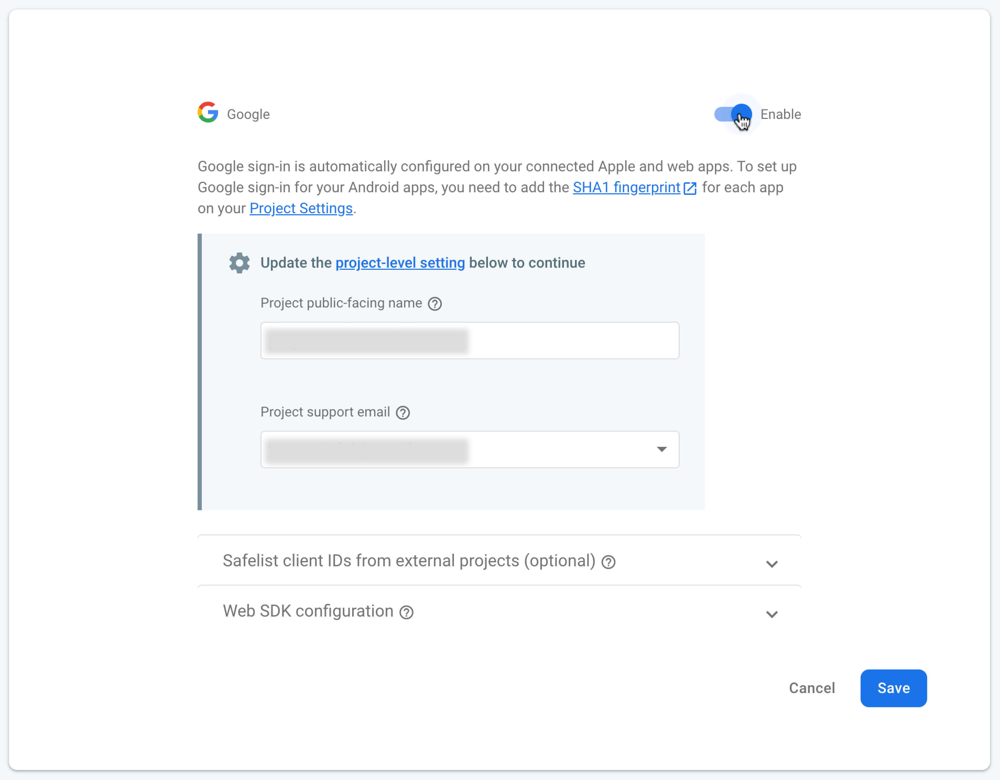
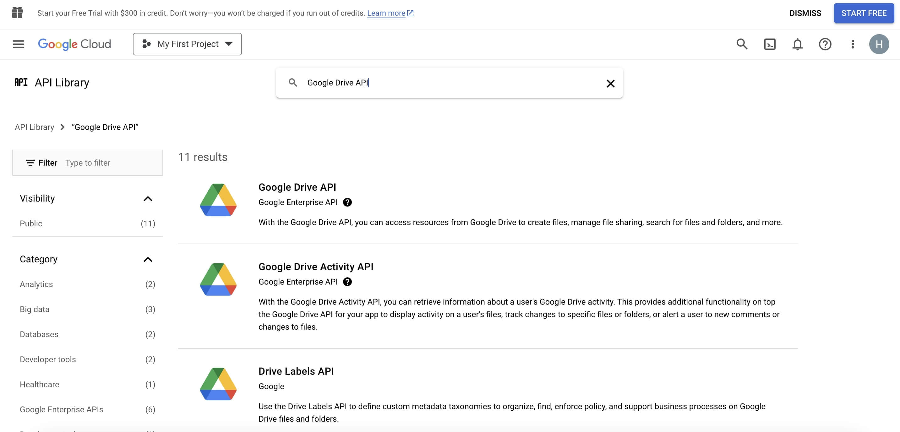
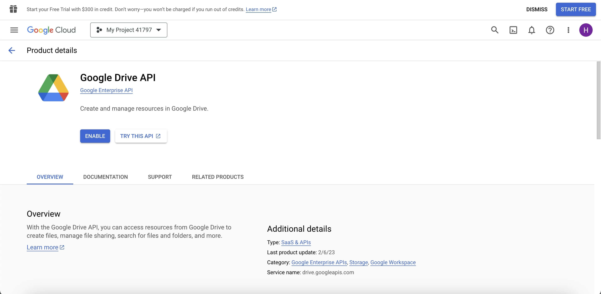

## Authentification Google Sign-In avec Firebase

<p align="center">
  <a href="README.md">English</a> |
  <a href="README.zh-CN.md">简体中文</a> |
  <a href="README.de-DE.md">Deutsch</a> |
  <span>Français</span> |
  <a href="README.es-ES.md">Español</a>
</p>

- #### Utilisation
  Dans une application web, nous utilisons Firebase pour l'authentification Google sign-in afin de télécharger des projets OpenBot Playground sur Google Drive. Si vous clonez ce projet et l'exécutez sur votre appareil, vous devez configurer votre propre projet Firebase car la configuration de Firebase est nécessaire pour l'authentification de connexion.
- #### À propos de Google Sign-In
  L'authentification Google Sign-In de Firebase est une fonctionnalité de la plateforme Firebase qui permet aux utilisateurs de se connecter à des applications mobiles ou web en utilisant leurs identifiants Google. Ce service offre un moyen sécurisé et pratique pour les utilisateurs d'accéder aux applications sans avoir à se souvenir et à gérer des identifiants de connexion distincts. Firebase gère l'ensemble du processus d'authentification, de la vérification de l'identité de l'utilisateur avec Google à la fourniture d'un identifiant utilisateur unique qui peut être utilisé pour personnaliser l'expérience de l'utilisateur au sein de l'application. Cette fonctionnalité inclut également des mesures de sécurité supplémentaires, telles que l'authentification à deux facteurs, pour aider à protéger les comptes des utilisateurs contre les accès non autorisés.

****

### Configuration du projet Firebase

- Allez sur la console Firebase (https://console.firebase.google.com/) et connectez-vous avec votre compte Google.

- Cliquez sur le bouton `Ajouter un projet` pour créer un nouveau projet Firebase.

- Entrez un nom pour votre projet, sélectionnez votre pays/région, puis cliquez sur le bouton `Créer un projet`.
    <p align="left">
    
    
    </p>

- Une fois votre projet créé, cliquez sur l'icône `Web` pour ajouter Firebase à votre application web, puis entrez un surnom pour l'application et cliquez sur le bouton `Enregistrer l'application`.
  <p align="left">
  
  
  </p>

    - Ajoutez le `SDK Firebase` au fichier `env` de votre projet.
        - Lors de la création du projet, vous obtiendrez Firebase ici, ou vous pouvez l'obtenir à partir des paramètres du projet.
          <p align="left">
          
          
          
          </p>

        - Utilisation des variables d'environnement Lors de l'utilisation de l'authentification Firebase, vous devrez peut-être stocker des informations sensibles telles que des clés API, des identifiants de base de données et d'autres secrets. Pour ce faire de manière sécurisée, vous pouvez utiliser des variables d'environnement pour stocker ces informations en dehors de votre code en suivant les étapes suivantes.

            1. Créez un nouveau fichier dans OpenBot Playground appelé .env.
                 <p align="left">
                
                 </p> 

            3. Ajoutez les variables d'environnement suivantes au fichier .env qui seront utilisées dans le fichier firebase.js.

            ```bash
              REACT_APP_FIREBASE_API_KEY=<REACT_APP_FIREBASE_API_KEY>
              REACT_APP_AUTH_DOMAIN=<REACT_APP_AUTH_DOMAIN>
              REACT_APP_PROJECT_ID=<REACT_APP_PROJECT_ID>
              REACT_APP_STORAGE_BUCKET=<REACT_APP_STORAGE_BUCKET>
              REACT_APP_MESSAGING_SENDER_ID=<REACT_APP_MESSAGING_SENDER_ID>
              REACT_APP_APP_ID=<REACT_APP_APP_ID>
              REACT_APP_MEASUREMENT_ID=<REACT_APP_MEASUREMENT_ID>
              GENERATE_SOURCEMAP=false
            ```

- Activez la méthode de connexion Firebase Authentication en utilisant Google.

  <p align="left">

  

  

  

  </p>


- Pour activer la base de données Firestore, naviguez dans le menu Build sur la barre latérale gauche.
  Cliquez sur ``Firestore Database`` parmi les options. Ensuite, cliquez sur le bouton ``Créer une base de données``.

  

    - Pour des règles sécurisées, sélectionnez ``Démarrer en mode production`` et choisissez l'emplacement de Firestore pour l'application, puis cliquez sur le bouton ``Activer``.

      
      

        - Une fois votre base de données créée, cliquez sur ``Règles`` pour configurer les permissions de lecture et d'écriture.

          

        - Remplacez les règles par défaut par le code ci-dessous et cliquez sur le bouton ``Publier``.

          ```bash
          rules_version = '2';
          service cloud.firestore {
              match /databases/{database}/documents {
                  match /{document=**} {
                      allow read, write: if request.auth != null;
                  }
              }
          }
          ```
        
### Configuration des services Google Drive

- #### Pour activer l'API
  Allez sur la console Google Cloud (https://console.cloud.google.com/) et connectez-vous en utilisant le même compte Google que vous utilisez pour Firebase. Cela garantit une intégration transparente entre les services. En haut de la page, vous verrez le nom du projet actuel. Cliquez dessus pour ouvrir le sélecteur de projet. Dans la section `TOUS`, sélectionnez le projet que vous avez ajouté à Firebase et passez à celui-ci.

  
  

- Après avoir changé de projet, sous Accès rapide, vous devriez voir une option intitulée ``APIs & Services``. Cliquez dessus.
  Si vous ne la voyez pas immédiatement, vous devrez peut-être cliquer sur l'icône du menu (généralement trois lignes horizontales) en haut à gauche pour développer le menu et révéler les options.

  

    - Après avoir ouvert "APIs & Services", naviguez vers la section ``Bibliothèque``. C'est ici que vous pouvez rechercher l'API Google Drive.
      

    - L'API Google Drive devrait apparaître dans les résultats de recherche. Cliquez dessus.
      Sur la page suivante, vous trouverez des informations sur l'API. Cliquez sur le bouton "Activer" pour l'activer pour votre projet.
      Une fois activée, vous pourrez accéder aux paramètres de Google Drive et de l'API Drive.
  
      
      

### Dépannage

Voici quelques problèmes courants qui peuvent survenir lors du processus de configuration de Firebase et leurs solutions correspondantes.

```bash
  1. Erreur d'identifiants invalides : Inspectez la console du navigateur pour tout message d'erreur ou avertissement lié aux identifiants invalides.
```

- Vérifiez que vous avez entré le bon ID client et la clé API dans la console Firebase.
- Vérifiez qu'il n'y a pas de fautes de frappe ou d'erreurs dans les valeurs entrées dans les variables d'environnement.
- Assurez-vous d'avoir correctement activé les paramètres de configuration lors de l'appel de la fonction firebase.auth().signInWithPopup().
- Assurez-vous d'avoir spécifié la version correcte du SDK Firebase et que vous vous connectez avec le compte Google valide.

```bash
  2. Erreur de compte utilisateur désactivé.
```

- La seule façon de résoudre ce problème est de réactiver le compte existant ou d'en créer un nouveau.
- De plus, vous pouvez vérifier si le compte a été désactivé ou supprimé avant de tenter de les authentifier avec Firebase Google Sign-in, et afficher un message d'erreur si le compte n'est pas actif.

```bash
  3. Erreur de partage des ressources entre origines (CORS) : Si vous remarquez que le comportement attendu de l'application web ne se produit pas, comme des données qui ne sont pas chargées ou affichées correctement.
```

- Allez sur la console Firebase, dans la section Authentification, sélectionnez l'onglet "Méthode de connexion". Sous la section "Domaines autorisés", assurez-vous que le domaine de votre application web est ajouté et que CORS est activé pour celui-ci.
- Si vous utilisez un flux d'authentification côté serveur, assurez-vous d'avoir ajouté les en-têtes CORS nécessaires à votre réponse serveur pour permettre les requêtes depuis le domaine de votre application web.
- Si vous hébergez votre application web sur Firebase Hosting, il active automatiquement CORS pour votre domaine. Vous pouvez également utiliser Firebase Cloud Run pour servir des requêtes API avec les en-têtes CORS inclus.