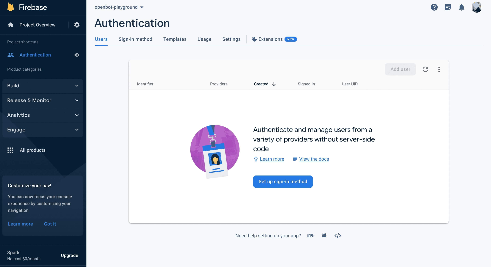

## Firebase Google Sign-In Authentication

<p align="center">
  <span>English</span> |
  <a href="README.zh-CN.md">简体中文</a> |
  <a href="README.de-DE.md">Deutsch</a> |
  <a href="README.fr-FR.md">Français</a> |
  <a href="README.es-ES.md">Español</a>
</p>

- #### Usage
  In web application, we use Firebase for Google sign-in authentication to upload OpenBot Playground projects on Google
  Drive. If you clone this project and run on your device, you must set up your own Firebase project because the
  firebase configuration is required for sign-in authentication.
- #### About  Google Sign-In
  Firebase Google Sign-In Authentication is a feature of the Firebase platform that allows users to sign in to mobile or
  web apps using their Google credentials. This service provides a secure and convenient way for users to access apps
  without having to remember and manage separate login credentials. Firebase manages the entire authentication process,
  from verifying the user's identity with Google to providing a unique user ID that can be used to personalize the user'
  s experience within the app. This feature also includes additional security measures, such as two-factor
  authentication, to help protect user accounts from unauthorized access.

****

### Setting up Firebase Project

- Go to the Firebase Console (https://console.firebase.google.com/) and sign in with your Google account.

- Click on the `Add Project` button to create a new Firebase project.

- Enter a name for your project, select your country/region, and then click on the `Create Project` button.
    <p align="left">
    
    
    </p>

- Once your project is created, click on the `Web` icon to add Firebase to your web app and then enter an App nickname
  and click on the `Register App` button.
  <p align="left">
  
  
  </p>

    - Add `firebase SDK` to your project's `env` file.
        - When creating project you will get firebase here, or you can get it from project setting.
          <p align="left">
          
          
          
          </p>

        - Using Environment Variables When using Firebase Authentication, you may need to store sensitive information
          such as API keys, database credentials, and other secrets. To do this securely, you can use environment
          variables to store this information outside your code. by doing following steps.

            1. Create a new file in OpenBot Playground called .env.
                 <p align="left">
                
                 </p> 

            3. Add following environment variables to the .env file that will be used in firebase.js file.

            ```bash
              REACT_APP_FIREBASE_API_KEY=<REACT_APP_FIREBASE_API_KEY>
              REACT_APP_AUTH_DOMAIN=<REACT_APP_AUTH_DOMAIN>
              REACT_APP_PROJECT_ID=<REACT_APP_PROJECT_ID>
              REACT_APP_STORAGE_BUCKET=<REACT_APP_STORAGE_BUCKET>
              REACT_APP_MESSAGING_SENDER_ID=<REACT_APP_MESSAGING_SENDER_ID>
              REACT_APP_APP_ID=<REACT_APP_APP_ID>
              REACT_APP_MEASUREMENT_ID=<REACT_APP_MEASUREMENT_ID>
              GENERATE_SOURCEMAP=false
            ```

- Enable Firebase Authentication SignIn method using Google.

  <p align="left">

  

  

  

  </p>


- Enabling Firestore database, navigate to the Build menu on the left sidebar.
  Click on ``Firestore Database`` from the options. Then, Click on ``Create database`` button.

  

    - For secure rules, select ``Start in production mode`` and choose firestore location for the
      app and click on the ``Enable`` button.

      
      

        - Once your database is created, click on the ``Rules`` to configure permissions for read and write.

          

        - Replace the default rules with below code and click on ``Publish`` button.

          ```bash
          rules_version = '2';
          service cloud.firestore {
              match /databases/{database}/documents {
                  match /{document=**} {
                      allow read, write: if request.auth != null;
                  }
              }
          }
          ```
        
### Setting up Google Drive Services

- #### To Enable API
  Go to the Google Cloud
  Console (https://console.cloud.google.com/) and sign
  in using the same Google account that you
  use for Firebase. This ensures seamless integration between the services. At the top of the page, you'll see the current project name. Click on it to open the project selector. Under the `ALL` section, select the project you added to firebase and switch to it.

  
  

- After switching, under Quick access, you should see an option
  labeled ``APIs & Services``. Click on it.
  If you don't see it immediately, you might need to click on the menu icon (usually three horizontal lines) at the
  top left corner to expand the menu and reveal the options.

  

    - After opening "APIs & Services", navigate to the ``Library`` section. This is where you can search for Google
      Drive API.
      

    - The Google Drive API should appear in the search results. Click on it.
      On the next page, you'll find information about the API. Click the "Enable" button to enable it for your project.
      Once enabled, you'll be able to access and manage the Google Drive and Drive API settings.
  
      
      

### Troubleshooting

Here are some common issues that may occur during the Firebase configuration process and their corresponding solutions.

```bash
  1. Invalid Credentials error: Inspect the browser console for any error messages or warnings related to Invalid Credentials.
```

- Verify that you have entered the correct client ID and API key in the Firebase Console.
- Double-check that there are no typos or errors in the values entered in environment variables.
- Make sure you have enabled the configuration settings properly when calling the firebase.auth().signInWithPopup()
  function.
- Ensure that you have specified correct firebase SDK version, and you are signing in with the valid Google account.

```bash
  2.  User account disabled error.
```

- The only way to fix this issue is to reactivate the existing account or create a new one.
- Additionally, you can check if account has been disabled or deleted before attempting to authenticate them with
  Firebase Google Sign-in, and display an error message if account is not active.

```bash
  3.  Cross-Origin Resource Sharing (CORS) error: If you notice that expected behavior of the web application is not occurring, such as data not being loaded or displayed correctly.
```

- Go to the Firebase Console, in the Authentication section select the "Sign-in method" tab. Under the "Authorized
  domains" section, make sure that your web application domain is added and that CORS is enabled for it.
- If you are using a server-side authentication flow, make sure that you have added the necessary CORS headers to your
  server response to allow requests from your web application domain.
- If you are hosting your web application on Firebase Hosting, it automatically enables CORS for your domain. You can
  also use Firebase Cloud Run to serve API requests with CORS headers included. 


