## Firebase Google Sign-In 认证

<p align="center">
  <a href="README.md">English</a> |
  <span>简体中文</span> |
  <a href="README.de-DE.md">Deutsch</a> |
  <a href="README.fr-FR.md">Français</a> |
  <a href="README.es-ES.md">Español</a>
</p>

- #### 使用方法
  在网络应用中，我们使用 Firebase 进行 Google 登录认证，以便将 OpenBot Playground 项目上传到 Google Drive。如果你克隆了这个项目并在你的设备上运行，你必须设置你自己的 Firebase 项目，因为登录认证需要 Firebase 配置。
- #### 关于 Google 登录
  Firebase Google 登录认证是 Firebase 平台的一个功能，允许用户使用他们的 Google 凭证登录移动或网络应用。该服务提供了一种安全且方便的方式，让用户无需记住和管理单独的登录凭证即可访问应用。Firebase 管理整个认证过程，从使用 Google 验证用户身份到提供一个唯一的用户 ID，这个 ID 可以用来个性化用户在应用中的体验。该功能还包括额外的安全措施，如双因素认证，以帮助保护用户账户免受未经授权的访问。

****

### 设置 Firebase 项目

- 访问 Firebase 控制台 (https://console.firebase.google.com/) 并使用你的 Google 账户登录。

- 点击 `添加项目` 按钮创建一个新的 Firebase 项目。

- 输入你的项目名称，选择你的国家/地区，然后点击 `创建项目` 按钮。
    <p align="left">
    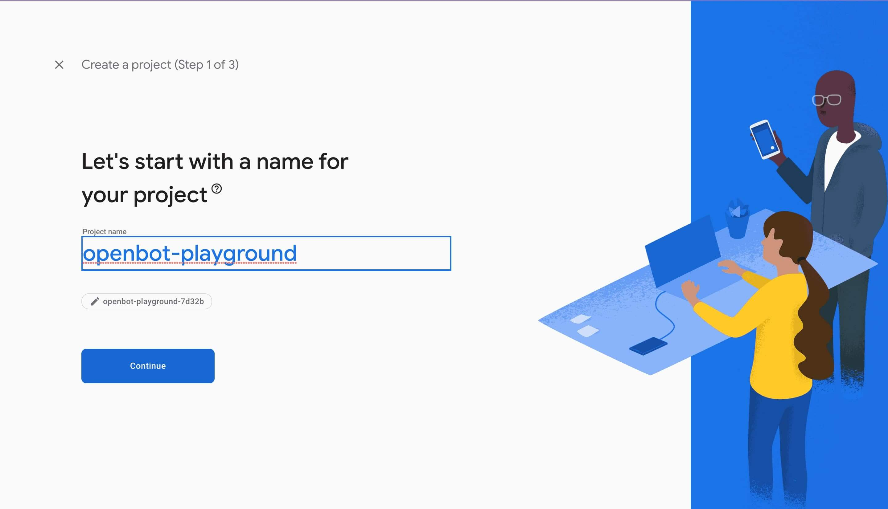
    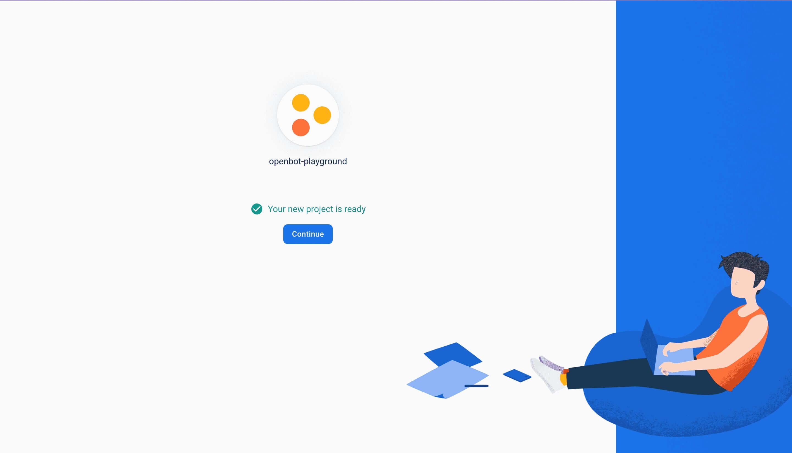
    </p>

- 项目创建完成后，点击 `Web` 图标将 Firebase 添加到你的网络应用中，然后输入应用昵称并点击 `注册应用` 按钮。
  <p align="left">
  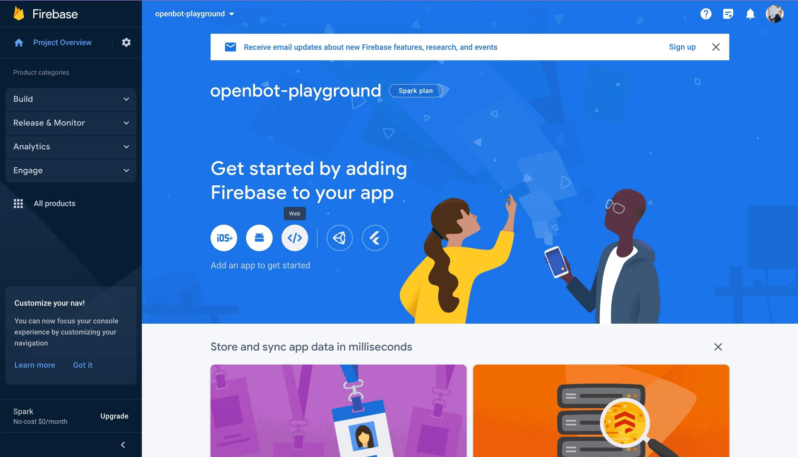
  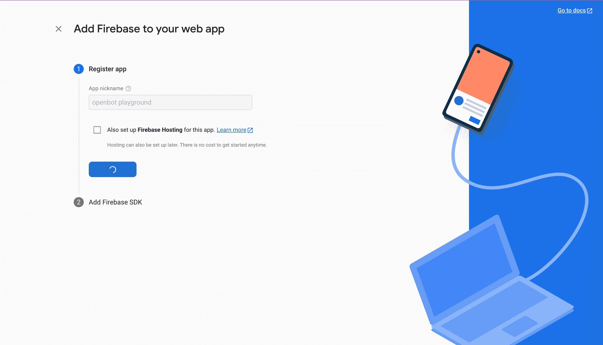
  </p>

    - 将 `firebase SDK` 添加到你项目的 `env` 文件中。
        - 创建项目时你会得到 firebase 配置，或者你可以从项目设置中获取。
          <p align="left">
          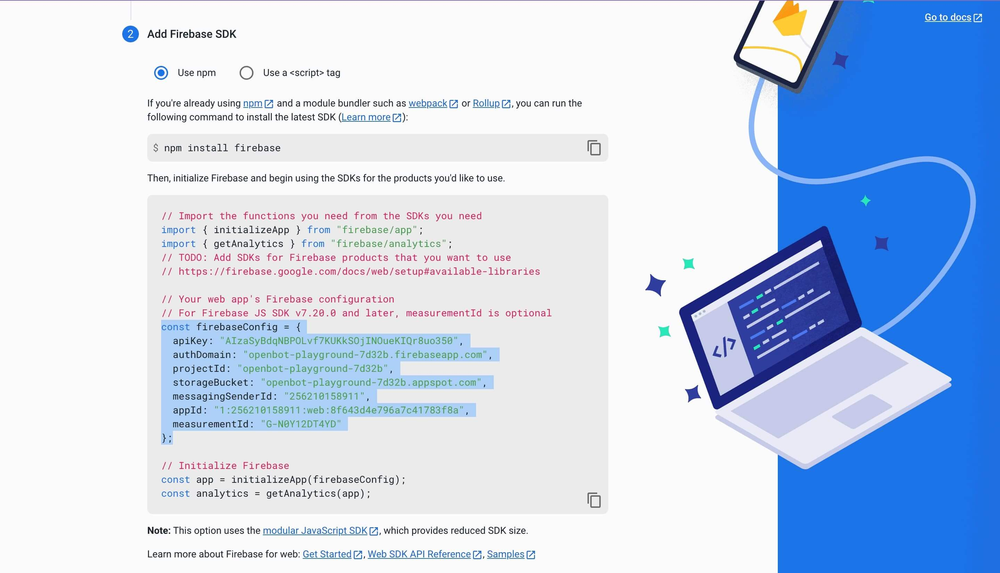
          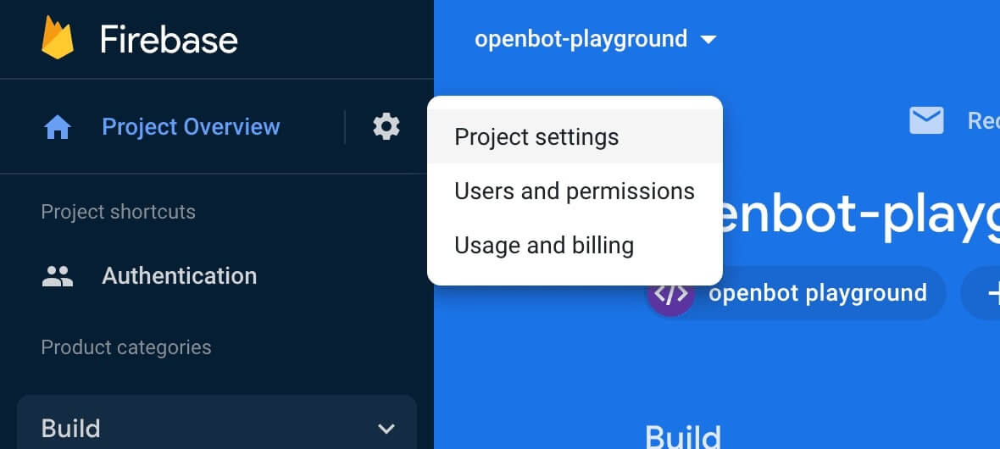
          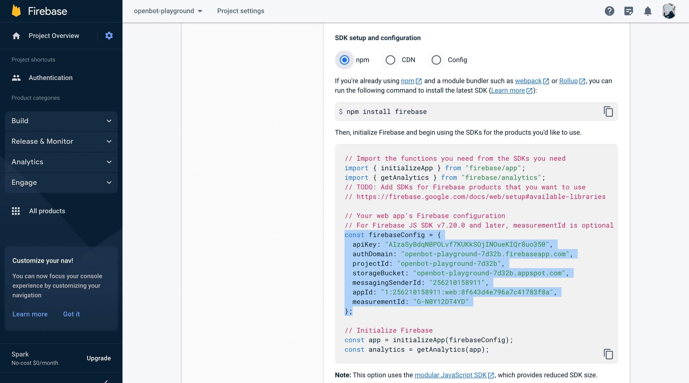
          </p>

        - 使用环境变量 当使用 Firebase 认证时，你可能需要存储敏感信息，如 API 密钥、数据库凭证和其他秘密信息。为了安全地存储这些信息，你可以使用环境变量将这些信息存储在代码之外。按以下步骤操作。

            1. 在 OpenBot Playground 中创建一个名为 .env 的新文件。
                 <p align="left">
                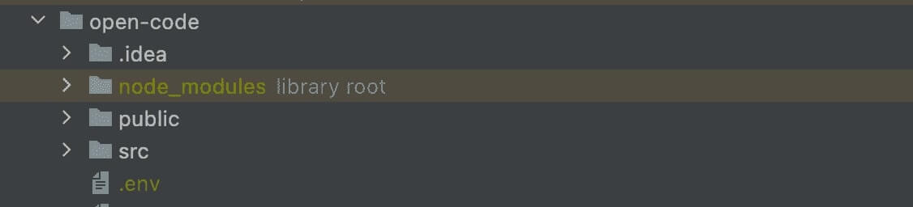
                 </p> 

            3. 将以下环境变量添加到 .env 文件中，这些变量将在 firebase.js 文件中使用。

            ```bash
              REACT_APP_FIREBASE_API_KEY=<REACT_APP_FIREBASE_API_KEY>
              REACT_APP_AUTH_DOMAIN=<REACT_APP_AUTH_DOMAIN>
              REACT_APP_PROJECT_ID=<REACT_APP_PROJECT_ID>
              REACT_APP_STORAGE_BUCKET=<REACT_APP_STORAGE_BUCKET>
              REACT_APP_MESSAGING_SENDER_ID=<REACT_APP_MESSAGING_SENDER_ID>
              REACT_APP_APP_ID=<REACT_APP_APP_ID>
              REACT_APP_MEASUREMENT_ID=<REACT_APP_MEASUREMENT_ID>
              GENERATE_SOURCEMAP=false
            ```

- 启用 Firebase 认证的 Google 登录方法。

  <p align="left">

  

  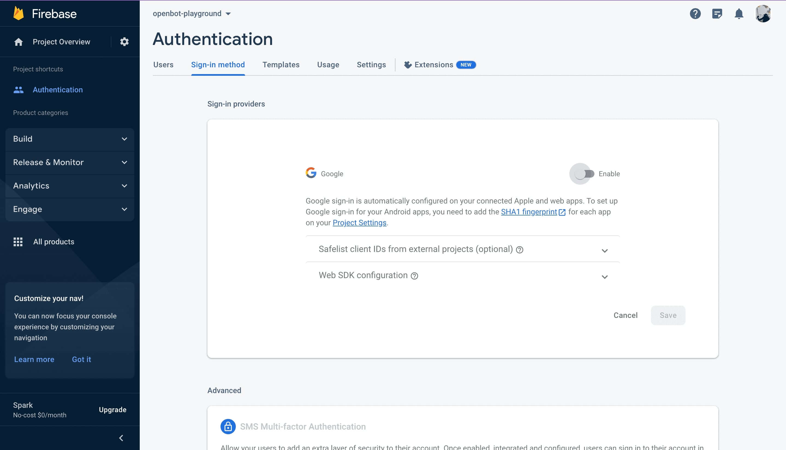

  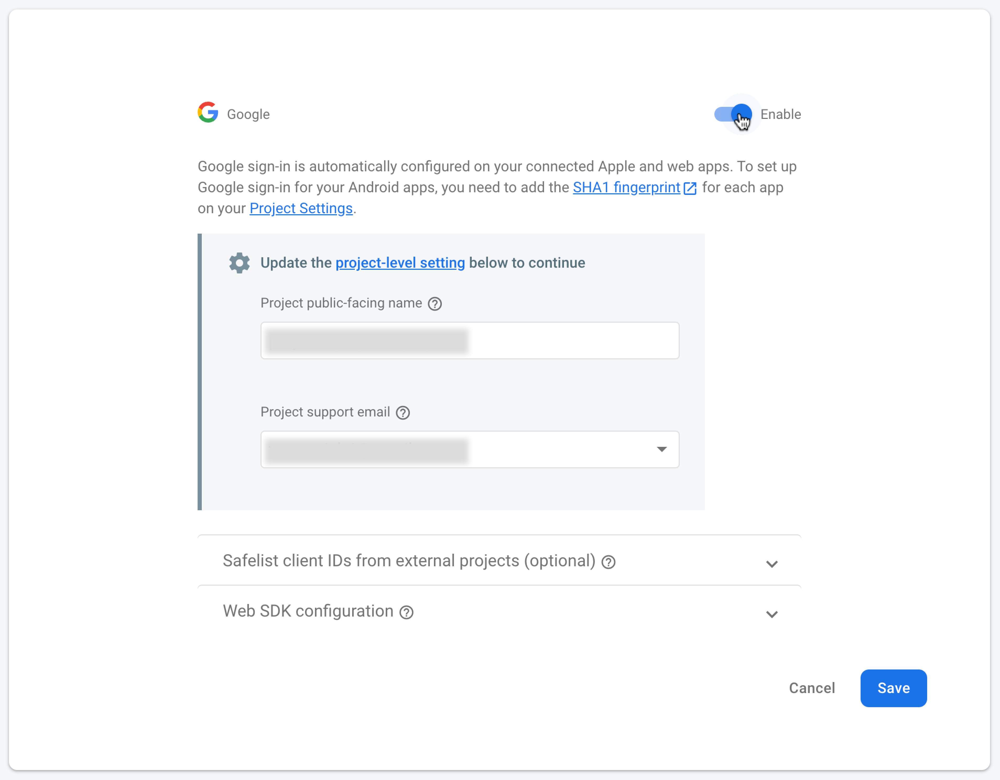

  </p>


- 启用 Firestore 数据库，导航到左侧边栏的构建菜单。
  从选项中点击 ``Firestore 数据库``。然后，点击 ``创建数据库`` 按钮。

  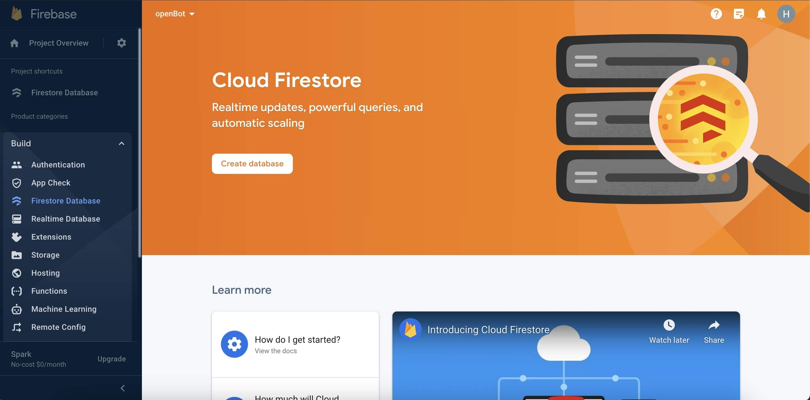

    - 为了安全规则，选择 ``在生产模式下启动`` 并为应用选择 Firestore 位置，然后点击 ``启用`` 按钮。

      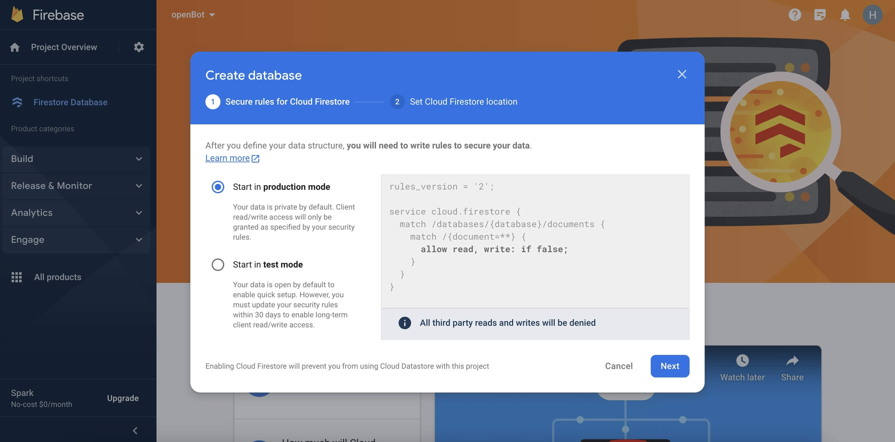
      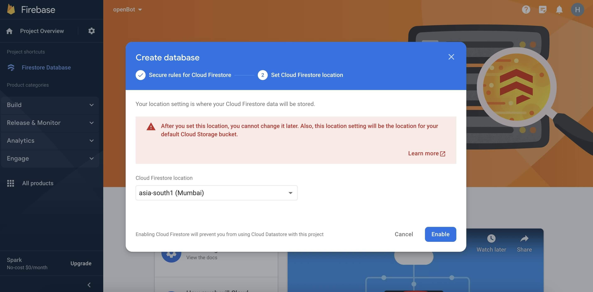

        - 数据库创建完成后，点击 ``规则`` 配置读写权限。

          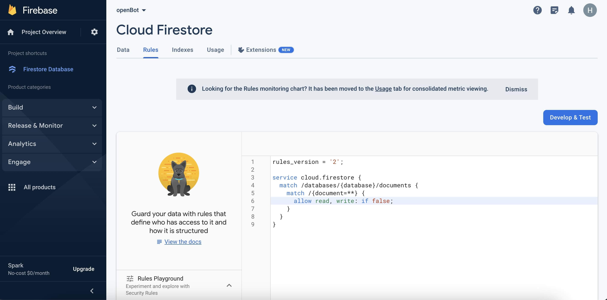

        - 用以下代码替换默认规则并点击 ``发布`` 按钮。

          ```bash
          rules_version = '2';
          service cloud.firestore {
              match /databases/{database}/documents {
                  match /{document=**} {
                      allow read, write: if request.auth != null;
                  }
              }
          }
          ```
        
### 设置 Google Drive 服务

- #### 启用 API
  访问 Google Cloud 控制台 (https://console.cloud.google.com/) 并使用你用于 Firebase 的同一个 Google 账户登录。这确保了服务之间的无缝集成。在页面顶部，你会看到当前的项目名称。点击它打开项目选择器。在 `所有` 部分，选择你添加到 Firebase 的项目并切换到它。

  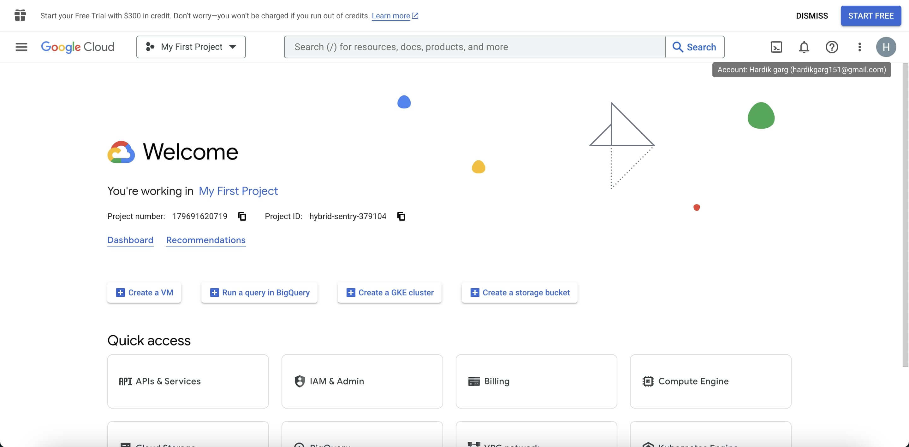
  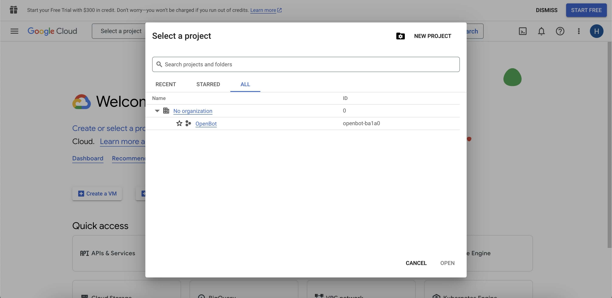

- 切换后，在快速访问下，你应该看到一个标记为 ``API 和服务`` 的选项。点击它。
  如果你没有立即看到它，你可能需要点击左上角的菜单图标（通常是三条水平线）以展开菜单并显示选项。

  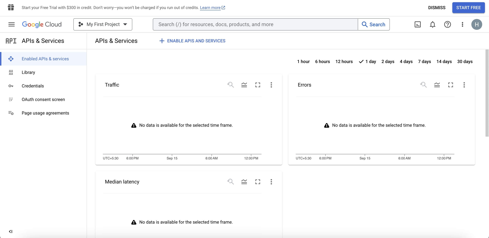

    - 打开 "API 和服务" 后，导航到 ``库`` 部分。在这里你可以搜索 Google Drive API。
      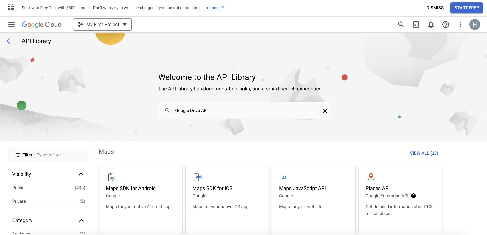

    - Google Drive API 应该会出现在搜索结果中。点击它。
      在下一页，你会找到关于 API 的信息。点击 "启用" 按钮为你的项目启用它。
      启用后，你将能够访问和管理 Google Drive 和 Drive API 设置。
  
      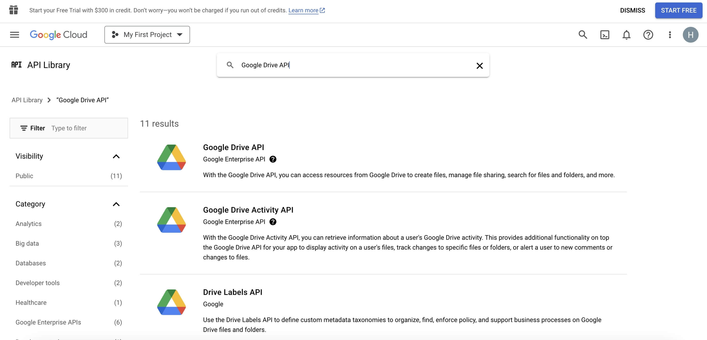
      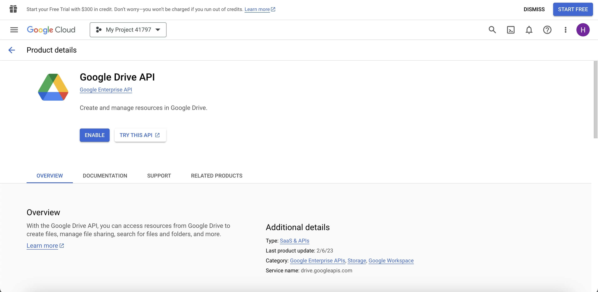

### 故障排除

以下是一些在 Firebase 配置过程中可能出现的常见问题及其相应的解决方案。

```bash
  1. 无效凭证错误：检查浏览器控制台是否有任何与无效凭证相关的错误消息或警告。
```

- 验证你在 Firebase 控制台中输入的客户端 ID 和 API 密钥是否正确。
- 仔细检查环境变量中输入的值是否有拼写错误或错误。
- 确保在调用 firebase.auth().signInWithPopup() 函数时正确启用了配置设置。
- 确保你指定了正确的 firebase SDK 版本，并且你使用有效的 Google 账户登录。

```bash
  2. 用户账户被禁用错误。
```

- 解决此问题的唯一方法是重新激活现有账户或创建一个新账户。
- 此外，你可以在尝试使用 Firebase Google 登录认证用户之前检查账户是否已被禁用或删除，如果账户未激活则显示错误消息。

```bash
  3. 跨域资源共享 (CORS) 错误：如果你注意到网络应用的预期行为未发生，例如数据未正确加载或显示。
```

- 访问 Firebase 控制台，在认证部分选择 "登录方法" 选项卡。在 "授权域" 部分，确保已添加你的网络应用域并为其启用了 CORS。
- 如果你使用服务器端认证流程，确保你已在服务器响应中添加了必要的 CORS 头，以允许来自你的网络应用域的请求。
- 如果你在 Firebase Hosting 上托管你的网络应用，它会自动为你的域启用 CORS。你也可以使用 Firebase Cloud Run 来处理包含 CORS 头的 API 请求。