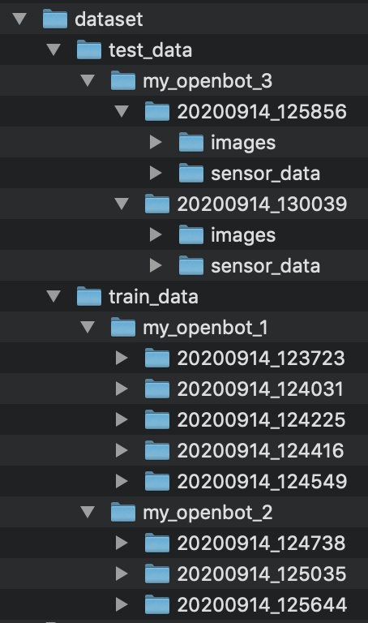

# Driving Policy (Advanced)

<p align="center">
  <span>English</span> |
  <a href="README_CN.md">简体中文</a>
</p>

## DISCLAIMERS

1. **Safety:** Driving policies are not perfect and may crash the robot. Always make sure you operate in a safe environment! Keep in mind, that your phone could be damaged in a collision! Make sure you always have a game controller connected and are familiar with the key mapping so you can stop the vehicle at any time. Use at your own risk!
2. **Compute hardware:** Training a driving policy requires a lot of resources and may slow down or even freeze your machine. It is recommended to use a high-end laptop or workstation with large amount of RAM and dedicated GPU, especially when training with larger batch sizes. The documentation is currently also not very detailed. Use at your own risk!
3. **Patience required:** To get a good driving policy for your custom dataset will require some patience. It is not straight-forward, involves data collection, hyperparameter tuning, etc. If you have never trained machine learning models before, it will be challenging and may even get frustrating.

You first need to setup your training environment.

## Dependencies

We recommend to create a conda environment for OpenBot. Instructions on installing conda can be found [here](https://docs.conda.io/projects/conda/en/latest/user-guide/install/).
If you do not have a dedicated GPU (e.g. using your laptop) you can create a new environment with the following command:

```bash
conda create -n openbot python=3.7 tensorflow=2.0.0 notebook=6.1.1 matplotlib=3.3.1 pillow=7.2.0
```

Note that training will be very slow. So if you have access to a computer with dedicated GPU, we highly recommend to use it. In this case, you will need Tensorflow with GPU support. Run the following command to setup the conda environment:

```bash
conda create -n openbot python=3.7 tensorflow-gpu=2.0.0 notebook=6.1.1 matplotlib=3.3.1 pillow=7.2.0
```

If you prefer to setup the environment manually, here is a list of the dependencies:

- Tensorflow
- Jupyter Notebook
- Matplotlib
- Numpy
- PIL

After setting up the conda environment navigate to the folder `policy` within your local OpenBot repository.

NOTES:
- Whenever you want to run the Jupyter notebook you need the activate the environment first: `conda activate openbot`
- If you want to use tensorflow=2.2.0 you may need to pass the custom metrics as custom objects dictionary. (See this [issue](https://github.com/intel-isl/OpenBot/issues/39).)
- If your tensorflow import does not work, try installing via `pip install tensorflow --user`. (See this [issue](https://github.com/intel-isl/OpenBot/issues/98).)

## Data Collection

In order to train an autonomous driving policy, you will first need to collect a dataset. The more data you collect, the better the resulting driving policy. For the experiments in our paper, we collected about 30 minutes worth of data. Note that the network will imitate your driving behaviour. The better and more consistent you drive, the better the network will learn to drive.

1. Connect a bluetooth game controller to the phone (e.g. PS4 controller: to enter pairing mode press the PS and share buttons until the LED flashes quickly).
2. Select the AUTOPILOT_F network in the app.
3. Now drive drive the car via a game controller and record a dataset. On the PS4 controller logging can be toggled with the **X** button.

You will now find a folder called *Openbot* on the internal storage of your smartphone. For each recording, there will be zip file. The name of the zip file will be in the format *yyyymmdd_hhmmss.zip* corresponding to the timestamp of when the recording was started.

The Jupyter notebook expects a folder called `dataset` in the same folder. In this folder, there should be two subfolders, `train_data` and `test_data`. The training data is used to learn the driving policy. The test data is used to validate the learned driving policy on unseen data during the training process. This provides some indication how well this policy will work on the robot. Even though the robot may drive along the same route as seen during training, the exact images observed will be slightly different in every run. The common split is 80% training data and 20% test data. Inside the `train_data` and `test_data` folders, you need to make a folder for each recording session and give it a name such as `my_openbot_1`, `my_openbot_2`, etc. The idea here is that each recording session may have different lighting conditions, a different robot, a different route. In the Jupyter notebook, you can then train only on a subset of these datasets or on all of them. Inside each recording session folder, you drop all the recordings from that recording session. Each recording corresponds to an extracted zip file that you have transferred from the *Openbot* folder on your phone. Your dataset folder should look like this:



Rather than copying all files manually from the phone, you can also upload the logs automatically to a [Python server](#web-app) on your computer. In this case, the zip files will be uploaded and unpacked into the folder `dataset/uploaded`. You will still need to move them into the folder structure for training. You can simply treat the `uploaded` folder as a recording session and move it into `train_data`. The recordings will then be recognized as training data by the Jupyter notebook. If you do not already have a recording session in the `test_data` folder, you also need to move at least one recording from `train_data/uploaded` into `test_data/uploaded`.

## Policy Training

We provide a [Jupyter Notebook](policy_learning.ipynb) that guides you through the steps for training an autonomous driving policy. Open the notebook with the following command.

```bash
jupyter notebook policy_learning.ipynb
```

Now a web-browser window will open automatically and load the Jupyter notebook. Follow the steps in order to train a model with your own data. At the end, two tflite files are generated: one corresponds to the best checkpoint according to the validation metrics and the other to the last checkpoint. Pick one of them and rename it to autopilot_float.tflite. Replace the existing model in Android Studio and recompile the app.

<p align="center">
  
</p>

If you are looking for the folder in your local directory, you will find it at: `app/src/main/assets/networks`.

## Web App

We provide a web app and a python web server for easier policy training. (Beta)

### Features

* Automatic log (session) upload 
  * see Troubleshooting for details
* List uploaded sessions, with GIF preview 
* List datasets, with basic info
* Move session to a dataset
* Delete session
* List trained models, and show plots about training
* Train a model with basic parameters, show progress bar

### Preview


### Quickstart

```
conda activate openbot
pip install -r requirements.txt
python -m openbot.server
```

You can now open your browser to visualize the dataset and see incoming uploads by going to: 
[http://localhost:8000/#/uploaded](http://localhost:8000/#/uploaded)

### Dependencies

If you do not want install the dependencies globally, activate your conda environment first:

```
conda activate openbot
```

Make sure you are in the folder `policy`. Now, you can install all the dependencies with the following command:

```
pip install -r requirements.txt
```

### Running the server

You can run the python server with the command:

```
python -m openbot.server
```

There is also a developer mode:

```
adev runserver openbot/server
```

For frontend development (react app):

```
FE_DEV=1 adev runserver openbot/server
```

When you run the server you should see something like:

```
Skip address 127.0.0.1 @ interface lo
Found address 192.168.x.x @ interface wlp2s0
Registration of a service, press Ctrl-C to exit...
Running frontend: 0.1.0
Frontend path: /home/USERNAME/miniconda3/envs/openbot/lib/python3.7/site-packages/openbot_frontend
======== Running on http://0.0.0.0:8000 ========
(Press CTRL+C to quit)
```

### Troubleshooting

If the upload to the server is not working, here are some troubleshooting tips:

- Try restarting the server (computer) and the OpenBot app (smartphone)
- Make sure the smartphone and your computer are connected to the same WiFi network
- If your router has both 2.4 GHz and 5 GHz networks with the same name, disable the 5 GHz network
- Keep the phone connected to Android Studio while running the app. In the Logcat tab, select Debug from the dropdown. Type `NSD` into the filter field to see the debug messages concerning the server connection. Type `Upload` into the filter field for debug messages concerning the recording file upload.
- If a published models gets downloaded continiously, make sure the time on your phone and laptop / workstation are set correctly
